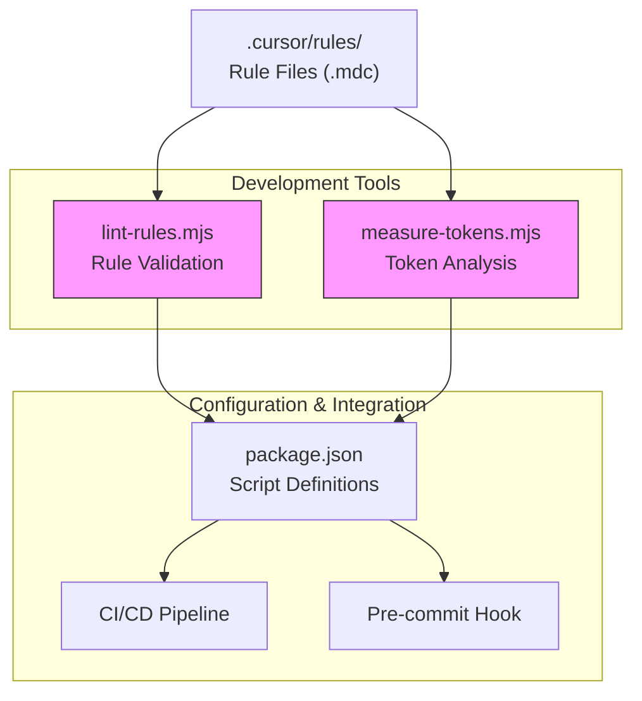
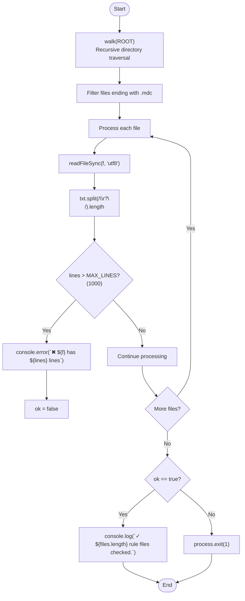
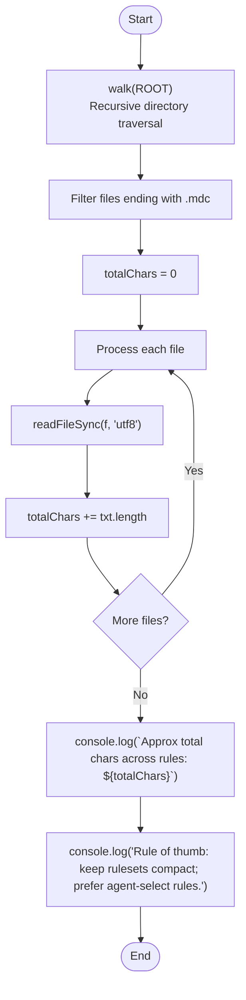
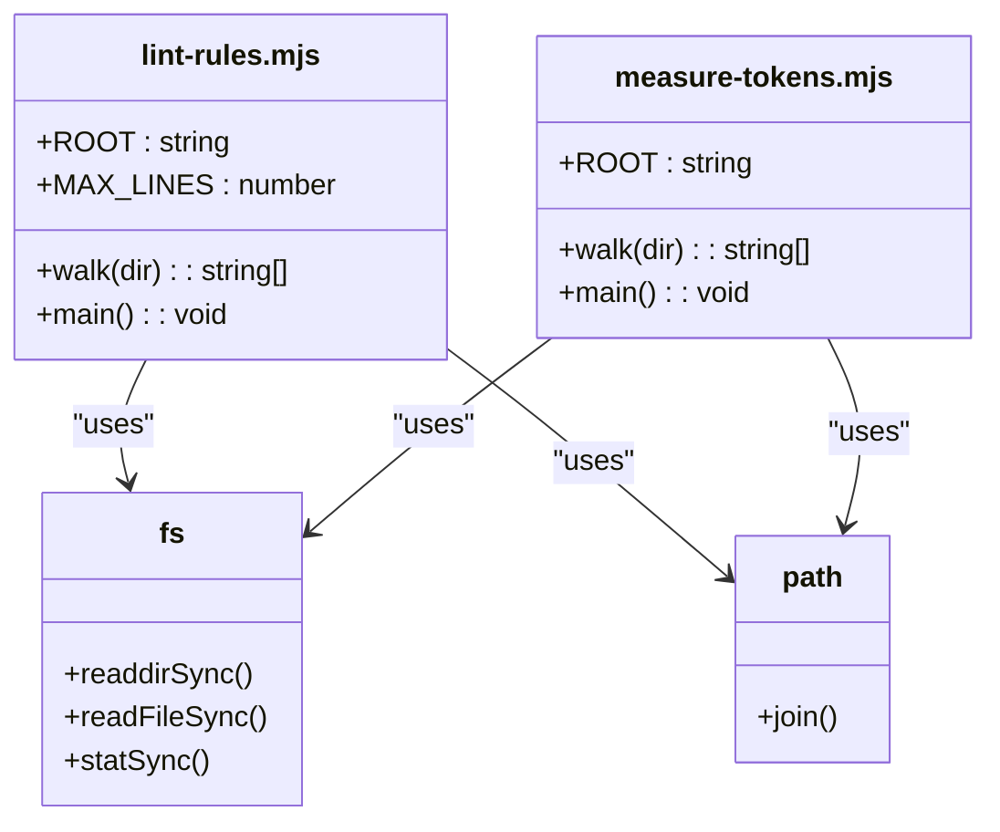

# Development Tools and Utilities

<cite>
**Referenced Files in This Document**   
- [lint-rules.mjs](file://scripts/lint-rules.mjs)
- [measure-tokens.mjs](file://scripts/measure-tokens.mjs)
- [package.json](file://package.json)
- [CONTRIBUTING.md](file://CONTRIBUTING.md)
- [README.md](file://README.md)
</cite>

## Table of Contents
1. [Introduction](#introduction)
2. [Core Components](#core-components)
3. [Architecture Overview](#architecture-overview)
4. [Detailed Component Analysis](#detailed-component-analysis)
5. [Dependency Analysis](#dependency-analysis)
6. [Performance Considerations](#performance-considerations)
7. [Troubleshooting Guide](#troubleshooting-guide)
8. [Conclusion](#conclusion)

## Introduction
This document provides comprehensive documentation for the development tools within the Vue 3 Cursor Rules repository, focusing on two critical utility scripts: `lint-rules.mjs` and `measure-tokens.mjs`. These tools support rule maintenance and cost optimization by ensuring consistency across the rulebase and analyzing token consumption to control AI development costs. The utilities are designed to maintain high-quality standards while promoting efficient resource usage in AI-assisted development workflows.

## Core Components

The core components of this development toolkit consist of two specialized Node.js scripts that serve distinct but complementary purposes in maintaining the quality and efficiency of the rule system. These utilities work together to ensure that the `.cursor/rules/` directory maintains optimal structure and performance characteristics.

**Section sources**
- [lint-rules.mjs](file://scripts/lint-rules.mjs#L0-L24)
- [measure-tokens.mjs](file://scripts/measure-tokens.mjs#L0-L18)

## Architecture Overview

**Diagram sources **
- [lint-rules.mjs](file://scripts/lint-rules.mjs#L0-L24)
- [measure-tokens.mjs](file://scripts/measure-tokens.mjs#L0-L18)
- [package.json](file://package.json#L0-L61)

## Detailed Component Analysis

### lint-rules.mjs Analysis

The `lint-rules.mjs` script serves as a validation tool for ensuring rule file integrity and consistency across the rulebase. It implements a recursive file traversal mechanism to locate all `.mdc` files within the `.cursor/rules/` directory structure, then performs line count validation against a predefined threshold.

#### Functionality and Implementation

**Diagram sources **
- [lint-rules.mjs](file://scripts/lint-rules.mjs#L0-L24)

**Section sources**
- [lint-rules.mjs](file://scripts/lint-rules.mjs#L0-L24)

### measure-tokens.mjs Analysis

The `measure-tokens.mjs` script provides quantitative analysis of the rulebase's size by measuring total character count across all rule files. This metric serves as a proxy for estimating token consumption in AI-assisted development environments, helping teams manage costs associated with AI model usage.

#### Functionality and Implementation

**Diagram sources **
- [measure-tokens.mjs](file://scripts/measure-tokens.mjs#L0-L18)

**Section sources**
- [measure-tokens.mjs](file://scripts/measure-tokens.mjs#L0-L18)

## Dependency Analysis

The development tools depend primarily on Node.js built-in modules for filesystem operations and path manipulation. Both scripts share common dependencies and follow a similar architectural pattern for traversing the directory structure.

**Diagram sources **
- [lint-rules.mjs](file://scripts/lint-rules.mjs#L0-L24)
- [measure-tokens.mjs](file://scripts/measure-tokens.mjs#L0-L18)

**Section sources**
- [lint-rules.mjs](file://scripts/lint-rules.mjs#L0-L24)
- [measure-tokens.mjs](file://scripts/measure-tokens.mjs#L0-L18)

## Performance Considerations

Both utility scripts implement synchronous filesystem operations which can impact performance when processing large numbers of files or very large individual files. The `walk` function uses recursion to traverse directories, which could lead to stack overflow issues with deeply nested directory structures. However, given the typical size and structure of the `.cursor/rules/` directory, these performance considerations are generally not problematic in practice.

The scripts are optimized for simplicity and reliability rather than maximum performance. They process files sequentially rather than in parallel, which ensures predictable behavior but doesn't leverage potential performance gains from concurrent file reading. For most use cases, the execution time is negligible due to the relatively small number of rule files and their moderate sizes.

**Section sources**
- [lint-rules.mjs](file://scripts/lint-rules.mjs#L0-L24)
- [measure-tokens.mjs](file://scripts/measure-tokens.mjs#L0-L18)

## Troubleshooting Guide

### Common Issues and Solutions

#### Parsing Errors
When encountering parsing errors, verify that:
- All rule files have the `.mdc` extension
- File paths do not contain special characters or spaces
- The `.cursor/rules/` directory exists in the expected location
- File permissions allow read access

#### Inaccurate Token Counts
The `measure-tokens.mjs` script provides an approximation based on character count rather than actual tokenization. To address potential inaccuracies:
- Understand that different AI models tokenize text differently
- Use the output as a relative metric rather than absolute truth
- Focus on trends over time rather than specific values
- Consider that whitespace and formatting affect character count

#### Integration Issues
When integrating these tools into automated workflows:
- Ensure Node.js version compatibility (requires Node 16+)
- Verify that the working directory is correctly set
- Check that all required dependencies are installed
- Confirm that environment variables don't interfere with script execution

**Section sources**
- [lint-rules.mjs](file://scripts/lint-rules.mjs#L0-L24)
- [measure-tokens.mjs](file://scripts/measure-tokens.mjs#L0-L18)
- [package.json](file://package.json#L0-L61)

## Conclusion

The `lint-rules.mjs` and `measure-tokens.mjs` utilities provide essential functionality for maintaining the quality and efficiency of the Vue 3 Cursor Rules system. By enforcing structural consistency and providing visibility into resource consumption, these tools help ensure that the rulebase remains effective and cost-efficient. Their integration into development workflows through npm scripts enables seamless usage in both manual and automated contexts, supporting best practices in AI-assisted development.