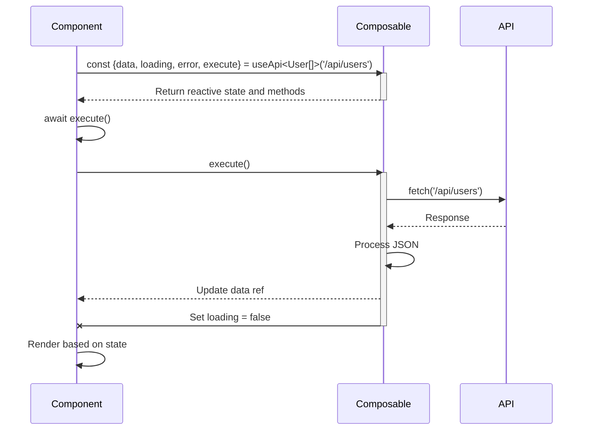

# API Integration with Composables

<cite>
**Referenced Files in This Document**   
- [useApi.ts](file://examples/useApi.ts)
</cite>

## Table of Contents
1. [Introduction](#introduction)
2. [Core Architecture](#core-architecture)
3. [Type-Safe Request Patterns](#type-safe-request-patterns)
4. [State Management and Reactivity](#state-management-and-reactivity)
5. [Error Handling and Cleanup](#error-handling-and-cleanup)
6. [Composable Reusability](#composable-reusability)
7. [Usage Examples](#usage-examples)
8. [Code Organization Benefits](#code-organization-benefits)
9. [Security Considerations](#security-considerations)
10. [Extensibility Options](#extensibility-options)
11. [Token Efficiency Analysis](#token-efficiency-analysis)

## Introduction

This document explores the implementation of reusable, type-safe API interaction patterns using Vue 3 composables, focusing on the `useApi` composable pattern. The approach demonstrates how to create a robust abstraction layer for HTTP requests that enhances code organization, testability, and maintainability while providing strong TypeScript integration.

The composable pattern presented here addresses common challenges in frontend development by encapsulating API logic into reusable units that can be easily shared across components. This eliminates the need for repetitive inline API calls and provides a consistent interface for data fetching operations throughout an application.

**Section sources**
- [useApi.ts](file://examples/useApi.ts#L3-L37)

## Core Architecture

The `useApi` composable follows a clean architectural pattern that separates concerns and promotes reusability. It leverages Vue 3's Composition API to create a self-contained unit of functionality that can be instantiated with different configuration parameters.

The architecture centers around a generic function that accepts a URL parameter and returns reactive state objects along with control methods. This design enables the creation of specialized API hooks for different endpoints while maintaining a consistent interface and behavior pattern across the application.

```mermaid
graph TD
A[useApi<T>(url)] --> B[Reactive State]
A --> C[Control Methods]
B --> D[data: Ref<T | null>]
B --> E[loading: Ref<boolean>]
B --> F[error: Ref<string | null>]
C --> G[execute(): Promise<void>]
C --> H[reset(): void]
I[Generic Type T] --> A
J[URL String] --> A
```

**Diagram sources**
- [useApi.ts](file://examples/useApi.ts#L3-L37)

**Section sources**
- [useApi.ts](file://examples/useApi.ts#L3-L37)

## Type-Safe Request Patterns

The composable implements type safety through generic type parameters that allow developers to specify the expected response structure at the point of instantiation. When calling `useApi<User[]>('/api/users')`, the generic type `User[]` ensures that the returned `data` property is correctly typed, enabling full IDE support and compile-time type checking.

This pattern eliminates the need for manual type assertions or casting when working with API responses. The TypeScript compiler understands the relationship between the generic parameter and the resulting data structure, providing autocompletion, refactoring support, and error detection for properties accessed on the response data.

The type safety extends to the entire API interaction lifecycle, ensuring that consumers of the composable work with correctly typed data from request initiation through response handling.

**Section sources**
- [useApi.ts](file://examples/useApi.ts#L3-L37)

## State Management and Reactivity

The composable manages request state through Vue's reactivity system using `ref` objects for three key state variables: `data`, `loading`, and `error`. These refs provide automatic reactivity, meaning any component that consumes these values will automatically update when their state changes.

The `readonly` wrapper is applied to the state refs before they are exposed in the return object. This protective pattern prevents external components from directly modifying the internal state, ensuring that state transitions occur only through the composable's defined methods. This encapsulation maintains consistency and prevents unintended side effects.

```mermaid
classDiagram
class useApi {
+data : Readonly<Ref<T | null>>
+loading : Readonly<Ref<boolean>>
+error : Readonly<Ref<string | null>>
+execute() : Promise<void>
+reset() : void
}
note right of useApi
State management pattern :
- Internal refs managed by composable
- Readonly wrappers protect state integrity
- Reactive updates trigger UI rendering
- Encapsulation ensures predictable behavior
end
```

**Diagram sources**
- [useApi.ts](file://examples/useApi.ts#L4-L6)

**Section sources**
- [useApi.ts](file://examples/useApi.ts#L4-L6)

## Error Handling and Cleanup

The composable implements comprehensive error handling within the `execute` function using a try-catch-finally block structure. The try block contains the asynchronous fetch operation, with explicit status checking to convert HTTP errors into JavaScript exceptions.

In the catch block, error normalization ensures consistent error representation by extracting the message property from Error objects while providing a fallback message for non-Error types. This prevents potential security vulnerabilities from exposing raw error details to the user interface.

The finally block guarantees cleanup operations execute regardless of success or failure, specifically resetting the loading state to false. This prevents the application from getting stuck in a loading state if an unhandled exception occurs.

```mermaid
flowchart TD
Start([execute() called]) --> SetLoading["Set loading = true<br/>Clear error"]
SetLoading --> TryFetch["Try: Fetch URL"]
TryFetch --> CheckResponse{"Response OK?"}
CheckResponse --> |No| ThrowError["Throw HTTP error"]
CheckResponse --> |Yes| ParseJSON["Parse JSON response"]
ParseJSON --> AssignData["Assign to data ref"]
ThrowError --> CatchBlock["Catch: Handle error"]
AssignData --> FinallyBlock["Finally: Set loading = false"]
CatchBlock --> FormatError["Format error message"]
FormatError --> SetError["Set error ref"]
SetError --> FinallyBlock
FinallyBlock --> End([Function complete])
```

**Diagram sources**
- [useApi.ts](file://examples/useApi.ts#L12-L28)

**Section sources**
- [useApi.ts](file://examples/useApi.ts#L12-L28)

## Composable Reusability

The `reset` function enables composable reuse by providing a clean mechanism to return the internal state to its initial conditions. This is particularly valuable in scenarios where the same composable instance needs to be used for multiple requests, such as in search interfaces or pagination controls.

By calling `reset()`, consumers can clear previous data, remove error states, and prepare the composable for a new request cycle without needing to recreate the entire instance. This pattern supports both singleton composable usage and per-request instantiation strategies, giving developers flexibility in how they manage API state.

The combination of generic typing and state reset functionality makes the composable highly versatile, allowing it to be used across different parts of an application with varying data requirements while maintaining consistent behavior.

**Section sources**
- [useApi.ts](file://examples/useApi.ts#L30-L35)

## Usage Examples

The composable can be instantiated with specific TypeScript interfaces to create specialized API hooks for different endpoints. Consumers destructure the returned object to access the reactive state and control methods.



**Diagram sources**
- [useApi.ts](file://examples/useApi.ts#L3-L37)

**Section sources**
- [useApi.ts](file://examples/useApi.ts#L3-L37)

## Code Organization Benefits

This abstraction significantly improves code organization by centralizing API logic that would otherwise be scattered across multiple components. Instead of having fetch calls embedded in component methods or lifecycle hooks, all API interaction concerns are consolidated into a single, well-defined composable.

The pattern enhances testability by making the API logic independent of component rendering. Unit tests can focus on verifying the composable's behavior with mock fetch implementations, without needing to mount components or deal with DOM manipulation.

Maintainability improves because changes to error handling strategies, request formatting, or response processing can be made in one place and automatically propagate to all consumers. This eliminates the "shotgun surgery" problem where the same change must be applied in multiple locations.

Additionally, the composable serves as documentation for API interaction patterns, establishing a standard approach that team members can follow consistently.

## Security Considerations

The implementation addresses several security considerations in its design. Error sanitization in the catch block prevents potentially sensitive information from being exposed through error messages. By using `err instanceof Error ? err.message : 'Unknown error'`, the composable ensures that only the message property is revealed, avoiding exposure of stack traces or internal object structures.

While the current implementation provides basic response validation through the `response.ok` check, additional security measures could be incorporated, such as content-type verification, response schema validation, and timeout handling to prevent denial-of-service scenarios.

The readonly protection of state variables prevents unauthorized modification of API response data, reducing the risk of injection attacks that might attempt to manipulate the data flow within the application.

For production applications, consideration should be given to implementing additional security features like CSRF token handling, rate limiting awareness, and secure header management.

## Extensibility Options

The composable pattern is designed to be extensible, allowing for the addition of advanced features without breaking existing consumers. Several enhancement opportunities exist:

**Authentication Headers**: The composable could be extended to automatically include authorization tokens from a global store or local storage, with options to customize header composition per request.

**Request Cancellation**: Integration with AbortController would enable cancellation of pending requests, which is particularly valuable for search-as-you-type interfaces or when navigating away from pages with active requests.

**Caching Mechanisms**: Implementing client-side caching could reduce redundant network requests and improve application performance, especially for frequently accessed but infrequently changing data.

**Retry Logic**: Adding configurable retry attempts with exponential backoff would make the application more resilient to transient network issues.

**Progress Tracking**: For large file uploads or downloads, integrating progress event handling would enable better user feedback.

These extensions can be implemented incrementally, with backward compatibility maintained through optional configuration parameters.

## Token Efficiency Analysis

When considering AI-assisted development, this composable pattern demonstrates excellent token efficiency. The initial investment in creating the