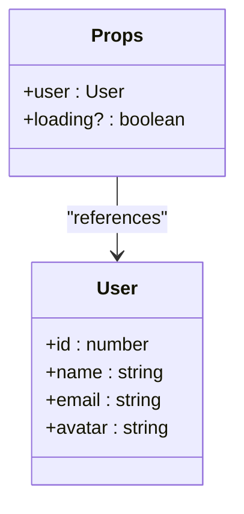
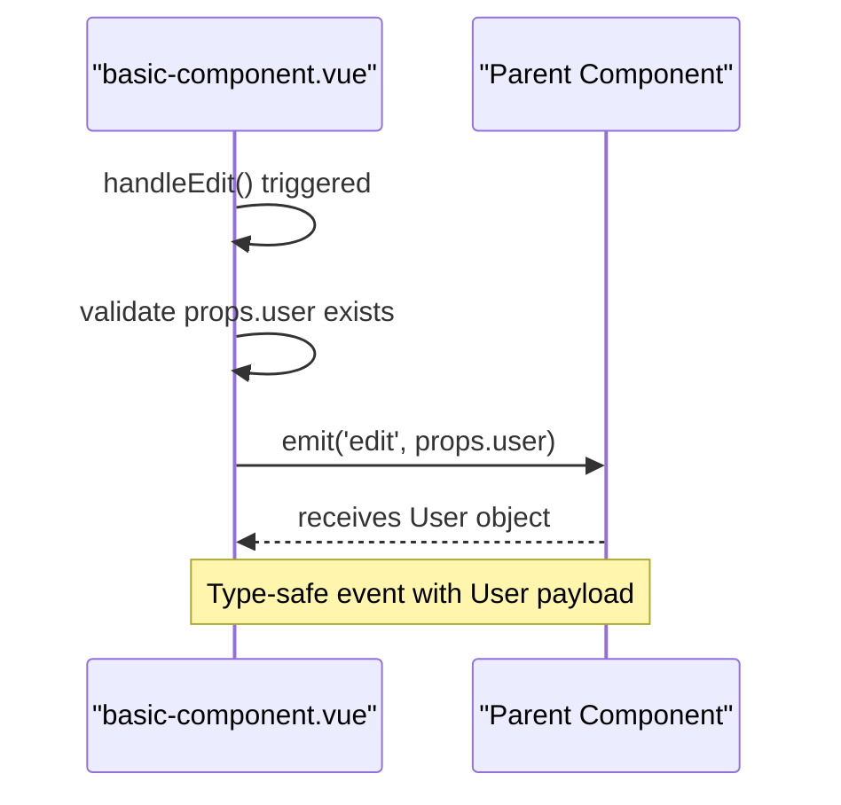
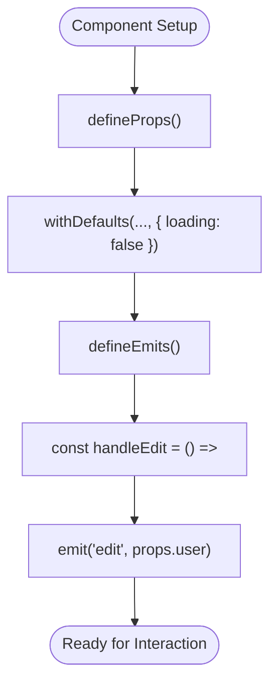
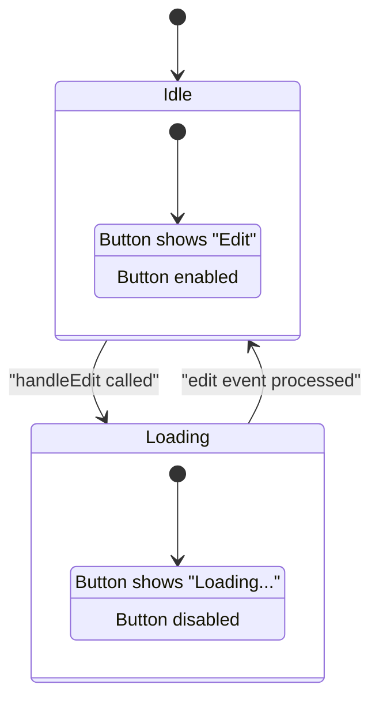

# Basic Component Architecture

<cite>
**Referenced Files in This Document**   
- [basic-component.vue](file://examples/basic-component.vue)
- [form-component.vue](file://examples/form-component.vue)
- [useApi.ts](file://examples/useApi.ts)
</cite>

## Table of Contents
1. [Introduction](#introduction)
2. [Props Typing with TypeScript Interfaces](#props-typing-with-typescript-interfaces)
3. [Type-Safe Event Emission with defineEmits](#type-safe-event-emission-with-defineemits)
4. [Reactive State Management in script setup](#reactive-state-management-in-script-setup)
5. [Default Prop Handling with withDefaults](#default-prop-handling-with-withdefaults)
6. [Loading State and Button Disable Logic](#loading-state-and-button-disable-logic)
7. [Component Reusability and Maintainability Patterns](#component-reusability-and-maintainability-patterns)
8. [Extending the Base Structure](#extending-the-base-structure)
9. [Common Mistakes and Rule Prevention](#common-mistakes-and-rule-prevention)

## Introduction
This document analyzes the `basic-component.vue` file to demonstrate proper Vue 3 Composition API usage with TypeScript. The component serves as a foundational example of type-safe, maintainable Vue development practices that promote reusability and prevent common errors through strict typing and clear API contracts.

**Section sources**
- [basic-component.vue](file://examples/basic-component.vue#L1-L52)

## Props Typing with TypeScript Interfaces
The component demonstrates proper prop typing using TypeScript interfaces within `<script setup lang="ts">`. The `User` interface defines the structure of user data with required properties: id (number), name (string), email (string), and avatar (string). The `Props` interface then specifies the component's input contract, requiring a `user` object of type User and making the `loading` boolean optional with a question mark syntax (`loading?: boolean`). This approach provides compile-time type checking, IDE autocompletion, and clear documentation of expected prop types.

**Diagram sources**
- [basic-component.vue](file://examples/basic-component.vue#L13-L20)

**Section sources**
- [basic-component.vue](file://examples/basic-component.vue#L13-L20)

## Type-Safe Event Emission with defineEmits
The component implements type-safe event emission through the `defineEmits` macro with a properly typed interface. The `Emits` interface defines the event signature `(e: 'edit', user: User): void`, specifying that the 'edit' event emits a User object. This pattern ensures that both the emitting component and parent components receive compile-time validation for event names and payload types, preventing runtime errors from incorrect event usage or malformed payloads.

**Diagram sources**
- [basic-component.vue](file://examples/basic-component.vue#L25-L33)

**Section sources**
- [basic-component.vue](file://examples/basic-component.vue#L25-L33)

## Reactive State Management in script setup
The component leverages Vue 3's `<script setup>` syntax for concise reactive state management. The `props` constant is created by combining `defineProps<Props>()` with `withDefaults()` to establish the component's reactive input state. The `emit` function is defined through `defineEmits<Emits>()` to create a type-safe event dispatch mechanism. The `handleEdit` method demonstrates simple event handling logic that emits the edit event with the current user data, maintaining a clean separation between state definition and business logic.

**Diagram sources**
- [basic-component.vue](file://examples/basic-component.vue#L29-L37)

**Section sources**
- [basic-component.vue](file://examples/basic-component.vue#L29-L37)

## Default Prop Handling with withDefaults
The component properly handles optional props using Vue's `withDefaults` function. By wrapping `defineProps<Props>()` with `withDefaults()`, it establishes default values for optional properties—in this case setting `loading` to false by default. This pattern ensures predictable component behavior when parents don't provide certain props, while still allowing customization when needed. The combination of optional typing (`?`) in the interface and explicit defaults in `withDefaults` creates a robust prop system that's both flexible and reliable.

**Section sources**
- [basic-component.vue](file://examples/basic-component.vue#L29-L31)

## Loading State and Button Disable Logic
The template demonstrates effective use of reactive state for UI control through the loading property. The button's disabled state is bound to `:disabled="loading"`, which prevents interaction during loading states. The button text uses a ternary expression `{{ loading ? 'Loading...' : 'Edit' }}` to provide appropriate feedback. This pattern enhances user experience by visually indicating processing states and preventing duplicate actions, while the reactive binding ensures immediate UI updates when the loading state changes.

**Diagram sources**
- [basic-component.vue](file://examples/basic-component.vue#L8-L10)

**Section sources**
- [basic-component.vue](file://examples/basic-component.vue#L8-L10)

## Component Reusability and Maintainability Patterns
The component architecture promotes reusability and maintainability through several key patterns: type-safe props ensure consistent data contracts across uses; self-contained logic in `<script setup>` reduces cognitive load; clear separation of concerns between template, script, and style sections; and semantic naming that makes the component's purpose immediately clear. These practices allow the component to be reliably used across different contexts while remaining easy to understand and modify.

**Section sources**
- [basic-component.vue](file://examples/basic-component.vue#L1-L52)

## Extending the Base Structure
This base structure can be extended for more complex scenarios. For dynamic styling, computed properties could generate CSS classes based on component state. For accessibility enhancements, ARIA attributes could be added to the button, keyboard navigation support implemented, and screen reader announcements integrated. Additional composables like `useApi` (as seen in `useApi.ts`) could be imported to handle data fetching within the component, while keeping the core architecture intact.

**Section sources**
- [basic-component.vue](file://examples/basic-component.vue#L1-L52)
- [useApi.ts](file://examples/useApi.ts#L1-L41)

## Common Mistakes and Rule Prevention
Common mistakes this pattern prevents include improper typing (using `any` or no types), missing prop validation (not defining required props), and incorrect event emission (typos in event names or wrong payload structures). The rule system enforces these best practices by requiring interface definitions for props and emits, mandating the use of `withDefaults` for optional props, and validating that all reactive state is properly typed. This prevents runtime errors and ensures consistent, predictable component behavior across the codebase.

**Section sources**
- [basic-component.vue](file://examples/basic-component.vue#L13-L37)
- [form-component.vue](file://examples/form-component.vue#L36-L46)