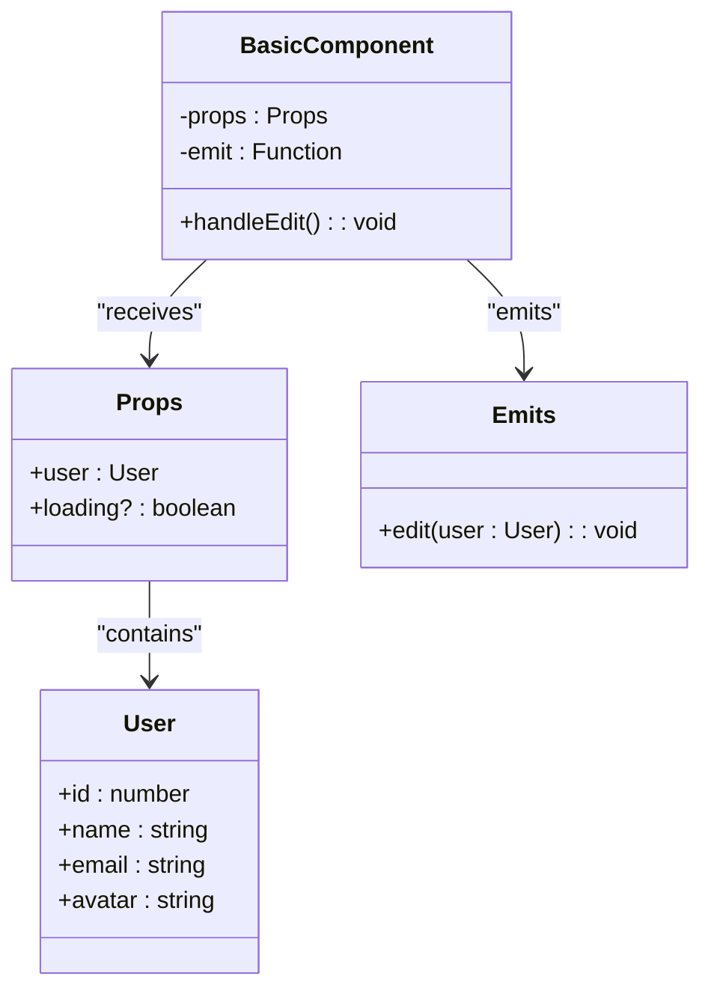
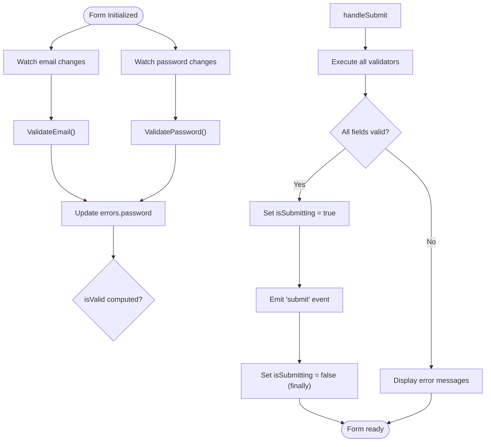
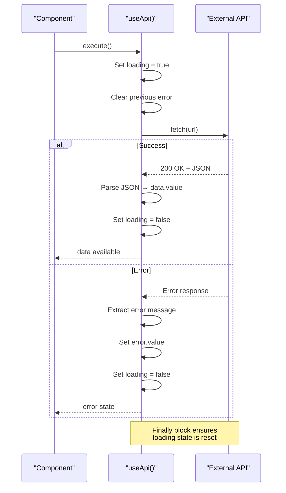

# Examples and Usage Patterns

<cite>
**Referenced Files in This Document**  
- [basic-component.vue](file://examples/basic-component.vue)
- [form-component.vue](file://examples/form-component.vue)
- [useApi.ts](file://examples/useApi.ts)
- [README.md](file://examples/README.md)
</cite>

## Table of Contents
1. [Introduction](#introduction)
2. [Basic Component Pattern](#basic-component-pattern)
3. [Form Component with Validation](#form-component-with-validation)
4. [API Composable Implementation](#api-composable-implementation)
5. [Best Practices Summary](#best-practices-summary)
6. [Common Anti-Patterns to Avoid](#common-anti-patterns-to-avoid)
7. [Extending Patterns for Complex Components](#extending-patterns-for-complex-components)

## Introduction

This document analyzes three core implementation examples that demonstrate proper application of Vue 3 best practices using the Composition API, TypeScript, and modern component patterns. Each example serves as a template for building robust, maintainable components in Vue applications. The analysis focuses on how these implementations align with recommended coding standards, including type safety, reactivity management, accessibility, and separation of concerns.

The examples are designed to be immediately reusable while providing clear guidance for extending their patterns to more complex scenarios. They represent foundational building blocks for Vue 3 development that balance simplicity with production-ready features.

**Section sources**
- [README.md](file://examples/README.md#L1-L30)

## Basic Component Pattern

The `basic-component.vue` demonstrates fundamental Vue 3 composition principles using the `<script setup>` syntax with TypeScript. It implements a clean user card component that receives data through props and communicates with parent components via emits.

Key implementation patterns include:
- **Type-safe props definition**: Using TypeScript interfaces to define expected prop structure
- **Default values**: Applying `withDefaults()` for optional properties
- **Event-driven communication**: Defining explicit emit signatures for predictable component interaction
- **Reactive state management**: Leveraging Vue's reactivity system for dynamic UI updates

The component follows a unidirectional data flow pattern where user interaction triggers events rather than directly modifying external state. This approach enhances testability and makes data flow easier to trace.

**Diagram sources**
- [basic-component.vue](file://examples/basic-component.vue#L15-L30)

**Section sources**
- [basic-component.vue](file://examples/basic-component.vue#L1-L53)

## Form Component with Validation

The `form-component.vue` implements comprehensive form handling patterns with built-in validation and accessibility features. This example showcases how to manage complex reactive state while maintaining code readability and user experience considerations.

Key implementation patterns include:
- **Reactive form state**: Using `reactive()` for multi-field form data
- **Computed validity**: Deriving form validity from individual field states
- **Real-time validation**: Watching input changes to provide immediate feedback
- **Accessibility compliance**: Proper label-input associations and error messaging
- **Loading state management**: Disabling submission during processing

The validation strategy separates concerns by implementing dedicated validation functions for each field type. Error messages are stored in a reactive object that automatically updates the UI when validation rules are violated. The form also handles asynchronous operations safely by wrapping submission logic in try-finally blocks to ensure loading states are properly reset.

**Diagram sources**
- [form-component.vue](file://examples/form-component.vue#L45-L120)

**Section sources**
- [form-component.vue](file://examples/form-component.vue#L1-L145)

## API Composable Implementation

The `useApi.ts` composable demonstrates a reusable pattern for handling API requests with proper state management. This implementation encapsulates common concerns such as loading states, error handling, and data retrieval into a single, importable function.

Key implementation patterns include:
- **Generic typing**: Using TypeScript generics to support different response types
- **Readonly exposure**: Returning readonly refs to prevent external mutation
- **Error boundary protection**: Catching and normalizing errors for consistent handling
- **Reset functionality**: Providing a method to clear state for repeated use
- **Fetch abstraction**: Wrapping native fetch API with Vue reactivity

The composable follows the Single Responsibility Principle by focusing exclusively on API request lifecycle management. It provides a clean interface that can be easily consumed by any component while hiding implementation complexity. The use of readonly wrappers ensures data integrity by preventing consumers from accidentally modifying the internal state.

**Diagram sources**
- [useApi.ts](file://examples/useApi.ts#L3-L37)

**Section sources**
- [useApi.ts](file://examples/useApi.ts#L1-L42)

## Best Practices Summary

These examples collectively demonstrate several key best practices for Vue 3 development:

### Type Safety
All components use TypeScript interfaces to define contracts for props, emits, and data structures. This enables better tooling support, prevents runtime errors, and improves code documentation.

### Composition API Patterns
The examples leverage `<script setup>` syntax with imported Composition API functions (`ref`, `reactive`, `computed`, `watch`) to create readable, modular code that clearly expresses intent.

### State Management
Each example manages state appropriately for its context:
- Basic components use simple props and emits
- Forms use reactive objects for multi-field state
- Async operations use refs with loading/error/data triad

### Accessibility
The form component demonstrates proper accessibility practices:
- Semantic HTML with proper label-input associations
- ARIA-compatible error messaging
- Keyboard navigation support through standard form controls

### Reusability
The composable pattern in `useApi.ts` shows how to create reusable logic that can be shared across multiple components without duplication.

## Common Anti-Patterns to Avoid

When implementing similar patterns, avoid these common mistakes:

### Direct Store Mutation
Never allow child components to directly modify parent state or Vuex/Pinia stores. Always use events or dedicated actions.

### Inline Validation Logic
Avoid placing validation logic directly in templates or event handlers. Extract validation rules into separate functions for reusability and testability.

### Missing Loading States
Always account for loading states in async operations. Failing to do so creates poor user experiences and potential race conditions.

### Overusing Refs
While `ref()` is powerful, prefer `reactive()` for complex objects with multiple properties to avoid excessive `.value` access.

### Ignoring Cleanup
For watchers and subscriptions, always consider cleanup needs. While not needed in these simple examples, complex components should clean up side effects.

## Extending Patterns for Complex Components

These foundational patterns can be extended to handle more complex scenarios:

### Nested Forms
Extend the form pattern by creating sub-components that emit their own events, which the parent form collects and validates holistically.

### Paginated API Calls
Enhance the `useApi` composable with parameters for pagination, sorting, and filtering while maintaining the same core state management.

### Form with File Uploads
Combine the form and API patterns to handle file uploads with progress tracking and validation.

### Real-time Data
Integrate WebSocket connections with the composable pattern, adding connection state and message handling alongside HTTP request management.

These examples serve as starting points that can be adapted and combined to address increasingly sophisticated requirements while maintaining code quality and developer experience.