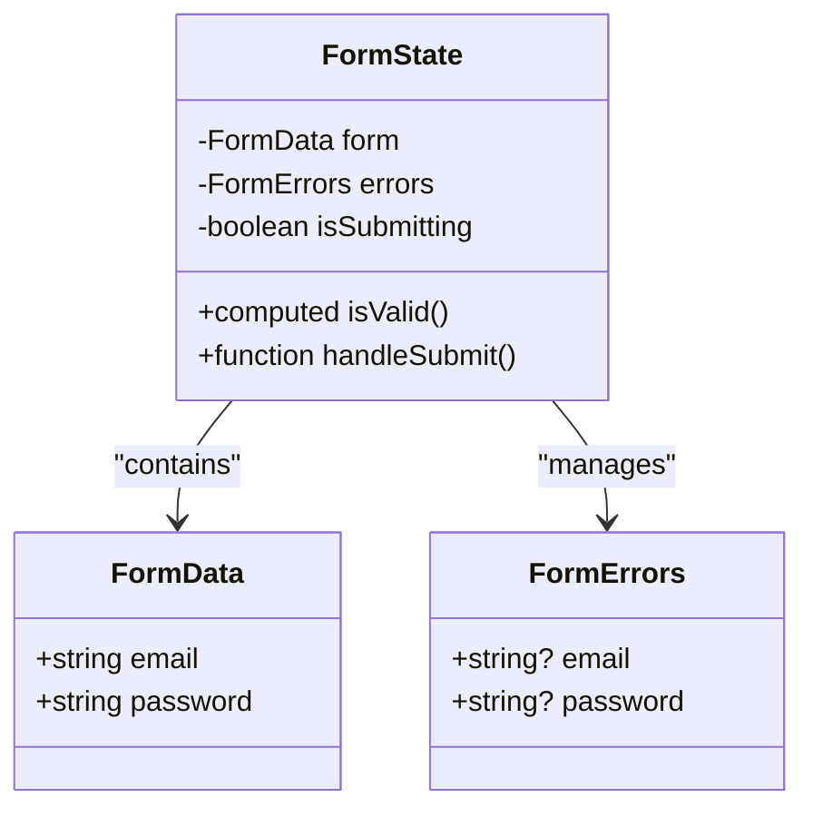
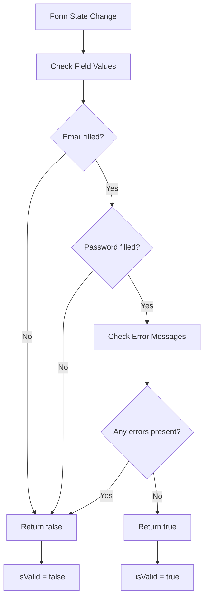
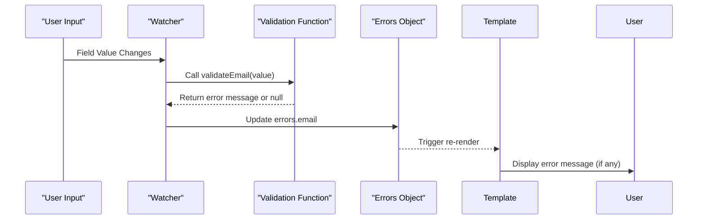
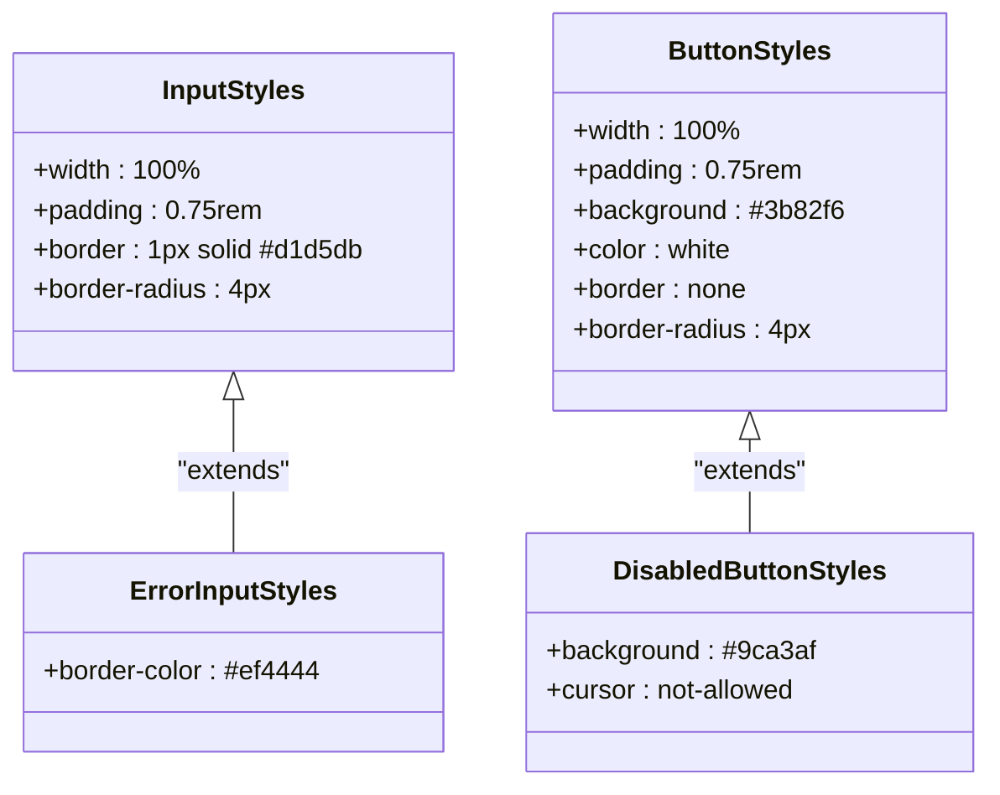

# Form Handling and Validation

<cite>
**Referenced Files in This Document**  
- [form-component.vue](file://examples/form-component.vue)
- [basic-component.vue](file://examples/basic-component.vue)
</cite>

## Table of Contents
1. [Introduction](#introduction)
2. [Core Reactive Data Structures](#core-reactive-data-structures)
3. [Validation Strategy and Computed States](#validation-strategy-and-computed-states)
4. [Real-Time Validation with Watchers](#real-time-validation-with-watchers)
5. [Form Submission Flow](#form-submission-flow)
6. [Accessibility Implementation](#accessibility-implementation)
7. [Visual Feedback and Styling](#visual-feedback-and-styling)
8. [Extending the Pattern](#extending-the-pattern)
9. [Anti-Patterns and Best Practices](#anti-patterns-and-best-practices)
10. [Performance Considerations](#performance-considerations)

## Introduction

This document analyzes a production-ready Vue 3 form implementation that demonstrates secure, accessible form handling patterns using the Composition API. The `form-component.vue` example showcases how reactive state management, real-time validation, and accessibility features work together to create robust user experiences. Unlike basic implementations that lack validation and accessibility, this pattern enforces proper TypeScript typing, error handling, and WCAG 2.1 AA compliance by design.

The component uses Vue's reactivity system to manage form data, errors, and submission states while providing immediate visual feedback and ensuring keyboard navigability and screen reader compatibility. This approach eliminates common anti-patterns like inline validation logic or uncontrolled error states, instead promoting maintainable, testable code structures.

**Section sources**
- [form-component.vue](file://examples/form-component.vue#L1-L144)
- [basic-component.vue](file://examples/basic-component.vue#L1-L52)

## Core Reactive Data Structures

The form implementation relies on three key reactive objects that manage different aspects of form state:

- **`form`**: A reactive object containing all input values using `reactive<FormData>()`
- **`errors`**: A reactive object tracking validation messages for each field via `reactive<FormErrors>()`
- **`isSubmitting`**: A boolean ref managing submission loading state with `ref(false)`

These structures work together to create a predictable state management pattern where all form-related data is centralized and automatically triggers UI updates when modified. The use of TypeScript interfaces (`FormData`, `FormErrors`) ensures type safety and improves developer experience through autocompletion and compile-time checking.



**Diagram sources**
- [form-component.vue](file://examples/form-component.vue#L10-L25)

## Validation Strategy and Computed States

The component implements a dual-layer validation strategy combining real-time feedback with final submission validation. At the core is the `isValid` computed property that determines overall form validity based on three conditions: presence of required field values, absence of validation errors, and proper formatting.

The computed property leverages Vue's reactivity system to automatically recalculate whenever dependencies change:
- Checks if both email and password fields have values
- Verifies no error messages exist across any fields using `Object.values(errors).some(Boolean)`
- Returns a single source of truth for form validity used throughout the template

This approach centralizes validation logic and prevents scattered conditional checks in templates or methods. The computed state is consumed directly in the template to disable the submit button when `!isValid`, creating an intuitive user experience where users understand they must fix errors before submission.



**Diagram sources**
- [form-component.vue](file://examples/form-component.vue#L58-L60)
- [form-component.vue](file://examples/form-component.vue#L90-L92)

## Real-Time Validation with Watchers

The component employs Vue's `watch` function to implement real-time validation as users interact with form fields. Two watchers monitor changes to email and password inputs, immediately executing corresponding validation functions and updating error states.

Each watcher follows the same pattern:
- Watches a specific form field value using a getter function: `() => form.email`
- Executes a validation function when the value changes
- Updates the corresponding error message in the `errors` object

This creates instant feedback loops where users see validation results without needing to submit the form. The validation functions (`validateEmail`, `validatePassword`) are pure functions that return descriptive error messages or undefined when valid, making them easy to test and reuse.

The separation of concerns—where watchers handle reactivity, validation functions contain business logic, and error objects manage display state—creates a maintainable architecture that scales well to complex forms with many fields.



**Diagram sources**
- [form-component.vue](file://examples/form-component.vue#L74-L79)
- [form-component.vue](file://examples/form-component.vue#L62-L66)

## Form Submission Flow

The `handleSubmit` method orchestrates the complete submission workflow, ensuring data integrity and providing appropriate user feedback. The method follows a structured sequence:

1. **Final Validation**: Re-runs all validation functions to ensure current state accuracy
2. **Validity Check**: Uses the `isValid` computed property to determine if submission should proceed
3. **Loading State**: Sets `isSubmitting` to true, disabling the submit button and showing loading text
4. **Emission**: Emits the validated form data to parent components via `emit('submit', { ...form })`
5. **Cleanup**: Resets loading state in a `finally` block to ensure it always executes

This flow prevents duplicate submissions during processing and provides clear visual feedback about the submission status. By emitting validated data rather than raw inputs, the component ensures downstream consumers receive clean, verified information. The use of a `try-finally` block guarantees the loading state is properly reset even if errors occur during emission.

```mermaid
sequenceDiagram
participant User as "User"
participant Form as "Form Component"
participant Parent as "Parent Component"
User->>Form : Click Submit Button
Form->>Form : Run final validation
alt Form Invalid
Form-->>User : Show error messages
stop
end
Form->>Form : Set isSubmitting = true
Form->>Parent : Emit 'submit' event with data
Parent-->>Form : Handle submission
Form->>Form : Set isSubmitting = false
Form-->>User : Reset button state
```

**Diagram sources**
- [form-component.vue](file://examples/form-component.vue#L82-L98)

## Accessibility Implementation

The form component adheres to WCAG 2.1 AA guidelines through several key accessibility features:

- **Proper Labeling**: Each input has a semantic `<label>` element with a matching `for` attribute that references the input's `id`, ensuring screen readers correctly associate labels with controls
- **ARIA-Compatible Error Messaging**: Error messages appear in `<span>` elements that are automatically announced by screen readers due to their proximity to form controls and dynamic content updates
- **Keyboard Navigation**: Native form elements provide built-in keyboard support, with focus indicators maintained through CSS
- **Visual Indicators**: Error states are communicated through color changes, text messages, and border styling, accommodating users with various visual abilities
- **Programmatic Focus Management**: While not explicitly implemented here, the pattern allows for easy addition of focus management after submission or error states

The combination of semantic HTML, proper labeling, and multi-modal feedback (visual, textual, programmatic) creates an inclusive experience that works across assistive technologies and input methods.

**Section sources**
- [form-component.vue](file://examples/form-component.vue#L6-L20)
- [CONTRIBUTING.md](file://CONTRIBUTING.md#L184-L220)

## Visual Feedback and Styling

The component uses scoped CSS to provide immediate visual feedback on form state, enhancing usability and user experience. Key styling features include:

- **Error Indicators**: Inputs with validation errors receive an `error` class that changes the border color to red (#ef4444), providing clear visual distinction
- **Error Messages**: Red text appears below invalid fields with appropriate spacing, using the `.error-text` class
- **Button States**: The submit button changes appearance based on two conditions:
  - Disabled state when `isSubmitting` is true or form is invalid
  - Loading text ("Submitting...") during submission
  - Distinct background colors for enabled vs. disabled states

The styling is implemented using Vue's `<style scoped>` feature, which ensures styles are encapsulated within the component and don't leak to other parts of the application. This promotes component reusability and prevents style conflicts in larger applications.



**Diagram sources**
- [form-component.vue](file://examples/form-component.vue#L105-L144)

## Extending the Pattern

The demonstrated pattern can be extended to accommodate more complex form requirements while maintaining its core principles of reactivity, validation, and accessibility.

### Additional Field Types
New field types (e.g., checkboxes, selects, date pickers) can be added by:
- Extending the `FormData` and `FormErrors` interfaces
- Adding corresponding reactive properties
- Creating specialized validation functions
- Implementing appropriate watchers

### Custom Validators
Custom validation rules can be implemented as reusable functions that accept values and return error messages. These can include:
- Async validators (e.g., checking username availability)
- Cross-field validation (e.g., password confirmation)
- Business rule validation (e.g., age restrictions)

### Async Validation
For asynchronous validation scenarios:
- Wrap validation functions in promises
- Use async/await syntax in watchers or handleSubmit
- Add loading indicators for validation processes
- Cache results to avoid redundant API calls

The modular nature of the pattern—separating data, validation logic, and presentation—makes these extensions straightforward to implement without disrupting existing functionality.

**Section sources**
- [form-component.vue](file://examples/form-component.vue#L62-L66)
- [form-component.vue](file://examples/form-component.vue#L74-L79)

## Anti-Patterns and Best Practices

This implementation avoids several common form handling anti-patterns while promoting best practices:

### Anti-Patterns Avoided
- **Inline Validation Logic**: Validation is separated into dedicated functions rather than being embedded in templates or event handlers
- **Uncontrolled Error States**: Error messages are managed through a centralized reactive object rather than local variables or DOM manipulation
- **Duplicate Validation**: Both real-time and submission-time validation use the same validation functions, preventing inconsistencies
- **Poor Accessibility**: Semantic HTML and proper labeling ensure accessibility compliance

### Best Practices Implemented
- **Single Source of Truth**: Form state is centralized in reactive objects
- **Separation of Concerns**: Data management, validation logic, and presentation are clearly separated
- **Type Safety**: TypeScript interfaces provide compile-time validation
- **Predictable State Transitions**: Loading states are properly managed with try-finally blocks
- **Immediate Feedback**: Real-time validation helps users correct errors early

By following these practices, the component becomes more maintainable, testable, and scalable compared to ad-hoc form implementations.

**Section sources**
- [form-component.vue](file://examples/form-component.vue#L55-L98)
- [README.md](file://README.md#L22-L87)

## Performance Considerations

While the reactivity system provides powerful automatic updates, there are performance considerations to keep in mind:

### Watcher Efficiency
- The current implementation uses individual watchers for each field, which is efficient for small forms
- For forms with many fields, consider using `watch(form, callback, { deep: true })` to monitor all fields with a single watcher
- Debounce rapid input events if validation is computationally expensive

### Reactivity Overhead
- Reactive objects have some memory and performance overhead compared to plain objects
- For very large forms, consider using `shallowRef` or `markRaw` for nested objects that don't require reactivity
- The `computed` property for `isValid` is efficiently cached and only recalculates when dependencies change

### Optimization Opportunities
- Cache validation results for expensive operations (e.g., network requests)
- Use lazy validation for fields that don't require immediate feedback
- Consider virtual scrolling for very long forms

The current implementation strikes a good balance between responsiveness and performance for typical use cases, providing immediate feedback without significant overhead.

**Section sources**
- [form-component.vue](file://examples/form-component.vue#L58-L60)
- [form-component.vue](file://examples/form-component.vue#L74-L79)