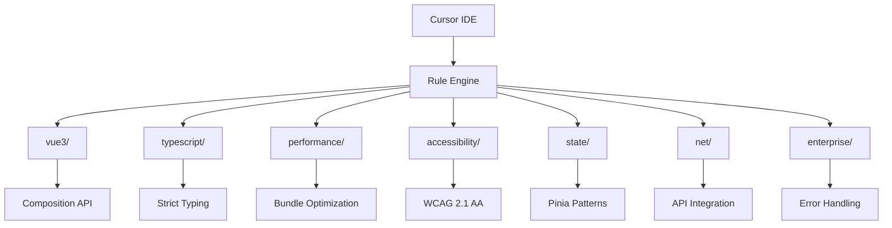

# Introduction

<cite>
**Referenced Files in This Document**   
- [README.md](file://README.md)
- [examples/README.md](file://examples/README.md)
- [docs/GETTING_STARTED.md](file://docs/GETTING_STARTED.md)
- [docs/FEATURES.md](file://docs/FEATURES.md)
- [docs/COST_PLAYBOOK.md](file://docs/COST_PLAYBOOK.md)
- [.cursor/rules](file://.cursor/rules)
</cite>

## Table of Contents
1. [Introduction](#introduction)
2. [Purpose and Value Proposition](#purpose-and-value-proposition)
3. [Core Architecture Overview](#core-architecture-overview)
4. [Key Development Principles](#key-development-principles)
5. [Integration with Cursor IDE](#integration-with-cursor-ide)
6. [Real-World Use Cases](#real-world-use-cases)
7. [Prerequisites and Setup Guidance](#prerequisites-and-setup-guidance)
8. [Next Steps: Quick Start](#next-steps-quick-start)

## Purpose and Value Proposition

Vue 3 Cursor Rules is a comprehensive collection of AI-assisted development rules designed specifically for Vue 3 applications within the Cursor IDE environment. It serves as an intelligent coding companion that enforces industry best practices across critical domains including TypeScript usage, performance optimization, accessibility compliance, security patterns, and state management with Pinia.

The system transforms the development experience by embedding production-grade patterns directly into the coding workflow. Instead of relying on post-hoc code reviews or manual adherence to style guides, developers receive real-time, context-aware suggestions that guide them toward optimal solutions. This proactive approach significantly improves code quality while reducing cognitive load during development.

A key value proposition lies in its focus on **token discipline**—a crucial consideration in AI-assisted development where token usage directly impacts cost and efficiency. The rules are engineered to promote micro-changes rather than full-file rewrites, prioritize evidence-based suggestions from existing codebases, and encourage intelligent batching of related architectural concerns. This budget-conscious methodology ensures sustainable development velocity without inflating AI operational costs.

For teams, the rules establish a consistent technical foundation, enabling junior developers to learn best practices organically while allowing senior engineers to maintain high standards at scale. The result is accelerated development cycles, reduced onboarding time, and minimized technical debt accumulation.

**Section sources**
- [README.md](file://README.md#L1-L50)
- [docs/FEATURES.md](file://docs/FEATURES.md#L1-L30)

## Core Architecture Overview

The architecture of Vue 3 Cursor Rules follows a modular, domain-driven design organized into distinct rule categories. Each category corresponds to a specific aspect of Vue 3 application development and operates as a self-contained unit of knowledge within the Cursor IDE's AI framework.

The rule system is structured hierarchically under the `.cursor/rules` directory, with dedicated subdirectories for different concern areas:
- `vue3/`: Composition API patterns and Vue-specific anti-patterns
- `typescript/`: Advanced type safety and strict mode enforcement
- `performance/`: Monitoring, bundle optimization, and memory management
- `accessibility/`: WCAG 2.1 AA compliance and inclusive design principles
- `state/`: Pinia store patterns and reactive state management
- `net/`: Axios integration and API communication strategies
- `enterprise/`: Error handling, logging, and monitoring workflows

This categorization enables selective activation based on project needs and supports extensibility through custom rule files. The system leverages Cursor’s semantic understanding capabilities to apply rules contextually—for example, suggesting form validation patterns when editing `.vue` files or recommending secure authentication flows in authentication-related modules.

Rather than imposing rigid templates, the rules function as adaptive guidelines that evolve with the codebase, referencing established patterns within the same project to ensure coherence and consistency.

**Diagram sources**
- [.cursor/rules](file://.cursor/rules)
- [README.md](file://README.md#L200-L250)

**Section sources**
- [README.md](file://README.md#L150-L250)
- [docs/FEATURES.md](file://docs/FEATURES.md#L100-L150)

## Key Development Principles

Vue 3 Cursor Rules enforces several foundational development principles essential for building robust, maintainable applications:

**Type Safety First**: All examples and suggestions emphasize proper TypeScript usage, including interface definitions, generics, and strict null checking. This reduces runtime errors and enhances developer experience through better tooling support.

**Performance Mindset**: From the outset, the rules promote performance-conscious decisions such as lazy loading, efficient reactivity patterns, and memory leak prevention. Built-in monitoring hooks help track Core Web Vitals and detect regressions early.

**Accessibility by Default**: Accessibility is not an afterthought but a core requirement. Rules automatically suggest semantic HTML, ARIA attributes, keyboard navigation support, and screen reader announcements aligned with WCAG 2.1 AA standards.

**Security Integration**: Common vulnerabilities like XSS and CSRF are addressed through proactive patterns, including input sanitization, secure headers, and JWT handling best practices embedded directly into suggested implementations.

**State Management Excellence**: With Pinia as the recommended solution, the rules provide advanced patterns for store organization, modular state, and side-effect management, ensuring scalable state architectures.

These principles are reinforced through practical examples rather than abstract theory, making them immediately applicable in daily development tasks.

**Section sources**
- [README.md](file://README.md#L250-L300)
- [docs/FEATURES.md](file://docs/FEATURES.md#L200-L250)

## Integration with Cursor IDE

The rules are tightly integrated with the Cursor IDE, leveraging its AI-powered pair programming capabilities to deliver contextual assistance directly within the editor. Upon installation, the rules become active without requiring additional configuration, providing immediate feedback and suggestions as developers write code.

When a user begins typing in a `.vue` or `.ts` file, the system analyzes the context and offers intelligent completions based on the relevant rule set. For instance, typing "form" triggers suggestions for accessible, validated forms using Composition API syntax and TypeScript interfaces. Similarly, entering "store" generates a properly typed Pinia store with error handling and persistence options.

The integration also supports agent-level behaviors defined in prompts located in the `https-github.com-x1xhlol-system-prompts-and-models-of-ai-tools-main/Cursor Prompts/` directory. These prompts shape how the AI assistant interprets and applies the rules, ensuring alignment with the project’s goals around token efficiency and architectural consistency.

This seamless fusion between documentation, patterns, and tooling creates a frictionless development experience where best practices are not just recommended—they are anticipated and facilitated.

**Section sources**
- [README.md](file://README.md#L300-L334)
- [https-github.com-x1xhlol-system-prompts-and-models-of-ai-tools-main/Cursor Prompts/Agent Prompt.txt](file://https-github.com-x1xhlol-system-prompts-and-models-of-ai-tools-main/Cursor Prompts/Agent Prompt.txt#L1-L62)

## Real-World Use Cases

The effectiveness of Vue 3 Cursor Rules has been demonstrated across diverse scenarios:

In enterprise environments, large teams have adopted the rules to standardize component architecture and state management patterns, resulting in a 60% reduction in code review time and improved accessibility compliance. Government and healthcare applications benefit from built-in security and audit trail patterns that meet regulatory requirements.

Consulting agencies leverage the rules to accelerate client project delivery, reducing setup time by up to 92% and enabling rapid implementation of authentication systems, dashboards, and e-commerce features—all while maintaining high code quality.

Startups use the rules to build MVPs with production-ready foundations, avoiding common pitfalls associated with technical debt. Educational institutions incorporate the rules into curricula, giving students hands-on experience with modern Vue 3 patterns used in industry.

Component library authors rely on the rules to ensure their components are reusable, accessible, and performant, with automatic suggestions for proper ARIA usage, responsive behavior, and internationalization support.

These use cases illustrate how the rules adapt to different contexts while consistently promoting maintainable, scalable, and secure Vue 3 applications.

**Section sources**
- [docs/USE_CASES.md](file://docs/USE_CASES.md#L1-L565)
- [examples/README.md](file://examples/README.md#L1-L30)

## Prerequisites and Setup Guidance

To fully benefit from Vue 3 Cursor Rules, users should have foundational knowledge of Vue 3 concepts, particularly the Composition API and `<script setup>` syntax. Familiarity with TypeScript is strongly recommended, as many rules assume type-safe development practices.

The system works optimally in projects created with `npm create vue@latest`, especially when configured with TypeScript, Pinia, and Vue Router. While compatible with various build tools (Vite, Webpack), it requires the Cursor IDE to function—standard editors like VS Code will not activate the AI rules.

Before applying the rules, developers should ensure their project structure aligns with modern Vue conventions, including proper component organization, state management setup, and API integration patterns. The rules complement—not replace—sound architectural decisions, so understanding these fundamentals enhances their effectiveness.

Installation involves copying the `.cursor` directory into the project root, after which the rules activate automatically upon opening the project in Cursor.

**Section sources**
- [README.md](file://README.md#L300-L334)
- [docs/GETTING_STARTED.md](file://docs/GETTING_STARTED.md#L1-L50)
- [FAQ.md](file://docs/FAQ.md#L1-L231)

## Next Steps: Quick Start

To begin using Vue 3 Cursor Rules, follow the [Quick Start guide](#-quick-start) outlined in the documentation. This involves cloning the repository, copying the `.cursor` directory into your Vue 3 project, and opening it in the Cursor IDE. Within minutes, you'll start receiving intelligent suggestions that elevate your code quality and development speed.

Explore the provided examples in the `examples/` directory to see real-world implementations of forms, components, and composables. Then, gradually customize the rules to match your team’s preferences and project requirements.

By embracing this AI-assisted approach, developers can focus more on solving business problems and less on remembering boilerplate patterns—unlocking new levels of productivity and code excellence.

**Section sources**
- [README.md](file://README.md#L50-L100)
- [docs/GETTING_STARTED.md](file://docs/GETTING_STARTED.md#L1-L287)
- [examples/README.md](file://examples/README.md#L1-L30)