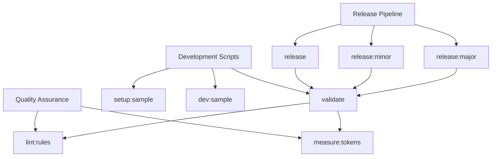
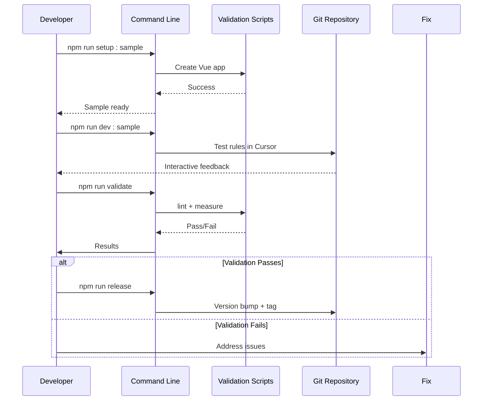

# Configuration Options

<cite>
**Referenced Files in This Document **  
- [package.json](file://package.json)
- [scripts/lint-rules.mjs](file://scripts/lint-rules.mjs)
- [scripts/measure-tokens.mjs](file://scripts/measure-tokens.mjs)
- [README.md](file://README.md)
- [CONTRIBUTING.md](file://CONTRIBUTING.md)
</cite>

## Table of Contents
1. [Introduction](#introduction)
2. [Engine Requirements](#engine-requirements)
3. [NPM Scripts Overview](#npm-scripts-overview)
4. [Validation and Quality Assurance Scripts](#validation-and-quality-assurance-scripts)
5. [Sample Application Management Scripts](#sample-application-management-scripts)
6. [Release Automation Scripts](#release-automation-scripts)
7. [Distribution Configuration: Files Array](#distribution-configuration-files-array)
8. [Practical Usage Examples](#practical-usage-examples)
9. [Troubleshooting Common Issues](#troubleshooting-common-issues)
10. [Integration with Development Workflows](#integration-with-development-workflows)

## Introduction
This document provides comprehensive documentation for all configuration options defined in the `package.json` file of the Vue 3 Cursor Rules project. It details each npm script, engine requirement, and distribution setting that governs development, testing, validation, and release processes. The configuration is designed to ensure code quality, maintain performance discipline, and streamline contributor workflows.

The project leverages modern Node.js tooling to automate critical development tasks, from rule validation to sample application setup and versioned releases. All configurations are optimized for production-ready Vue 3 development within the Cursor IDE environment.

**Section sources**
- [package.json](file://package.json#L1-L61)
- [README.md](file://README.md#L0-L334)

## Engine Requirements
The project specifies strict engine requirements to ensure compatibility and consistent behavior across development environments:

```json
"engines": {
  "node": ">=16.0.0",
  "npm": ">=8.0.0"
}
```

### Node.js (>=16.0.0)
Node.js version 16 or higher is required due to:
- Full support for ES modules (`"type": "module"` in package.json)
- Improved V8 engine performance and memory management
- Enhanced security features and long-term support (LTS) status
- Compatibility with modern JavaScript syntax used in `.mjs` scripts

### npm (>=8.0.0)
npm version 8 or higher ensures:
- Proper handling of workspaces and nested dependencies
- Support for `--yes` flag in automation scripts
- Improved peer dependency resolution
- Better audit and security scanning capabilities

These constraints prevent execution in outdated environments and help maintain a high standard of code quality and security.

**Section sources**
- [package.json](file://package.json#L58-L61)

## NPM Scripts Overview
The `scripts` field in `package.json` defines a comprehensive suite of commands for development, validation, testing, and release management. These scripts form the backbone of the project's automation strategy.



**Diagram sources **
- [package.json](file://package.json#L40-L57)

**Section sources**
- [package.json](file://package.json#L40-L57)

## Validation and Quality Assurance Scripts
These scripts ensure rule integrity, token efficiency, and overall quality before any release.

### lint:rules
Validates the structure and size of all rule files in the `.cursor/rules` directory.

**Purpose**: Ensures no single rule file exceeds 1,000 lines, promoting modularity and readability.

**Execution Context**: Runs during local development and as part of the validation pipeline.

**Implementation Details**: 
- Recursively walks through `.cursor/rules` directory
- Checks line count of each `.mdc` file
- Exits with error if any file exceeds limit

[SPEC SYMBOL](file://scripts/lint-rules.mjs#L1-L25)

### measure:tokens
Analyzes total character count across all rule files to estimate AI token usage.

**Purpose**: Promotes cost-effective development by encouraging compact rulesets.

**Execution Context**: Used during optimization phases and pre-release checks.

**Output Includes**:
- Approximate total characters across all rules
- Recommendation to prefer agent-select rules over broad patterns

[SPEC SYMBOL](file://scripts/measure-tokens.mjs#L1-L19)

### validate
Composite script that runs both quality checks sequentially.

**Command**: `npm run lint:rules && npm run measure:tokens`

**Integration**: Automatically executed before any release operation to enforce quality gates.

**Section sources**
- [package.json](file://package.json#L43)
- [scripts/lint-rules.mjs](file://scripts/lint-rules.mjs#L1-L25)
- [scripts/measure-tokens.mjs](file://scripts/measure-tokens.mjs#L1-L19)

## Sample Application Management Scripts
These scripts facilitate testing and demonstration of rules using a real Vue 3 + TypeScript application.

### setup:sample
Automatically creates a minimal Vue 3 + TypeScript application for testing.

**Command**: `cd samples && npm create vue@latest minimal-vue-app -- --template vue-ts && cd minimal-vue-app && npm install`

**Use Case**: Initial setup of the testing playground for contributors.

**Best Practice**: Always run this first when starting contribution work.

[SPEC SYMBOL](file://package.json#L49)

### dev:sample
Starts the development server for the sample application.

**Command**: `cd samples/minimal-vue-app && npm run dev`

**Purpose**: Allows interactive testing of rules within Cursor IDE.

**Workflow Integration**: After setting up the sample app, use this to launch it.

[SPEC SYMBOL](file://package.json#L48)

### test:sample
Runs tests on the sample application.

**Command**: `cd samples/minimal-vue-app && npm test`

**Purpose**: Verifies that implemented rules do not break standard Vue application behavior.

**Testing Strategy**: Part of manual verification process for new or modified rules.

[SPEC SYMBOL](file://package.json#L46)

**Section sources**
- [package.json](file://package.json#L46-L49)
- [CONTRIBUTING.md](file://CONTRIBUTING.md#L0-L262)

## Release Automation Scripts
These scripts automate versioning and release preparation with built-in quality checks.

### release
Prepares a patch version release after validating all rules.

**Command**: `npm run validate && npm version patch`

**Process Flow**:
1. Run full validation (lint + token measurement)
2. If successful, increment patch version
3. Create git commit and tag automatically

[SPEC SYMBOL](file://package.json#L50)

### release:minor
Creates a minor version release.

**Command**: `npm run validate && npm version minor`

**Use Case**: Introducing backward-compatible features or improvements.

[SPEC SYMBOL](file://package.json#L51)

### release:major
Creates a major version release.

**Command**: `npm run validate && npm version major`

**Use Case**: Implementing breaking changes or significant architectural updates.

[SPEC SYMBOL](file://package.json#L52)

All release scripts enforce the principle that only validated, high-quality code can be versioned.

**Section sources**
- [package.json](file://package.json#L50-L52)
- [CONTRIBUTING.md](file://CONTRIBUTING.md#L0-L262)

## Distribution Configuration: Files Array
The `files` array specifies which directories and files are included when the package is published.

```json
"files": [
  ".cursor/",
  "docs/",
  "examples/",
  "scripts/",
  "README.md",
  "LICENSE",
  "CONTRIBUTING.md"
]
```

### Inclusion Rationale
- **`.cursor/`**: Contains all rule definitions essential to the package's purpose
- **`docs/`**: Documentation for users and contributors
- **`examples/`**: Practical demonstrations of rule applications
- **`scripts/`**: Required for post-install validation and development
- **`README.md`**: Project overview and quick start guide
- **`LICENSE`**: Legal terms of use
- **`CONTRIBUTING.md`**: Guidelines for community contributions

This selective inclusion keeps the published package focused and efficient, excluding development-only assets like test fixtures or temporary files.

**Section sources**
- [package.json](file://package.json#L30-L38)
- [README.md](file://README.md#L0-L334)

## Practical Usage Examples
### Extending Scripts for CI/CD
Add pre-push hook to enforce validation:
```json
"scripts": {
  "prepush": "npm run validate",
  "prepare": "husky install"
}
```

### Customizing for Different Environments
Create environment-specific scripts:
```json
"scripts": {
  "validate:strict": "node scripts/lint-rules.mjs --max-lines=500",
  "analyze:cost": "node scripts/measure-tokens.mjs > token-report.txt"
}
```

### Integration with Editor Tooling
Configure VS Code tasks to run key scripts:
```json
{
  "label": "Validate Rules",
  "type": "shell",
  "command": "npm run validate"
}
```

These extensions demonstrate how the base configuration can be adapted to specific team workflows or continuous integration systems.

**Section sources**
- [package.json](file://package.json#L40-L57)
- [README.md](file://README.md#L0-L334)

## Troubleshooting Common Issues
### Missing Dependencies
**Symptom**: `npm create vue@latest` fails during `setup:sample`
**Solution**: Ensure npm >=8.0.0 and clear cache:
```bash
npm cache clean --force
npm install -g npm@latest
```

### Version Mismatch Errors
**Symptom**: "Unsupported engine" warnings
**Solution**: Use Node Version Manager (nvm):
```bash
nvm install 16
nvm use 16
```

### Script Execution Failures
**Symptom**: Permission errors on Windows
**Solution**: Run terminal as administrator or enable script execution:
```powershell
Set-ExecutionPolicy -ExecutionPolicy RemoteSigned -Scope CurrentUser
```

### Token Measurement Inconsistencies
**Symptom**: Unexpectedly high character counts
**Solution**: Check for hidden Unicode characters or encoding issues in `.mdc` files using a hex editor.

Always verify Node and npm versions match the engine requirements before reporting issues.

**Section sources**
- [package.json](file://package.json#L58-L61)
- [CONTRIBUTING.md](file://CONTRIBUTING.md#L0-L262)

## Integration with Development Workflows
The configuration seamlessly integrates into contributor workflows as follows:



**Diagram sources **
- [package.json](file://package.json#L40-L57)
- [CONTRIBUTING.md](file://CONTRIBUTING.md#L0-L262)

This workflow ensures that every contribution passes automated quality gates before being released, maintaining the project's high standards for Vue 3 development excellence.