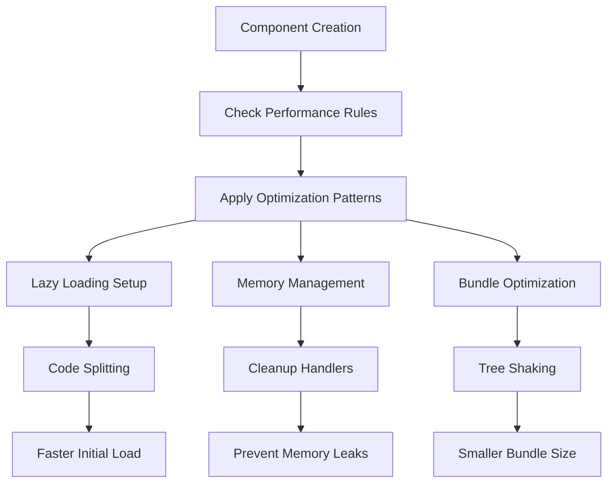
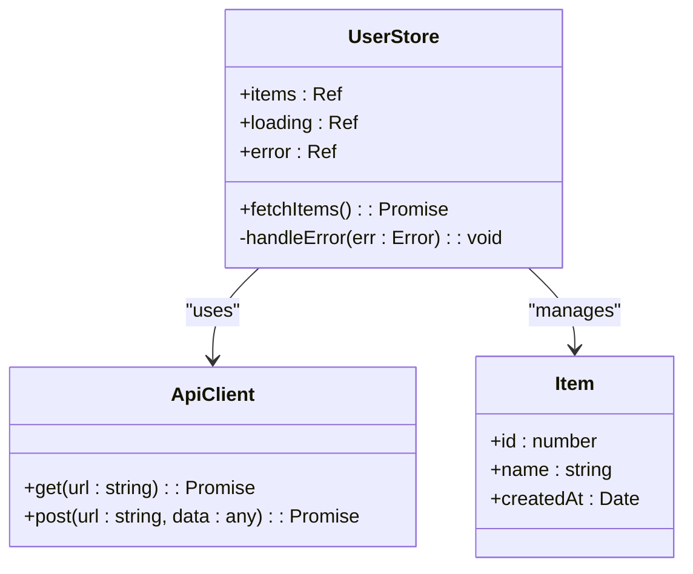
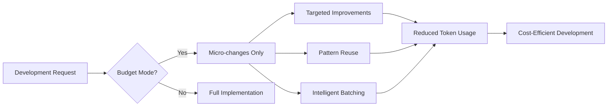

# Features Overview

<cite>
**Referenced Files in This Document**   
- [FEATURES.md](file://docs/FEATURES.md)
- [README.md](file://README.md)
- [package.json](file://package.json)
- [examples/basic-component.vue](file://examples/basic-component.vue)
- [examples/form-component.vue](file://examples/form-component.vue)
- [examples/useApi.ts](file://examples/useApi.ts)
- [.cursor/rules/vue3/](file://.cursor/rules/vue3/)
- [.cursor/rules/typescript/](file://.cursor/rules/typescript/)
- [.cursor/rules/performance/](file://.cursor/rules/performance/)
- [.cursor/rules/accessibility/](file://.cursor/rules/accessibility/)
- [.cursor/rules/state/](file://.cursor/rules/state/)
- [.cursor/rules/net/](file://.cursor/rules/net/)
- [.cursor/rules/i18n/](file://.cursor/rules/i18n/)
- [.cursor/rules/budget-optimized/](file://.cursor/rules/budget-optimized/)
</cite>

## Table of Contents
1. [Vue 3 Patterns](#vue-3-patterns)
2. [TypeScript Safety](#typescript-safety)
3. [Performance Optimization](#performance-optimization)
4. [Accessibility Compliance](#accessibility-compliance)
5. [Security Best Practices](#security-best-practices)
6. [State Management with Pinia](#state-management-with-pinia)
7. [API Integration via Axios](#api-integration-via-axios)
8. [Internationalization with Vue I18n](#internationalization-with-vue-i18n)
9. [Budget Optimization for AI Token Usage](#budget-optimization-for-ai-token-usage)
10. [Cursor IDE Integration Capabilities](#cursor-ide-integration-capabilities)

## Vue 3 Patterns

The Vue 3 patterns implemented in this ruleset leverage the Composition API and `<script setup>` syntax to create clean, reusable, and testable components. These patterns follow SOLID principles and modern architectural best practices for enterprise-grade applications.

Key implementation aspects include:
- **Component Architecture**: Clean separation between presentational and container components
- **Composition Functions**: Reusable logic encapsulated in composables
- **Advanced Patterns**: Factory patterns, dependency injection, and state machines
- **Lifecycle Management**: Proper cleanup of watchers, timers, and event listeners

The rules automatically generate production-ready component scaffolds with proper TypeScript interfaces, accessibility attributes, and performance optimizations.

**Section sources**
- [FEATURES.md](file://docs/FEATURES.md#L1-L325)
- [examples/basic-component.vue](file://examples/basic-component.vue#L1-L52)
- [examples/form-component.vue](file://examples/form-component.vue#L1-L144)

## TypeScript Safety

The TypeScript safety features ensure type-safe development throughout the codebase, preventing common runtime errors and improving developer experience. The rules enforce strict TypeScript configuration and provide advanced typing patterns.

Implementation scope includes:
- **Strict Type Checking**: Enforced strict mode with comprehensive type coverage
- **Advanced Types**: Branded types, discriminated unions, and type guards
- **Interface Definitions**: Complete interface contracts for props, emits, and data structures
- **Runtime Validation**: Type checking at runtime boundaries

These patterns align with production-ready development standards by catching type-related errors at compile time rather than runtime, significantly reducing bugs in production environments.

**Section sources**
- [FEATURES.md](file://docs/FEATURES.md#L1-L325)
- [examples/basic-component.vue](file://examples/basic-component.vue#L1-L52)
- [examples/form-component.vue](file://examples/form-component.vue#L1-L144)

## Performance Optimization

Performance optimization is built into the core of these rules, focusing on both application performance and development efficiency. The patterns address bundle size, rendering performance, and memory management.

Key optimization strategies:
- **Lazy Loading**: Automatic code splitting suggestions for routes and components
- **Memory Management**: Cleanup patterns for reactive references and event listeners
- **Bundle Optimization**: Tree-shaking friendly patterns and import analysis
- **Reactive Efficiency**: Optimized computed properties and watcher implementations

The rules include performance monitoring hooks that track render times, memory usage, and Core Web Vitals, ensuring applications meet performance budgets from day one.

**Diagram sources**
- [FEATURES.md](file://docs/FEATURES.md#L1-L325)
- [.cursor/rules/performance/](file://.cursor/rules/performance/)

**Section sources**
- [FEATURES.md](file://docs/FEATURES.md#L1-L325)
- [README.md](file://README.md#L184-L212)

## Accessibility Compliance

Accessibility compliance ensures all generated code meets WCAG 2.1 AA standards, making applications usable for people with disabilities. The rules automatically include accessibility features in component scaffolds.

Implemented compliance features:
- **Semantic HTML**: Proper heading hierarchy and ARIA landmarks
- **Keyboard Navigation**: Full keyboard accessibility and focus management
- **Screen Reader Support**: ARIA attributes and live regions
- **Color Contrast**: Sufficient contrast ratios for text and interactive elements

The patterns include accessibility helpers for common scenarios like modal dialogs, form validation, and dynamic content updates, ensuring consistent implementation across the codebase.

**Section sources**
- [FEATURES.md](file://docs/FEATURES.md#L1-L325)
- [CONTRIBUTING.md](file://CONTRIBUTING.md#L184-L220)
- [examples/form-component.vue](file://examples/form-component.vue#L1-L144)

## Security Best Practices

Security best practices are integrated into the development workflow, preventing common vulnerabilities and ensuring secure application architecture. The rules focus on proactive security measures rather than reactive fixes.

Key security implementations:
- **XSS Prevention**: Template security and input sanitization patterns
- **CSRF Protection**: Token validation and secure header configurations
- **Input Validation**: Comprehensive validation for all user inputs
- **Authentication Security**: Secure JWT handling and session management

These patterns align with production-ready standards by addressing security concerns at the code generation level, reducing the attack surface of applications before they reach production.

**Section sources**
- [FEATURES.md](file://docs/FEATURES.md#L1-L325)
- [README.md](file://README.md#L184-L212)

## State Management with Pinia

State management with Pinia follows advanced patterns for predictable and maintainable application state. The rules promote best practices for store organization, data fetching, and error handling.

Implementation scope includes:
- **Store Structure**: Clear separation of concerns within stores
- **Data Fetching**: Integrated loading, error, and caching states
- **Optimistic Updates**: UI updates before API confirmation
- **Real-time Sync**: WebSocket integration patterns

The patterns support advanced use cases like store composition, modular stores, and server-side state hydration, making them suitable for complex enterprise applications.

**Diagram sources**
- [examples/useApi.ts](file://examples/useApi.ts#L1-L41)
- [.cursor/rules/state/](file://.cursor/rules/state/)

**Section sources**
- [FEATURES.md](file://docs/FEATURES.md#L1-L325)
- [examples/useApi.ts](file://examples/useApi.ts#L1-L41)

## API Integration via Axios

API integration patterns using Axios provide robust solutions for HTTP communication with proper error handling, retry mechanisms, and caching strategies. The rules generate complete API service templates.

Key integration features:
- **Request Configuration**: Default headers, base URLs, and interceptors
- **Error Handling**: Comprehensive error taxonomy and recovery strategies
- **Retry Logic**: Configurable retry attempts with exponential backoff
- **Caching Strategies**: Client-side caching with TTL and invalidation

The patterns ensure reliable API communication by handling network failures gracefully and providing meaningful feedback to users during loading and error states.

**Section sources**
- [FEATURES.md](file://docs/FEATURES.md#L1-L325)
- [examples/useApi.ts](file://examples/useApi.ts#L1-L41)
- [.cursor/rules/net/](file://.cursor/rules/net/)

## Internationalization with Vue I18n

Internationalization patterns with Vue I18n enable building applications that support multiple languages and regional settings. The rules provide templates for managing translations and locale-specific content.

Implementation aspects:
- **Message Structure**: Organized translation files with namespaces
- **Dynamic Loading**: Lazy loading of language packs
- **Pluralization**: Proper handling of plural forms
- **Date/Number Formatting**: Locale-aware formatting

These patterns ensure applications can easily expand to global markets while maintaining consistent user experience across different languages and regions.

**Section sources**
- [FEATURES.md](file://docs/FEATURES.md#L1-L325)
- [.cursor/rules/i18n/](file://.cursor/rules/i18n/)

## Budget Optimization for AI Token Usage

Budget optimization focuses on minimizing AI token consumption while maximizing development efficiency. The rules promote micro-changes and intelligent batching to reduce costs.

Key budget optimization strategies:
- **Token Discipline**: Small, targeted changes instead of full rewrites
- **Intelligent Batching**: Grouping related changes by architectural concern
- **Pattern Reuse**: Leveraging existing codebase patterns
- **Evidence-Based Suggestions**: Referencing established patterns

This approach aligns with production-ready standards by making AI-assisted development cost-effective and sustainable for long-term projects.

**Diagram sources**
- [FEATURES.md](file://docs/FEATURES.md#L1-L325)
- [.cursor/rules/budget-optimized/](file://.cursor/rules/budget-optimized/)

**Section sources**
- [FEATURES.md](file://docs/FEATURES.md#L1-L325)
- [README.md](file://README.md#L132-L144)

## Cursor IDE Integration Capabilities

The Cursor IDE integration enables unique capabilities that transform the development experience. The rules work seamlessly with Cursor's AI-powered features to provide context-aware suggestions.

Unique capabilities enabled by Cursor integration:
- **Context-Aware Suggestions**: Intelligent completions based on project structure
- **Instant Setup**: Zero configuration with auto-detection of project setup
- **Framework Agnostic**: Works with any Vue 3 UI framework
- **Real-time Feedback**: Immediate feedback on code quality and best practices

The integration allows developers to focus on solving business problems rather than boilerplate code, significantly accelerating development velocity while maintaining high code quality standards.

**Section sources**
- [FEATURES.md](file://docs/FEATURES.md#L1-L325)
- [README.md](file://README.md#L0-L212)
- [package.json](file://package.json#L0-L61)