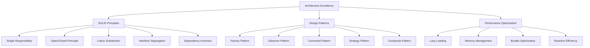
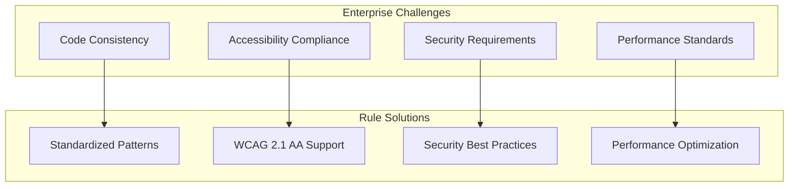
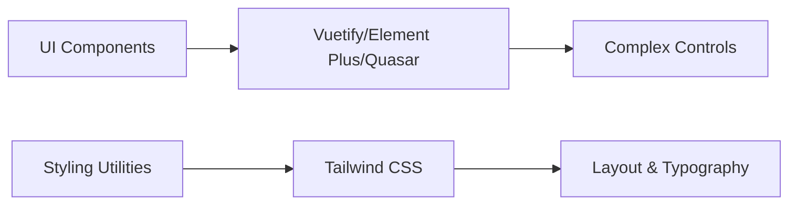

# Reference Materials

<cite>
**Referenced Files in This Document**   
- [FEATURES.md](file://docs/FEATURES.md)
- [USE_CASES.md](file://docs/USE_CASES.md)
- [FAQ.md](file://docs/FAQ.md)
- [UI_KITS_MIXING.md](file://docs/UI_KITS_MIXING.md)
- [package.json](file://package.json)
</cite>

## Table of Contents
1. [Core Capabilities](#core-capabilities)
2. [Application Scenarios](#application-scenarios)
3. [Frequently Asked Questions](#frequently-asked-questions)
4. [Configuration Options](#configuration-options)
5. [UI Framework Integration](#ui-framework-integration)
6. [Edge Cases and Limitations](#edge-cases-and-limitations)

## Core Capabilities

The Vue 3 Cursor Rules provide a comprehensive suite of features designed to accelerate development, improve code quality, and enforce best practices across Vue 3 projects.

### Development Acceleration Features

The rules significantly reduce time spent on common development tasks through intelligent code suggestions and pattern recognition. Key acceleration capabilities include:

- **Smart Component Generation**: Automatic creation of complete Vue components with proper TypeScript interfaces, accessibility attributes, and scoped styling
- **Advanced State Management**: Instant generation of Pinia stores with proper error handling, loading states, and reactive patterns
- **API Integration Patterns**: Comprehensive API handling with built-in retry mechanisms, caching, error reporting, and performance monitoring
- **Testing Excellence**: Pre-built testing patterns for unit, component, integration, and end-to-end tests with accessibility validation

These capabilities enable developers to create new components in seconds rather than minutes, implement form validation in minutes instead of tens of minutes, and integrate APIs with minimal boilerplate code.

**Section sources**
- [FEATURES.md](file://docs/FEATURES.md#L20-L325)

### Architecture and Design Principles

The rules incorporate industry-standard architectural principles and design patterns to ensure maintainable, scalable codebases:



**Diagram sources**
- [FEATURES.md](file://docs/FEATURES.md#L100-L150)

**Section sources**
- [FEATURES.md](file://docs/FEATURES.md#L100-L150)

### Accessibility and Security Compliance

The rules enforce WCAG 2.1 AA compliance by default, ensuring applications are accessible to all users. Key accessibility features include semantic HTML structure, proper ARIA attributes, keyboard navigation support, and screen reader optimization.

Security is addressed through built-in patterns for XSS prevention, CSRF protection, input validation, secure authentication with JWT handling, and safe data storage practices. These security measures help protect against common web vulnerabilities while maintaining developer productivity.

**Section sources**
- [FEATURES.md](file://docs/FEATURES.md#L170-L230)

## Application Scenarios

The Vue 3 Cursor Rules are designed to address diverse development challenges across various organizational contexts and project types.

### Enterprise Development Use Cases

For large-scale applications, the rules ensure consistency across multiple teams and thousands of components. They standardize component architecture, error handling, accessibility implementation, and performance optimization patterns enterprise-wide.

In regulated industries such as government and healthcare, the built-in WCAG 2.1 AA compliance and security patterns meet strict regulatory requirements. The rules automatically generate compliant forms with proper ARIA attributes, secure data handling, and audit-ready code structures.



**Diagram sources**
- [USE_CASES.md](file://docs/USE_CASES.md#L15-L100)

**Section sources**
- [USE_CASES.md](file://docs/USE_CASES.md#L15-L100)

### Consulting and Agency Applications

Consulting firms and agencies benefit from rapid project delivery enabled by pre-built patterns for common requirements like authentication systems, dashboard layouts, e-commerce components, and content management interfaces. This reduces project setup time from days to hours and cuts development timelines significantly.

For custom solutions, the flexible rules adapt to unique requirements while maintaining quality standards. The patterns support complex applications like product configurators and innovative business logic implementations without sacrificing code quality or performance.

**Section sources**
- [USE_CASES.md](file://docs/USE_CASES.md#L105-L180)

### Startup and Scale-up Scenarios

Startups leverage the rules to build MVPs quickly without accumulating technical debt. Production-ready patterns from day one ensure scalable architecture, built-in performance optimization, and easy feature addition workflows that support smooth transition to enterprise scale.

Scale-ups use the rules to focus innovation efforts on core business logic rather than boilerplate code. By automating common patterns, teams can dedicate more time to developing unique value propositions and competitive advantages.

**Section sources**
- [USE_CASES.md](file://docs/USE_CASES.md#L185-L260)

### Educational and Open Source Contexts

Educational institutions use the rules to teach modern Vue 3 best practices, including Composition API patterns, TypeScript integration, testing methodologies, and performance considerations. Students learn production patterns from day one, making them job-ready immediately.

Open source projects benefit from consistent contribution standards, easier code review processes, better contributor onboarding, and higher overall project quality. The rules ensure library components are reusable, accessible, and performant by default.

**Section sources**
- [USE_CASES.md](file://docs/USE_CASES.md#L265-L340)

## Frequently Asked Questions

This section addresses common inquiries about using Vue 3 Cursor Rules across different contexts and requirements.

### Getting Started Guidance

Basic Vue 3 knowledge is recommended but not strictly required, as the rules teach best practices during development. The rules are specifically designed for Vue 3 with Composition API and are not compatible with Vue 2 projects.

TypeScript is highly recommended but not mandatory. While the rules provide maximum value with TypeScript, they can be used with JavaScript projects. For Nuxt users, separate conventions apply as these rules focus on standard Vue 3 development without framework-specific abstractions.

**Section sources**
- [FAQ.md](file://docs/FAQ.md#L15-L50)

### Technical Implementation Questions

The rules require Cursor IDE to function properly and will not work in other editors like VS Code. They must be placed in the `.cursor/rules/` directory at the project root to be recognized by the IDE.

Specific rules can be disabled by removing or renaming rule files. Custom rules can be added by creating new `.md` or `.mdc` files in the rules directory following the established format. The rules are compatible with major Vue 3 UI frameworks including Vuetify, Element Plus, Quasar, and Tailwind CSS.

**Section sources**
- [FAQ.md](file://docs/FAQ.md#L55-L90)

### Usage and Best Practice Considerations

The rules are optimized for production applications requiring maintainability, accessibility, and performance. They may be too comprehensive for quick prototypes or learning projects.

Both junior and senior developers benefit from the rules. Juniors learn proper patterns from the start, while seniors save time on routine coding tasks, ensure team consistency, stay updated with latest patterns, and focus on architecture rather than boilerplate.

**Section sources**
- [FAQ.md](file://docs/FAQ.md#L95-L130)

### Performance and Cost Management

Contrary to increasing costs, the rules include budget-conscious patterns designed to minimize token usage. Features like "micro-changes only" and "intelligent batching" actually help reduce Cursor API costs.

Budget Mode optimizes development by making smaller targeted changes, reusing existing patterns, avoiding unnecessary refactoring, and batching related changes together. Token usage can be monitored using the `npm run measure:tokens` command.

**Section sources**
- [FAQ.md](file://docs/FAQ.md#L185-L205)

## Configuration Options

The behavior of Vue 3 Cursor Rules can be customized through package.json scripts and configuration settings.

### Available Scripts

The following npm scripts are available for managing and validating the rules:

| Script | Purpose |
|--------|---------|
| `lint:rules` | Validates rule syntax and structure |
| `measure:tokens` | Analyzes token usage patterns |
| `validate` | Runs both linting and token measurement |
| `test:sample` | Executes sample application tests |
| `build:docs` | Generates documentation from rule files |
| `dev:sample` | Starts development server for sample app |
| `setup:sample` | Sets up minimal Vue application for testing |
| `release` | Prepares patch version release |
| `release:minor` | Prepares minor version release |
| `release:major` | Prepares major version release |

**Section sources**
- [package.json](file://package.json#L30-L50)

### Customization Settings

The rules support configuration through a JSON object that controls various aspects of their behavior:

```json
{
  "budget_mode": true,
  "typescript_strict": true,
  "accessibility_level": "AA",
  "ui_framework": "auto-detect",
  "performance_monitoring": true,
  "security_patterns": true
}
```

These settings allow teams to adjust the strictness of TypeScript usage, accessibility compliance level, preferred UI framework, and whether to include performance and security patterns.

**Section sources**
- [FEATURES.md](file://docs/FEATURES.md#L300-L310)

## UI Framework Integration

The rules support integration with multiple UI frameworks while providing guidance on optimal usage patterns.

### Multi-Framework Support Strategy

The rules officially support several major Vue 3 UI frameworks:
- Vuetify (Material Design patterns)
- Ant Design Vue (enterprise components)
- Element Plus (desktop-focused patterns)
- Naive UI (TypeScript-native patterns)
- PrimeVue (rich component ecosystem)
- Quasar (cross-platform patterns)
- Tailwind CSS (utility-first styling)

Framework detection occurs automatically through package.json scanning, import analysis, and configuration detection, enabling smart, framework-specific suggestions.

**Section sources**
- [FEATURES.md](file://docs/FEATURES.md#L245-L265)
- [FAQ.md](file://docs/FAQ.md#L155-L165)

### Mixing UI Frameworks and Utility Libraries

When combining utility-first CSS frameworks like Tailwind with component libraries, follow these guidelines:

- Use UI kit components for complex interactive controls (forms, modals, data tables)
- Use Tailwind utilities for layout, spacing, typography, and simple styling
- Avoid deep CSS overrides of UI kit components; prefer official theming APIs
- Maintain consistent design language across the application

Specific implementation details and kit-specific rules are documented in the `.cursor/rules/ui-kits/*` directory.



**Diagram sources**
- [UI_KITS_MIXING.md](file://docs/UI_KITS_MIXING.md#L1-L8)

**Section sources**
- [UI_KITS_MIXING.md](file://docs/UI_KITS_MIXING.md#L1-L8)

## Edge Cases and Limitations

Understanding the boundaries and constraints of the rules helps manage expectations and avoid potential issues.

### Known Limitations

The rules are specifically designed for Vue 3 with Composition API and do not support Vue 2 projects. They require Cursor IDE and will not function in other development environments.

While