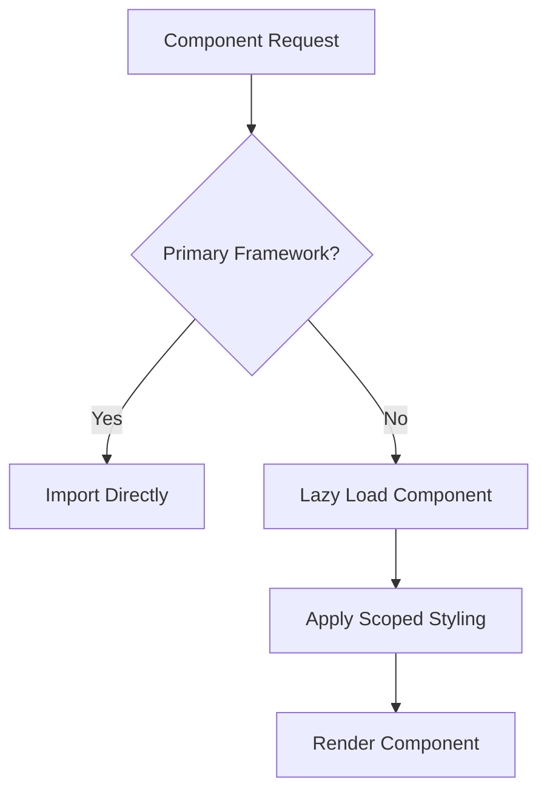
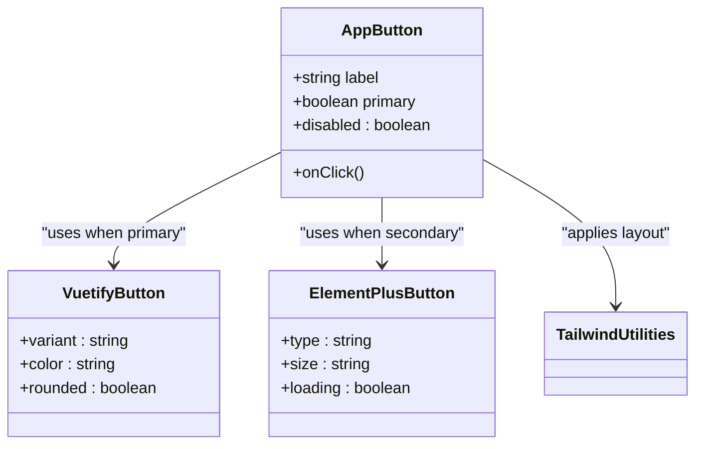
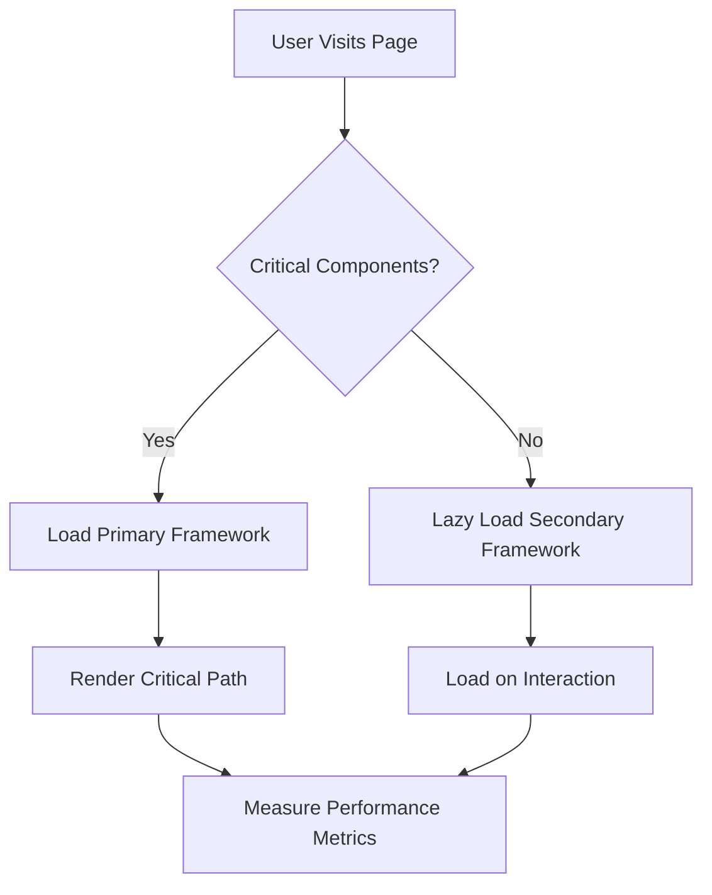

# UI Framework Integration

<cite>
**Referenced Files in This Document**
- [UI_KITS_MIXING.md](file://docs/UI_KITS_MIXING.md)
- [README.md](file://README.md)
- [CONTRIBUTING.md](file://CONTRIBUTING.md)
</cite>

## Table of Contents
1. [Introduction](#introduction)
2. [Supported UI Frameworks](#supported-ui-frameworks)
3. [Architectural Considerations](#architectural-considerations)
4. [Safe Mixing Strategies](#safe-mixing-strategies)
5. [Performance Implications](#performance-implications)
6. [Theming and Design Unification](#theming-and-design-unification)
7. [Accessibility Consistency](#accessibility-consistency)
8. [Recommended Combinations](#recommended-combinations)
9. [Limitations and Constraints](#limitations-and-constraints)

## Introduction

Integrating multiple UI frameworks within Vue 3 applications enables developers to leverage the strengths of different component libraries while maintaining flexibility in design and functionality. This document provides comprehensive guidance on safely combining popular UI frameworks such as Vuetify, Ant Design Vue, Element Plus, Naive UI, PrimeVue, and Quasar. The strategies outlined here are derived from best practices documented in `UI_KITS_MIXING.md` and real-world implementation patterns found in the project's documentation and examples.

The integration approach emphasizes architectural integrity, performance optimization, and consistent user experience across mixed components. Special attention is given to avoiding common pitfalls such as CSS collisions, component naming conflicts, and excessive bundle sizes.

**Section sources**
- [README.md](file://README.md#L1-L335)
- [UI_KITS_MIXING.md](file://docs/UI_KITS_MIXING.md#L0-L7)

## Supported UI Frameworks

The following UI frameworks are officially supported for integration within Vue 3 projects using these guidelines:

- **Vuetify**: Material Design-based components with extensive customization options
- **Ant Design Vue**: Enterprise-grade components following Ant Design principles
- **Element Plus**: Feature-rich desktop-oriented UI library with robust form controls
- **Naive UI**: TypeScript-first components designed for high customizability
- **PrimeVue**: Comprehensive suite of components with built-in accessibility
- **Quasar**: Cross-platform framework supporting SPA, PWA, SSR, mobile apps, and desktop apps

Each framework brings unique advantages in terms of component richness, theming capabilities, and ecosystem support. The decision to mix frameworks should be based on specific feature requirements rather than aesthetic preferences alone.

**Section sources**
- [README.md](file://README.md#L100-L120)

## Architectural Considerations

When combining multiple UI frameworks, several architectural factors must be addressed to maintain application stability and developer productivity.

### CSS Collision Avoidance

Framework-specific CSS can conflict when multiple libraries are imported globally. Recommended strategies include:
- Scoped styling for components using non-primary frameworks
- Dynamic import of framework styles only when needed
- Utilizing CSS modules or BEM naming conventions to isolate styles

### Component Naming Conflicts

Many frameworks export components with generic names (e.g., Button, Input, Modal). To prevent conflicts:
- Use explicit aliases during imports
- Implement a wrapper component pattern that abstracts underlying implementations
- Establish naming conventions that prefix components by framework origin

### Bundle Size Optimization

Combining frameworks increases bundle size significantly. Mitigation techniques include:
- Tree-shaking through proper module imports
- Code splitting based on route or feature boundaries
- Lazy loading of secondary framework components
- Using lightweight alternatives for simple components

**Diagram sources**
- [UI_KITS_MIXING.md](file://docs/UI_KITS_MIXING.md#L0-L7)
- [README.md](file://README.md#L150-L170)

**Section sources**
- [UI_KITS_MIXING.md](file://docs/UI_KITS_MIXING.md#L0-L7)
- [README.md](file://README.md#L150-L170)

## Safe Mixing Strategies

Based on the guidance in `UI_KITS_MIXING.md`, the recommended approach combines UI kit components with utility-first styling systems like Tailwind CSS.

### Component Hierarchy Guidelines

- Use primary UI framework components for complex interactive controls (forms, data tables, modals)
- Apply Tailwind utilities for layout, spacing, typography, and basic styling
- Avoid deep CSS overrides; instead, use official theming APIs provided by each framework
- Isolate mixed-component usage within dedicated wrapper components

### Implementation Pattern

**Diagram sources**
- [UI_KITS_MIXING.md](file://docs/UI_KITS_MIXING.md#L0-L7)
- [examples/basic-component.vue](file://examples/basic-component.vue#L1-L53)

**Section sources**
- [UI_KITS_MIXING.md](file://docs/UI_KITS_MIXING.md#L0-L7)
- [examples/basic-component.vue](file://examples/basic-component.vue#L1-L53)

## Performance Implications

Combining multiple UI frameworks has significant performance considerations that must be proactively managed.

### Initial Load Impact

Each additional framework contributes to:
- Increased JavaScript parsing time
- Larger CSS payload
- More DOM nodes during hydration
- Higher memory consumption

### Runtime Performance

Mixed frameworks may introduce:
- Inconsistent reactivity patterns
- Different virtual DOM optimization strategies
- Varied event handling mechanisms
- Divergent animation frame management

### Optimization Recommendations

- Measure Core Web Vitals before and after integration
- Use code splitting to defer non-critical framework loads
- Implement performance monitoring hooks
- Audit bundle composition regularly

**Diagram sources**
- [README.md](file://README.md#L250-L270)
- [examples/form-component.vue](file://examples/form-component.vue#L1-L145)

**Section sources**
- [README.md](file://README.md#L250-L270)
- [examples/form-component.vue](file://examples/form-component.vue#L1-L145)

## Theming and Design Unification

Achieving visual consistency across mixed frameworks requires deliberate theming strategies.

### Theme Harmonization

- Define a unified design token system (colors, spacing, typography)
- Map framework-specific theme variables to common tokens
- Create adapter layers that translate design tokens to framework themes
- Use CSS custom properties for cross-framework variable sharing

### Icon Set Management

- Standardize on a single icon set where possible
- Create icon wrapper components that normalize API differences
- Preload commonly used icons to avoid flickering
- Implement lazy loading for large icon libraries

### Responsive Behavior Harmonization

- Establish consistent breakpoint definitions
- Normalize responsive behavior through wrapper components
- Test cross-framework interactions at all breakpoints
- Document responsive behavior expectations

**Section sources**
- [README.md](file://README.md#L100-L120)
- [UI_KITS_MIXING.md](file://docs/UI_KITS_MIXING.md#L0-L7)

## Accessibility Consistency

Maintaining accessibility standards across mixed frameworks is critical for inclusive design.

### ARIA Compliance

- Ensure all custom wrappers maintain proper ARIA attributes
- Verify keyboard navigation works consistently
- Test screen reader announcements across components
- Maintain focus management patterns

### Semantic HTML Preservation

- Never compromise semantic structure for visual consistency
- Use appropriate heading levels regardless of visual styling
- Preserve landmark regions when combining layouts
- Ensure form labels and controls remain associated

### Testing Strategy

- Implement automated accessibility testing
- Conduct manual screen reader testing
- Validate color contrast ratios
- Test keyboard-only navigation flows

**Section sources**
- [README.md](file://README.md#L130-L140)
- [CONTRIBUTING.md](file://CONTRIBUTING.md#L200-L220)

## Recommended Combinations

Based on real-world use cases and performance characteristics, certain framework combinations work better than others.

### High-Compatibility Pairings

- **Vuetify + PrimeVue**: Both follow Material Design principles with strong accessibility support
- **Element Plus + Naive UI**: Similar enterprise focus with robust TypeScript support
- **Quasar + any lightweight framework**: Quasar's modular architecture allows selective component usage

### Context-Based Selection

- **Enterprise Applications**: Ant Design Vue as primary with Element Plus for specialized controls
- **Dashboards**: Vuetify for layout with PrimeVue for data visualization components
- **Cross-Platform Apps**: Quasar as foundation with other frameworks for web-specific enhancements

**Section sources**
- [README.md](file://README.md#L100-L120)
- [CONTRIBUTING.md](file://CONTRIBUTING.md#L150-L170)

## Limitations and Constraints

While mixing UI frameworks offers flexibility, several limitations must be acknowledged.

### Technical Constraints

- Increased complexity in debugging and error tracing
- Potential version incompatibilities between frameworks
- Challenges in upgrading individual frameworks
- Limited support for server-side rendering with some combinations

### Team Constraints

- Steeper learning curve for new team members
- Inconsistent developer experience across components
- Difficulty maintaining coding standards
- Longer review cycles due to framework diversity

### Maintenance Burden

- Higher risk of breaking changes affecting multiple frameworks
- More complex dependency management
- Greater effort required for security updates
- Increased testing surface area

Organizations should carefully evaluate whether the benefits of mixing frameworks outweigh these constraints, particularly for long-term maintenance.

**Section sources**
- [README.md](file://README.md#L300-L330)
- [CONTRIBUTING.md](file://CONTRIBUTING.md#L100-L130)