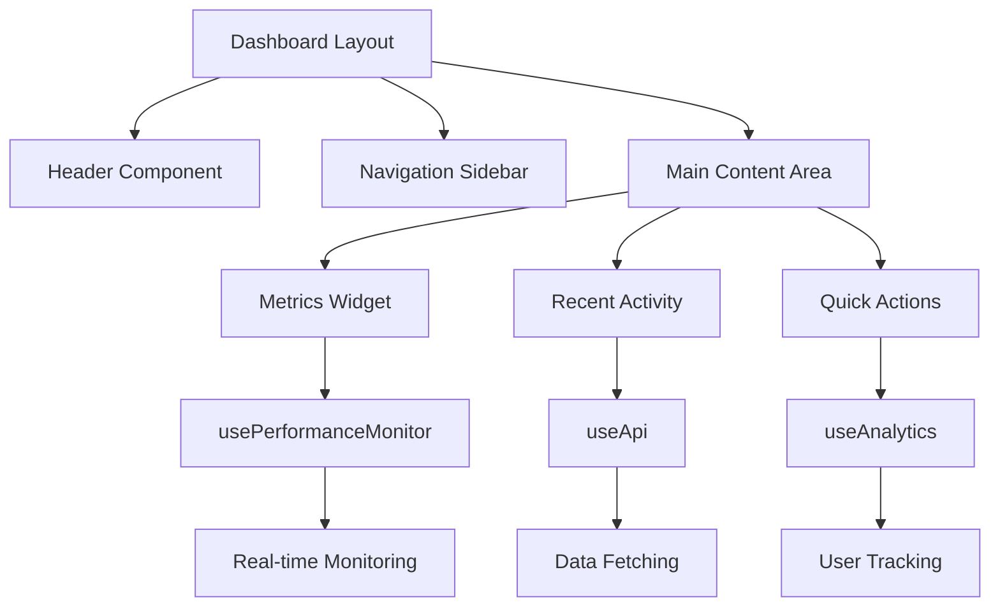
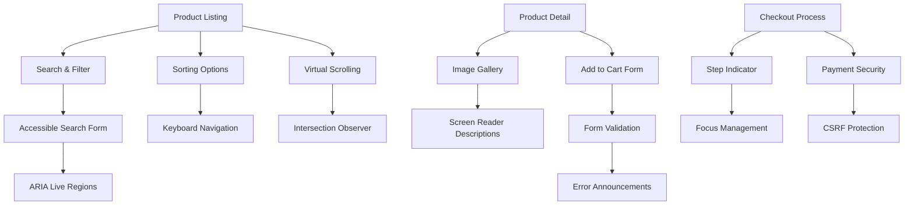
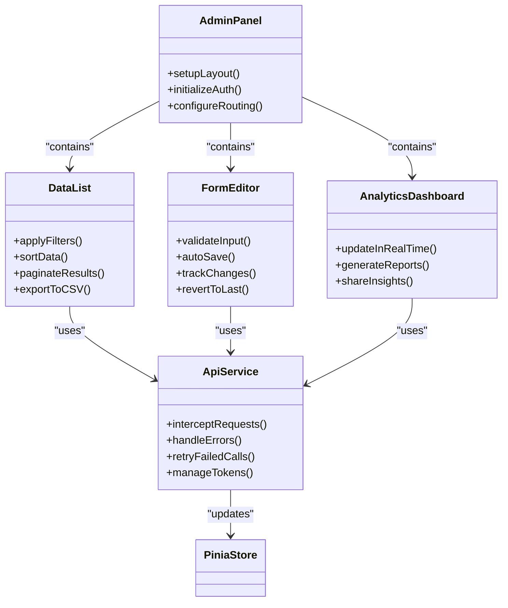

# Use Cases

<cite>
**Referenced Files in This Document**   
- [USE_CASES.md](file://docs/USE_CASES.md)
- [basic-component.vue](file://examples/basic-component.vue)
- [form-component.vue](file://examples/form-component.vue)
- [useApi.ts](file://examples/useApi.ts)
- [README.md](file://README.md)
</cite>

## Table of Contents
1. [Enterprise Dashboard Development](#enterprise-dashboard-development)
2. [Accessible E-Commerce Interface](#accessible-e-commerce-interface)
3. [High-Performance Admin Panel](#high-performance-admin-panel)
4. [Implementation Checklists and Success Metrics](#implementation-checklists-and-success-metrics)

## Enterprise Dashboard Development

This use case demonstrates how Vue 3 Cursor Rules streamline the creation of enterprise-grade dashboards with consistent architecture, performance optimization, and accessibility compliance.

The rules enforce standardized component patterns that ensure uniform structure across teams. By applying composition API best practices from the `vue3/` rule category, developers automatically implement proper state management using Pinia and efficient data fetching patterns. The `performance/` rules guide lazy loading of dashboard modules and code splitting to optimize initial load time.

Accessibility rules from the `accessibility/` category ensure WCAG 2.1 AA compliance by default, implementing proper ARIA attributes and keyboard navigation patterns. Security rules from the `enterprise/` category integrate JWT handling and role-based access control for sensitive data visualization.

Team workflow improves significantly as new members can quickly understand the codebase structure. Code reviews become more efficient since reviewers can focus on business logic rather than architectural consistency or accessibility issues.

**Diagram sources**
- [README.md](file://README.md#L200-L218)
- [USE_CASES.md](file://docs/USE_CASES.md#L65-L95)

**Section sources**
- [USE_CASES.md](file://docs/USE_CASES.md#L65-L95)
- [basic-component.vue](file://examples/basic-component.vue#L1-L53)

## Accessible E-Commerce Interface

Building an accessible e-commerce interface requires strict adherence to web standards while maintaining high performance and security. Vue 3 Cursor Rules provide comprehensive guidance for creating inclusive shopping experiences.

The `accessibility/` rules automatically suggest semantic HTML structure with proper landmark roles and ARIA labels for all interactive elements. Form components follow established patterns for error handling, validation messages, and focus management, ensuring screen reader users can complete purchases successfully.

Security rules from the `enterprise/` category protect against common vulnerabilities like XSS attacks on product pages and CSRF during checkout processes. Performance rules optimize image loading with lazy loading directives and implement virtual scrolling for product listings with hundreds of items.

Internationalization support from the `i18n/` rules enables multi-language storefronts with proper text direction handling for RTL languages. The rules also suggest appropriate currency formatting and localization patterns.

Development efficiency increases as teams don't need to research accessibility guidelines or security best practices independently. Instead, the system proactively suggests compliant implementations based on context.

**Diagram sources**
- [form-component.vue](file://examples/form-component.vue#L1-L145)
- [USE_CASES.md](file://docs/USE_CASES.md#L175-L205)

**Section sources**
- [USE_CASES.md](file://docs/USE_CASES.md#L175-L205)
- [form-component.vue](file://examples/form-component.vue#L1-L145)

## High-Performance Admin Panel

Creating a high-performance admin panel demands careful attention to rendering efficiency, memory management, and responsive interactions. Vue 3 Cursor Rules provide specific optimizations for data-intensive administrative interfaces.

The `performance/` rules recommend using `<Suspense>` for asynchronous component loading and suggest appropriate use of `v-memo` to prevent unnecessary re-renders in complex tables. Memory management patterns from the `enterprise/` category ensure proper cleanup of event listeners and subscriptions when navigating between views.

State management rules guide the implementation of efficient store patterns with auto-disposal of unused state and intelligent caching strategies. The `net/` rules suggest optimal Axios interceptor configurations for handling authentication tokens and retry logic on failed requests.

For data visualization components, the rules recommend using canvas-based charts instead of SVG for large datasets and suggest appropriate debouncing for search inputs that query backend APIs. Real-time updates are implemented using WebSocket connections with proper connection lifecycle management.

Team productivity improves as junior developers receive immediate feedback on performance anti-patterns, while senior developers can focus on complex business logic rather than boilerplate optimization code.

**Diagram sources**
- [useApi.ts](file://examples/useApi.ts#L1-L42)
- [README.md](file://README.md#L150-L180)

**Section sources**
- [USE_CASES.md](file://docs/USE_CASES.md#L207-L237)
- [useApi.ts](file://examples/useApi.ts#L1-L42)

## Implementation Checklists and Success Metrics

Each use case benefits from specific implementation checklists derived from relevant rule categories. These checklists ensure comprehensive coverage of critical aspects and provide measurable success criteria.

For enterprise dashboards, the checklist includes: consistent component architecture (from `vue3/` rules), WCAG 2.1 AA compliance (from `accessibility/` rules), secure data handling (from `enterprise/` rules), and Core Web Vitals optimization (from `performance/` rules). Success metrics track 60% reduction in code review time, 40% fewer accessibility issues, and 50% faster onboarding.

For e-commerce interfaces, the checklist covers: form validation patterns (from `widgets/` rules), payment security (from `enterprise/` rules), internationalization readiness (from `i18n/` rules), and mobile responsiveness (from `ui-kits/` rules). Measurable outcomes include improved Lighthouse accessibility scores (>90), reduced bounce rates on checkout pages, and increased conversion rates.

For admin panels, the checklist emphasizes: efficient state management (from `state/` rules), API error resilience (from `net/` rules), real-time update patterns (from `vue3/` rules), and bundle size optimization (from `performance/` rules). Key performance indicators include First Contentful Paint < 1.5s, Interaction to Next Paint < 200ms, and successful task completion rate by users.

Team workflow impacts are significant across all scenarios, with documented improvements in code review efficiency, reduced debugging time, and accelerated feature development cycles. The rules create a shared understanding of best practices, minimizing knowledge silos and enabling smoother collaboration.

**Section sources**
- [USE_CASES.md](file://docs/USE_CASES.md#L1-L565)
- [README.md](file