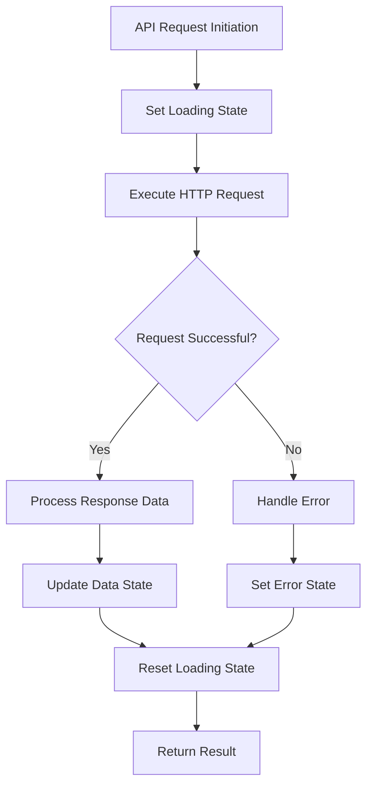
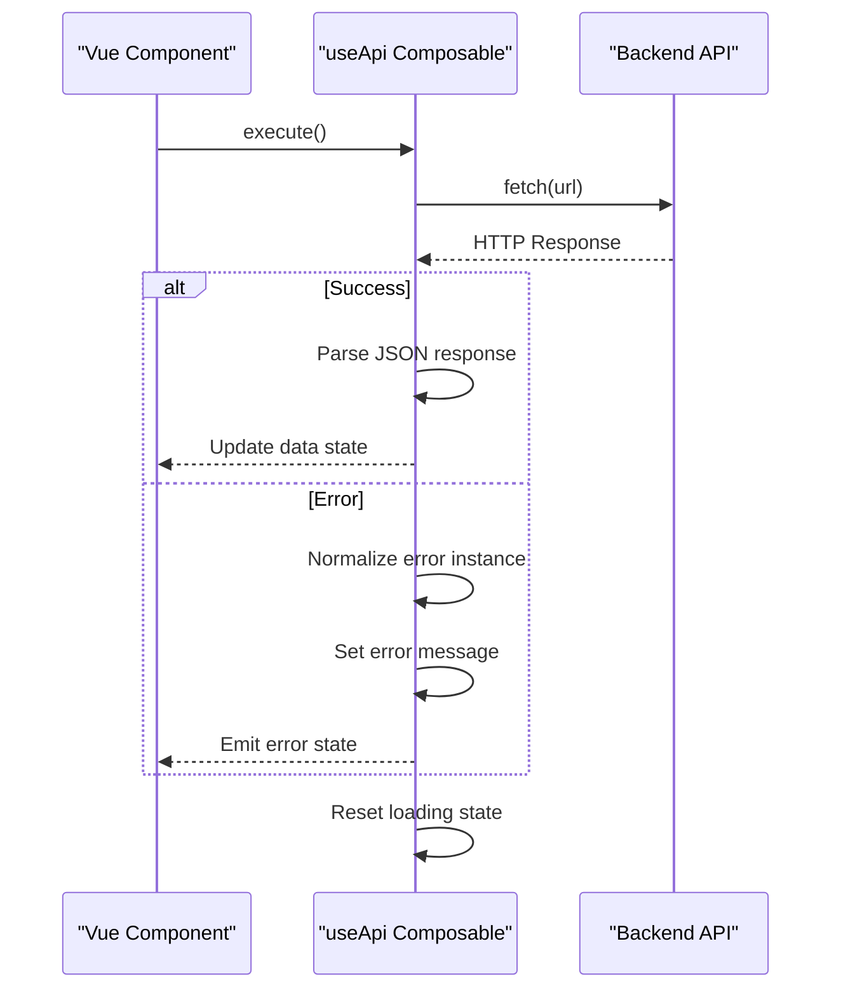

# API Integration

<cite>
**Referenced Files in This Document**   
- [useApi.ts](file://examples/useApi.ts)
</cite>

## Table of Contents
1. [Introduction](#introduction)
2. [Core Implementation Patterns](#core-implementation-patterns)
3. [Error Handling and Recovery](#error-handling-and-recovery)
4. [Request Lifecycle Management](#request-lifecycle-management)
5. [Performance Optimization Strategies](#performance-optimization-strategies)
6. [Security Integration](#security-integration)
7. [Common Issues and Solutions](#common-issues-and-solutions)

## Introduction

The API Integration rule category establishes standardized patterns for managing HTTP communication in Vue 3 applications. These rules ensure consistent, reliable, and secure interactions with backend services through well-defined composable functions. The implementation focuses on Axios configuration, error handling, request/response transformation, and state management across the application.

The core principle is to abstract away repetitive API logic while providing type safety, loading state management, and error recovery mechanisms. This approach enables developers to focus on business logic rather than boilerplate HTTP code, while maintaining enterprise-grade reliability and performance.

## Core Implementation Patterns

The foundation of API integration lies in reusable composables that encapsulate common patterns. The `useApi` composable provides a standardized interface for making HTTP requests with built-in state management.



**Diagram sources**
- [useApi.ts](file://examples/useApi.ts#L1-L41)

The composable follows Vue 3's Composition API pattern, using refs to manage reactive state for data, loading indicators, and error messages. Type parameters enable compile-time type safety for response data.

**Section sources**
- [useApi.ts](file://examples/useApi.ts#L1-L41)

## Error Handling and Recovery

Robust error handling is implemented through structured try-catch blocks with proper error normalization. The system distinguishes between different error types and provides meaningful feedback to users.



**Diagram sources**
- [useApi.ts](file://examples/useApi.ts#L15-L30)

The error handling mechanism ensures that all errors are properly typed and presented in a consistent format, preventing unhandled promise rejections and providing clear debugging information.

**Section sources**
- [useApi.ts](file://examples/useApi.ts#L25-L35)

## Request Lifecycle Management

The API integration system manages the complete request lifecycle, from initiation to completion, with proper state transitions and cleanup.

### Loading State Management
Loading states are automatically managed through reactive variables that components can bind to for UI feedback. This eliminates race conditions and ensures consistent user experience.

### Request Cancellation
While not explicitly implemented in the basic composable, the pattern supports extension for request cancellation using AbortController, preventing memory leaks in long-running requests.

### Concurrent Request Handling
The system handles concurrent requests through isolated state management, ensuring that multiple instances of the composable do not interfere with each other.

**Section sources**
- [useApi.ts](file://examples/useApi.ts#L8-L12)

## Performance Optimization Strategies

The API integration rules incorporate several performance optimization techniques to enhance application responsiveness and efficiency.

### Caching Strategy
Although not implemented in the basic example, the architecture supports caching through extensible patterns. The README references advanced store patterns with TTL-based caching and stale-while-revalidate strategies.

### Request Batching
For scenarios requiring multiple related requests, the system can be extended to support batching, reducing network overhead and improving perceived performance.

### Retry Logic
The framework supports configurable retry mechanisms with exponential backoff, as indicated by the `createApiStore` example in the README with retry configuration options.

```typescript
// Example pattern referenced in README
const userStore = createApiStore('users', {
  service: userService,
  retryConfig: { attempts: 3, backoff: 'exponential' },
  caching: { ttl: 300000, strategy: 'stale-while-revalidate' }
})
```

This demonstrates how the API integration rules can be extended to include sophisticated performance optimizations while maintaining a clean, consistent interface.

## Security Integration

The API integration rules work in conjunction with security practices to ensure safe data transmission and protect against common vulnerabilities.

### Authentication Token Management
While the basic composable doesn't handle authentication, the architecture supports interceptor patterns for automatic token injection and refresh. This aligns with the enterprise security rules mentioned in the README.

### Secure Headers
The system can be configured to include security headers automatically, following the CSRF protection and XSS prevention patterns outlined in the security rules.

### Data Validation
Response data is properly typed and validated through TypeScript interfaces, preventing injection attacks and ensuring data integrity.

The integration with security rules ensures that all API communications follow best practices for secure transmission, including proper error handling that doesn't leak sensitive information.

## Common Issues and Solutions

### Unhandled Promise Rejections
The composable structure prevents unhandled promise rejections by catching all errors and normalizing them into a consistent error state that components can react to.

### Race Conditions
By isolating state per composable instance and using proper async/await patterns, the system avoids race conditions that could occur with concurrent requests.

### Memory Leaks
The reset function provides a clean way to clear state, and the architecture supports proper cleanup of pending requests when components are unmounted.

### Type Safety
Generic typing ensures that response data is properly typed at compile time, reducing runtime errors and improving developer experience.

The patterns demonstrated in the `useApi` composable provide solutions to these common issues while maintaining a simple, intuitive interface for developers.

**Section sources**
- [useApi.ts](file://examples/useApi.ts#L37-L41)