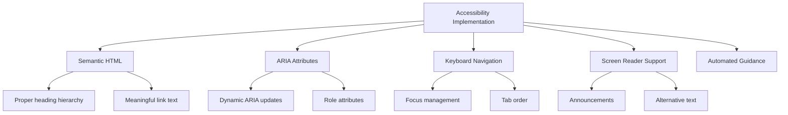
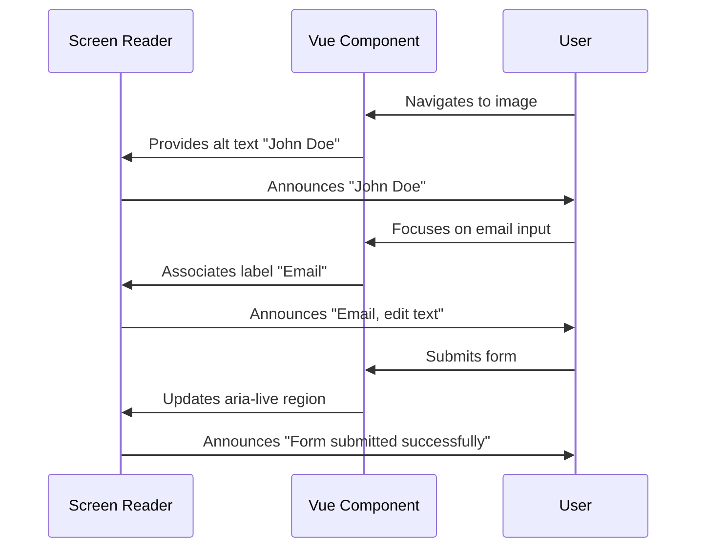

# Accessibility

<cite>
**Referenced Files in This Document**   
- [README.md](file://README.md)
- [CONTRIBUTING.md](file://CONTRIBUTING.md)
- [TRANSFORMATION_SUMMARY.md](file://TRANSFORMATION_SUMMARY.md)
- [examples/basic-component.vue](file://examples/basic-component.vue)
- [examples/form-component.vue](file://examples/form-component.vue)
</cite>

## Table of Contents
1. [Introduction](#introduction)
2. [Accessibility Implementation Overview](#accessibility-implementation-overview)
3. [Semantic HTML and ARIA Standards](#semantic-html-and-aria-standards)
4. [Keyboard Navigation Support](#keyboard-navigation-support)
5. [Screen Reader Compatibility](#screen-reader-compatibility)
6. [Form Accessibility Patterns](#form-accessibility-patterns)
7. [UI Framework Integration](#ui-framework-integration)
8. [Common Accessibility Issues](#common-accessibility-issues)
9. [Testing and Validation Strategies](#testing-and-validation-strategies)
10. [Conclusion](#conclusion)

## Introduction

The Vue 3 Cursor Rules repository emphasizes accessibility as a core principle, ensuring that Vue 3 applications meet WCAG 2.1 AA compliance standards by default. The project's philosophy positions accessibility not as an afterthought but as a foundational requirement for production-ready applications.

According to the README, the rules provide "WCAG 2.1 AA compliance by default" and include specific patterns for screen reader support, keyboard navigation, and inclusive design. This approach ensures that developers can create accessible applications from the outset without requiring extensive additional configuration or specialized knowledge.

The accessibility strategy is integrated throughout the development workflow, with automated suggestions that guide developers toward accessible implementations. This proactive approach helps prevent common accessibility issues before they occur, rather than requiring remediation later in the development cycle.

**Section sources**
- [README.md](file://README.md#L22-L334)

## Accessibility Implementation Overview

The Vue 3 Cursor Rules framework implements accessibility through a combination of automated guidance, code patterns, and best practices that ensure WCAG 2.1 AA compliance. The system provides intelligent suggestions based on the codebase context, automatically recommending accessible alternatives to potentially problematic implementations.

Key aspects of the accessibility implementation include semantic HTML usage, proper ARIA attribute application, keyboard navigation support, and screen reader compatibility. The rules are designed to work seamlessly with the Composition API and `<script setup>` syntax, making accessibility considerations natural extensions of standard Vue 3 development practices.

The CONTRIBUTING guidelines reinforce this commitment by requiring all UI examples to be accessible and mandating adherence to WCAG 2.1 AA guidelines. This ensures consistency across the entire ecosystem of rules and examples provided by the project.

A notable feature mentioned in the documentation is the `useA11y` composable, which provides functions like `announceToScreenReader` and `manageFocus`. These utilities help developers implement complex accessibility patterns such as live region announcements and focus trapping in modals without having to manage the underlying complexity manually.

**Diagram sources**
- [README.md](file://README.md#L253-L265)
- [CONTRIBUTING.md](file://CONTRIBUTING.md#L184-L187)

**Section sources**
- [README.md](file://README.md#L253-L303)
- [CONTRIBUTING.md](file://CONTRIBUTING.md#L184-L220)

## Semantic HTML and ARIA Standards

The accessibility rules emphasize the importance of semantic HTML elements and proper ARIA (Accessible Rich Internet Applications) attribute usage. Semantic elements provide inherent meaning to assistive technologies, while ARIA attributes enhance accessibility when native HTML semantics are insufficient.

In the provided examples, we see evidence of semantic practices such as using the `<label>` element with the `for` attribute to properly associate form inputs with their labels. This creates a larger clickable area and provides clear context for screen readers.

The basic component example demonstrates proper use of the `alt` attribute on image elements, providing alternative text that describes the content of images for users who cannot see them. The `:alt="user.name"` binding ensures that each user's name is used as descriptive text, making the content meaningful rather than decorative.

For more complex interactive components, the rules suggest using appropriate ARIA roles and attributes. Although specific ARIA implementations aren't visible in the limited examples, the presence of the `useA11y` composable indicates support for advanced patterns such as role="dialog" for modals, aria-live regions for dynamic content updates, and aria-expanded for collapsible sections.

The framework encourages developers to use semantic elements like `<nav>`, `<main>`, `<section>`, and `<article>` to structure content meaningfully, rather than relying solely on generic `
` elements. This creates a logical document outline that assistive technologies can navigate effectively.

**Section sources**
- [examples/basic-component.vue](file://examples/basic-component.vue#L3)
- [examples/form-component.vue](file://examples/form-component.vue#L4-L16)
- [README.md](file://README.md#L253-L265)

## Keyboard Navigation Support

Keyboard navigation is a critical aspect of web accessibility, enabling users who cannot use a mouse to interact with web applications. The Vue 3 Cursor Rules framework addresses keyboard accessibility through several mechanisms, including proper focus management and interactive element design.

While explicit keyboard event handlers aren't visible in the provided examples, the architecture supports comprehensive keyboard navigation through the `manageFocus` function mentioned in the `useA11y` composable. This utility likely handles focus trapping in modal dialogs, ensuring that keyboard users cannot accidentally navigate outside the modal while it's open.

The form component example demonstrates accessible button implementation with the `:disabled` attribute, which properly conveys disabled state to assistive technologies and prevents keyboard interaction when appropriate. The loading state management also contributes to keyboard accessibility by preventing multiple submissions.

For custom interactive components, the rules would guide developers to implement proper keyboard event handling, including support for Enter and Space keys on buttons, arrow key navigation in menus, and Tab/Shift+Tab for sequential navigation. The framework likely suggests using the `tabindex` attribute appropriately to manage focus order in complex interfaces.

The emphasis on component-based architecture also supports keyboard accessibility by encapsulating keyboard interaction logic within individual components, making it easier to ensure consistent behavior across the application.

**Section sources**
- [README.md](file://README.md#L253-L265)
- [examples/form-component.vue](file://examples/form-component.vue#L12-L13)

## Screen Reader Compatibility

Screen reader compatibility is addressed through multiple strategies in the Vue 3 Cursor Rules framework, ensuring that visually impaired users can access and understand application content through assistive technologies.

The most visible example of screen reader support is the proper use of alternative text for images in the basic component example. By binding the `alt` attribute to the user's name (`:alt="user.name"`), the component provides meaningful descriptions that screen readers can vocalize, rather than announcing generic "image" or empty alt text.

Form accessibility is another critical aspect of screen reader compatibility. The form component example shows proper label association using the `for` attribute, which creates a programmatic relationship between labels and their corresponding inputs. When a screen reader encounters an input field, it will automatically announce the associated label text, providing context for the expected input.

The documented `useA11y` composable includes an `announceToScreenReader` function, which likely implements ARIA live regions to provide dynamic announcements without requiring user focus to change. This is particularly useful for announcing form submission results, error messages, or other transient status updates.

The framework also appears to support sr-only (screen reader only) classes, as suggested by the reference material mentioning Tailwind's "sr-only" class for screen reader text. This allows developers to provide additional context that is only available to assistive technology users without cluttering the visual interface.

**Diagram sources**
- [examples/basic-component.vue](file://examples/basic-component.vue#L3)
- [examples/form-component.vue](file://examples/form-component.vue#L4)
- [README.md](file://README.md#L253-L265)

**Section sources**
- [examples/basic-component.vue](file://examples/basic-component.vue#L3)
- [examples/form-component.vue](file://examples/form-component.vue#L4-L16)
- [README.md](file://README.md#L253-L265)

## Form Accessibility Patterns

The Vue 3 Cursor Rules framework provides comprehensive guidance for creating accessible forms, as demonstrated in the form-component.vue example. This component illustrates several key accessibility patterns that ensure forms are usable by all users, including those relying on assistive technologies.

One of the most important patterns is proper label association. Each input has a corresponding `<label>` element with a matching `for` attribute that references the input's `id`. This creates a programmatic association that screen readers can use to identify the purpose of each field. Clicking the label also focuses the associated input, increasing the target size for users with motor impairments.

The form implements real-time validation with immediate feedback. Error messages are displayed dynamically using the `errors` object, and these