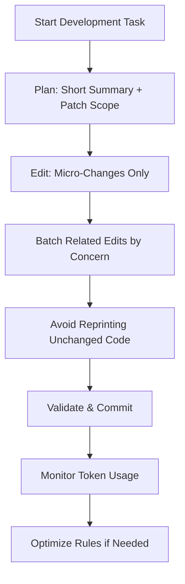
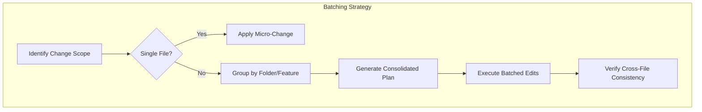
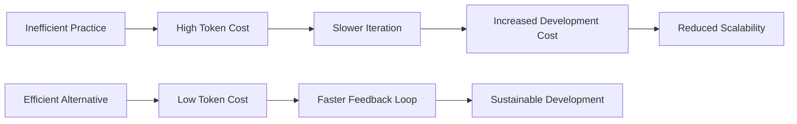

# Budget Optimization

<cite>
**Referenced Files in This Document**   
- [README.md](file://README.md)
- [COST_PLAYBOOK.md](file://docs/COST_PLAYBOOK.md)
- [measure-tokens.mjs](file://scripts/measure-tokens.mjs)
</cite>

## Table of Contents
1. [Introduction](#introduction)
2. [Core Principles of Budget Optimization](#core-principles-of-budget-optimization)
3. [Implementation Patterns for Token Efficiency](#implementation-patterns-for-token-efficiency)
4. [Intelligent Batching and Edit Grouping](#intelligent-batching-and-edit-grouping)
5. [Micro-Changes and Patch-Sized Diffs](#micro-changes-and-patch-sized-diffs)
6. [Monitoring with measure-tokens.mjs](#monitoring-with-measure-tokenstokenmjs)
7. [Common Inefficiencies to Avoid](#common-inefficiencies-to-avoid)
8. [Optimization Strategies for Enterprise Environments](#optimization-strategies-for-enterprise-environments)
9. [Conclusion](#conclusion)

## Introduction
The **Budget Optimization** rule category is designed to promote cost-effective AI-assisted development within the Cursor IDE by enforcing token discipline and minimizing unnecessary AI usage. These rules are essential for maintaining sustainable development practices, especially in enterprise environments where AI usage costs can scale rapidly. By focusing on micro-changes, intelligent batching, and efficient context handling, developers can maximize productivity while minimizing token consumption.

This document explores how these principles are implemented across the codebase, supported by tools like `measure-tokens.mjs`, and aligned with best practices documented in `COST_PLAYBOOK.md`. The goal is to create a development workflow that balances speed, quality, and economic efficiency.

**Section sources**
- [README.md](file://README.md#L132-L144)
- [COST_PLAYBOOK.md](file://docs/COST_PLAYBOOK.md#L0-L5)

## Core Principles of Budget Optimization
Budget optimization in AI-assisted development revolves around several key principles:

- **Token Discipline**: Ensuring every AI interaction is purposeful and minimal.
- **Context Minimization**: Avoiding overly broad file or project context requests.
- **Evidence-Based Suggestions**: Leveraging existing code patterns instead of generating redundant explanations.
- **Performance-First Mindset**: Prioritizing changes that improve both runtime performance and development cost efficiency.

These principles are codified in the repository's structure under `.cursor/rules/budget-optimized/` and reinforced through documentation and tooling. They align with broader architectural guardrails such as type safety, performance optimization, and code reuse.



**Diagram sources**
- [COST_PLAYBOOK.md](file://docs/COST_PLAYBOOK.md#L0-L5)
- [README.md](file://README.md#L132-L144)

## Implementation Patterns for Token Efficiency
Effective budget optimization relies on specific implementation patterns that reduce AI token consumption without sacrificing development velocity.

### Writing Micro-Changes
Instead of requesting full-file rewrites, the system encourages patch-sized diffs focused on specific modifications. This reduces input/output token usage significantly.

### Intelligent Context Summarization
Before proposing edits to large files, the AI summarizes relevant sections rather than processing entire files. This prevents excessive context loading and keeps prompts concise.

### Evidence-Based Code Suggestions
Rather than inventing new solutions, the AI references existing patterns in the codebase (e.g., from `vue3/`, `typescript/`, or `state/` rule directories), reducing the need for verbose explanations.

### Conservative Editing Approach
Edits are made using precise replacements (`str_replace_editor`) rather than rewriting entire files, preserving context and minimizing diff size.

**Section sources**
- [COST_PLAYBOOK.md](file://docs/COST_PLAYBOOK.md#L0-L5)
- [README.md](file://README.md#L132-L144)

## Intelligent Batching and Edit Grouping
To balance atomicity with efficiency, related changes are grouped intelligently based on architectural concerns:

- **Component-level changes**: All updates to a single Vue component (template, logic, styles) are batched.
- **Feature-area grouping**: Related files within the same domain (e.g., authentication, dashboard) are modified together.
- **Folder-based batching**: When multiple files in a directory require similar updates, they are processed as a unit.

This approach minimizes redundant AI queries while ensuring coherence across interdependent files.



**Diagram sources**
- [README.md](file://README.md#L132-L144)
- [COST_PLAYBOOK.md](file://docs/COST_PLAYBOOK.md#L0-L5)

## Micro-Changes and Patch-Sized Diffs
The principle of micro-changes emphasizes making small, focused edits rather than large-scale transformations. Key practices include:

- Proposing short implementation plans before executing changes
- Using patch-sized diffs instead of full-file outputs
- Limiting response length by line count
- Avoiding repetition of unchanged code in responses

This pattern ensures that each AI interaction consumes only the necessary tokens, promoting sustainability over time.

For example, instead of regenerating an entire Vue component, the AI might suggest:
```diff
+ :aria-label="formLabel"
+ autocomplete="email"
```
to enhance accessibility, keeping the change minimal and targeted.

**Section sources**
- [COST_PLAYBOOK.md](file://docs/COST_PLAYBOOK.md#L0-L5)
- [README.md](file://README.md#L132-L144)

## Monitoring with measure-tokens.mjs
The `scripts/measure-tokens.mjs` script provides quantitative insight into rule set complexity and potential token usage.

```javascript
const ROOT = ".cursor/rules";
function walk(dir){
  return readdirSync(dir).flatMap(f=>{
    const p = join(dir,f);
    return statSync(p).isDirectory() ? walk(p) : [p];
  });
}
const files = walk(ROOT).filter(p=>p.endsWith(".mdc"));
```

This script recursively scans all `.mdc` rule files under `.cursor/rules`, calculates total character count, and logs a summary:

```
Approx total chars across rules: ${totalChars}
Rule of thumb: keep rulesets compact; prefer agent-select rules.
```

By monitoring this metric, teams can identify bloated rule sets and refactor them into more focused, agent-specific rules, thereby reducing AI processing overhead.

**Section sources**
- [measure-tokens.mjs](file://scripts/measure-tokens.mjs#L0-L18)
- [README.md](file://README.md#L146-L182)

## Common Inefficiencies to Avoid
Several anti-patterns lead to excessive token consumption:

- **Overly Broad Context Requests**: Asking the AI to analyze entire large files when only a section is relevant
- **Redundant Explanations**: Re-explaining concepts already covered in previous interactions
- **Full-File Dumps**: Outputting complete files instead of showing diffs
- **Repetitive Pattern Generation**: Creating new implementations instead of reusing established patterns
- **Lack of Batching**: Making isolated changes to related files instead of grouping them

The budget optimization rules actively discourage these behaviors through prompt engineering and workflow constraints.



**Diagram sources**
- [COST_PLAYBOOK.md](file://docs/COST_PLAYBOOK.md#L0-L5)
- [measure-tokens.mjs](file://scripts/measure-tokens.mjs#L0-L18)

## Optimization Strategies for Enterprise Environments
In enterprise settings, budget optimization becomes critical due to scale and compliance requirements. Recommended strategies include:

- **Rule Modularization**: Breaking monolithic rules into smaller, reusable `.mdc` files
- **Agent-Select Rules**: Using conditional logic to activate rules only when relevant
- **Regular Audits**: Running `npm run measure:tokens` periodically to monitor growth
- **Team Training**: Educating developers on token-efficient prompting techniques
- **Standardized Workflows**: Enforcing use of `COST_PLAYBOOK.md` guidelines across teams

Additionally, integrating these practices into CI/CD pipelines (via `lint-rules.mjs` and `measure-tokens.mjs`) ensures ongoing adherence to budget-conscious development standards.

**Section sources**
- [README.md](file://README.md#L132-L144)
- [COST_PLAYBOOK.md](file://docs/COST_PLAYBOOK.md#L0-L5)
- [measure-tokens.mjs](file://scripts/measure-tokens.mjs#L0-L18)

## Conclusion
The **Budget Optimization** rule category establishes a foundation for sustainable, cost-effective AI-assisted development in Cursor IDE. By enforcing token discipline through micro-changes, intelligent batching, and context-aware editing, it enables teams to maintain high productivity without incurring unnecessary AI costs. Supported by monitoring tools like `measure-tokens.mjs` and guided by principles in `COST_PLAYBOOK.md`, these rules provide a scalable framework for enterprise-grade development efficiency.

Adopting these practices ensures long-term viability of AI integration, making advanced assistance accessible even under strict resource constraints.