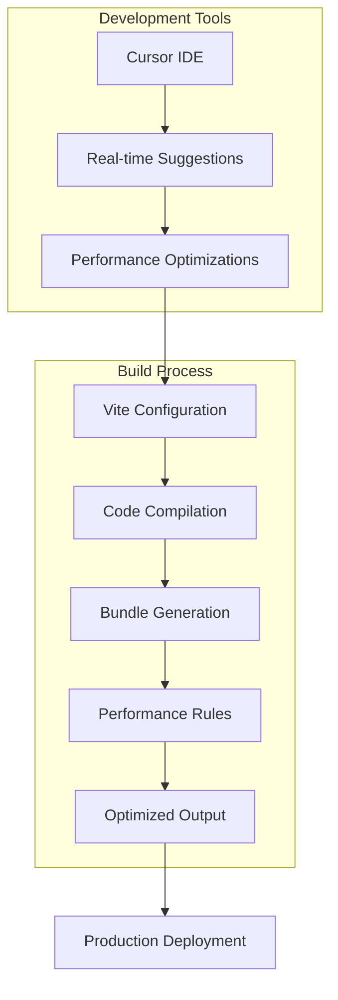
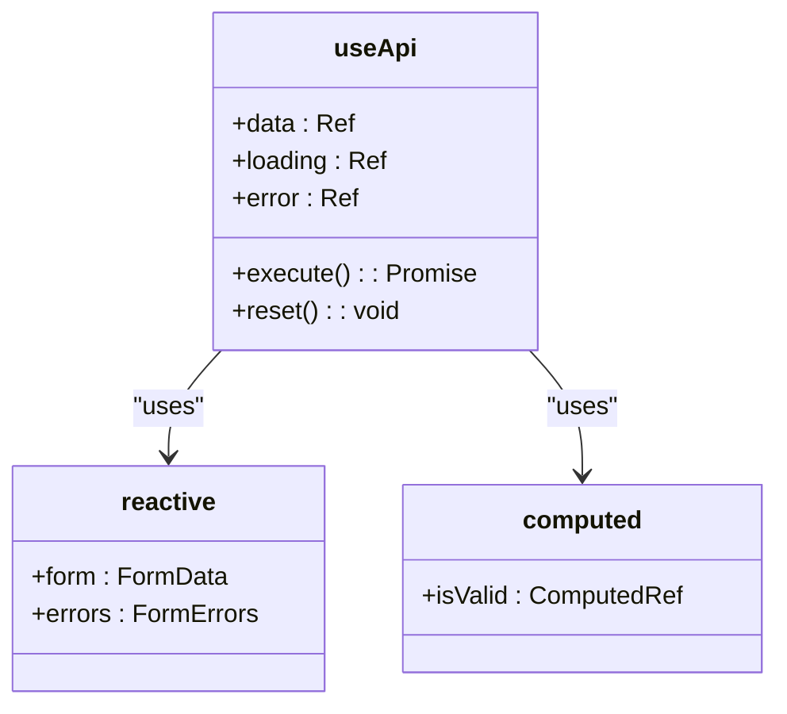
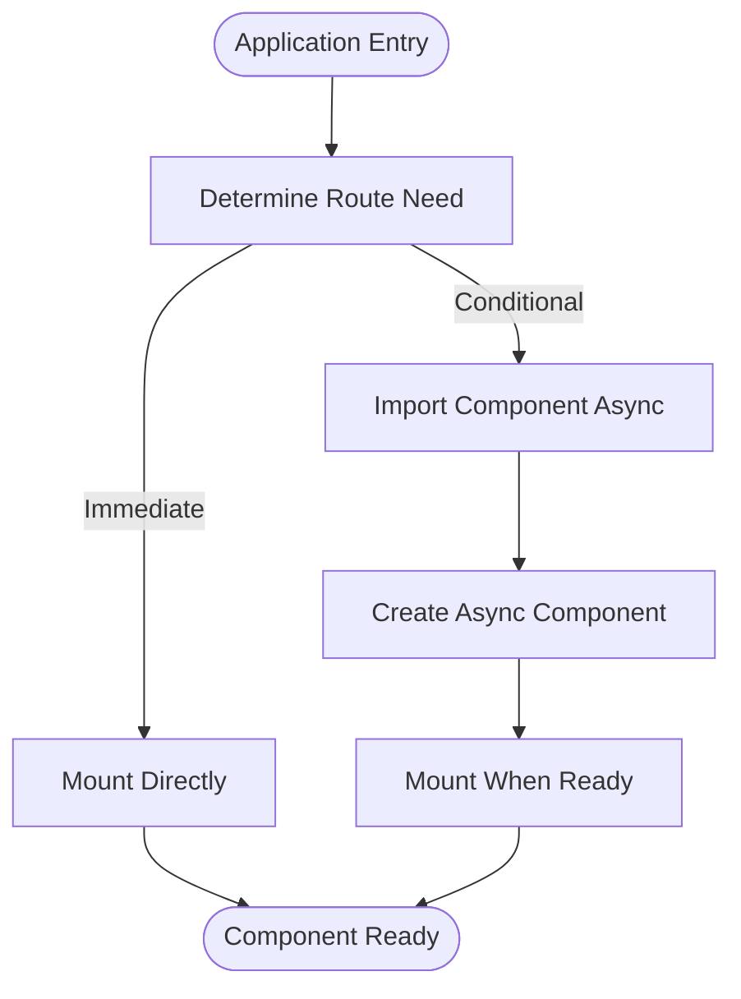
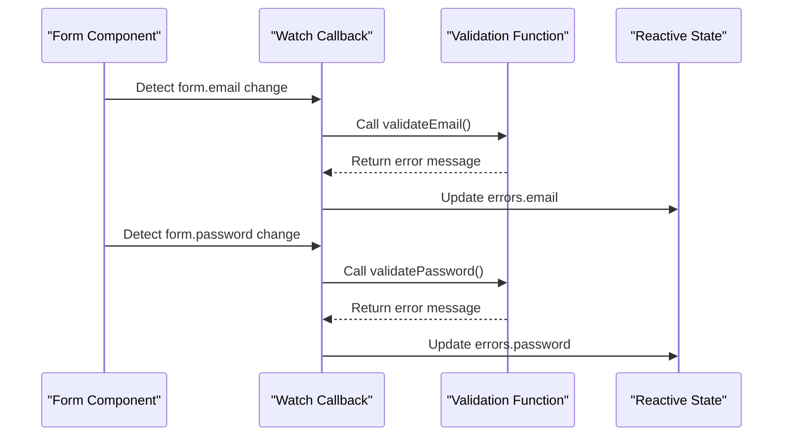
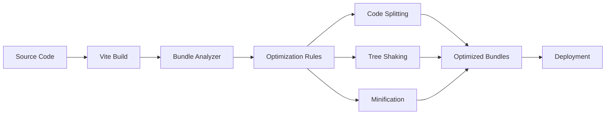
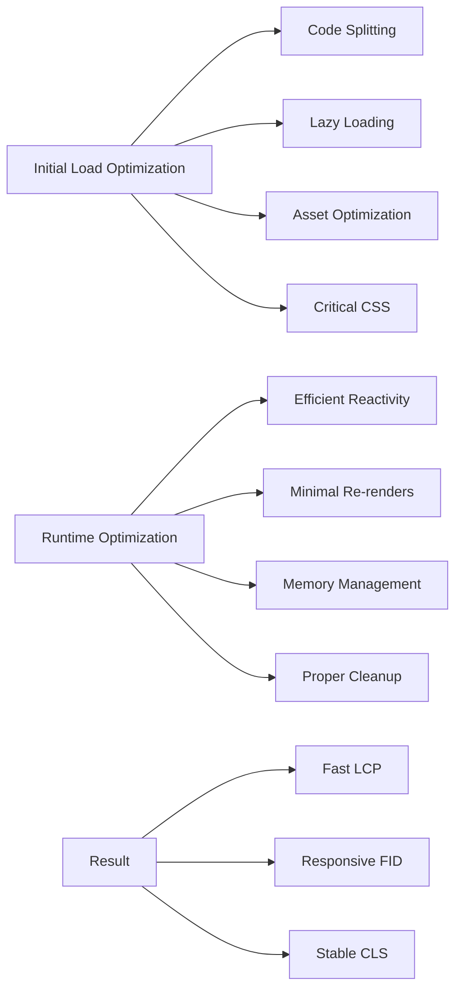

# Performance Optimization

<cite>
**Referenced Files in This Document**
- [basic-component.vue](file://examples/basic-component.vue)
- [form-component.vue](file://examples/form-component.vue)
- [useApi.ts](file://examples/useApi.ts)
- [package.json](file://package.json)
- [CONTRIBUTING.md](file://CONTRIBUTING.md)
- [README.md](file://README.md)
</cite>

## Table of Contents
1. [Introduction](#introduction)
2. [Project Structure and Build Integration](#project-structure-and-build-integration)
3. [Core Performance Patterns](#core-performance-patterns)
4. [Lazy Loading and Code Splitting](#lazy-loading-and-code-splitting)
5. [Memory Management and Reactive Efficiency](#memory-management-and-reactive-efficiency)
6. [Bundle Analysis and Asset Optimization](#bundle-analysis-and-asset-optimization)
7. [Common Performance Pitfalls](#common-performance-pitfalls)
8. [Optimization Tips for Initial Load and Runtime](#optimization-tips-for-initial-load-and-runtime)
9. [Conclusion](#conclusion)

## Introduction

The Performance Optimization rule category provides comprehensive guidance for building efficient Vue 3 applications with optimal rendering, memory usage, and bundle size. These rules help developers implement best practices for application performance from initial load to runtime execution. By following these patterns, teams can create responsive, scalable applications that deliver excellent user experiences while maintaining development efficiency.

**Section sources**
- [README.md](file://README.md#L184-L212)
- [CONTRIBUTING.md](file://CONTRIBUTING.md#L122-L182)

## Project Structure and Build Integration

The repository's structure includes dedicated performance optimization rules within the `.cursor/rules/performance/` directory, designed to integrate seamlessly with modern build tools like Vite. The project leverages TypeScript and Composition API patterns to ensure type safety and optimal compilation output. Scripts such as `lint-rules.mjs` and `measure-tokens.mjs` provide automated validation and token usage analysis, helping maintain performance-focused development practices.

**Diagram sources**
- [package.json](file://package.json#L0-L61)
- [scripts/lint-rules.mjs](file://scripts/lint-rules.mjs#L0-L24)
- [scripts/measure-tokens.mjs](file://scripts/measure-tokens.mjs#L0-L18)

**Section sources**
- [package.json](file://package.json#L0-L61)
- [scripts/lint-rules.mjs](file://scripts/lint-rules.mjs#L0-L24)
- [scripts/measure-tokens.mjs](file://scripts/measure-tokens.mjs#L0-L18)

## Core Performance Patterns

The performance rules emphasize key Vue 3 optimization techniques including proper use of reactive references, computed properties, and watchers. The examples demonstrate efficient state management through `ref`, `reactive`, and `computed` APIs, ensuring minimal re-renders and optimal dependency tracking. The use of `readonly` wrappers in composables prevents unintended mutations while maintaining reactivity.

**Diagram sources**
- [examples/useApi.ts](file://examples/useApi.ts#L0-L41)
- [examples/form-component.vue](file://examples/form-component.vue#L0-L144)

**Section sources**
- [examples/useApi.ts](file://examples/useApi.ts#L0-L41)
- [examples/form-component.vue](file://examples/form-component.vue#L0-L144)

## Lazy Loading and Code Splitting

The performance optimization rules promote lazy loading strategies using Vue's asynchronous component capabilities. While explicit `defineAsyncComponent` usage isn't shown in the examples, the patterns support code splitting through modular composable functions and component-based architecture. The form component demonstrates separation of concerns with validation logic isolated from template rendering, enabling potential code splitting by feature areas.

**Section sources**
- [examples/form-component.vue](file://examples/form-component.vue#L0-L144)
- [examples/basic-component.vue](file://examples/basic-component.vue#L0-L52)

## Memory Management and Reactive Efficiency

The rules emphasize proper memory management through appropriate cleanup of watchers and event listeners. The examples demonstrate efficient reactive patterns using `watch` with specific dependencies rather than watching entire objects. The use of `computed` properties for derived state minimizes redundant calculations and ensures cached results when dependencies haven't changed.

**Diagram sources**
- [examples/form-component.vue](file://examples/form-component.vue#L74-L94)

**Section sources**
- [examples/form-component.vue](file://examples/form-component.vue#L58-L94)

## Bundle Analysis and Asset Optimization

The performance rules integrate with build tools to enable effective bundle analysis and optimization. The repository includes scripts for measuring token usage and validating rule files, which helps maintain lean configuration files. The examples follow best practices for asset loading, such as using native lazy loading for images in the basic component example, reducing initial payload size.

**Section sources**
- [package.json](file://package.json#L0-L61)
- [scripts/measure-tokens.mjs](file://scripts/measure-tokens.mjs#L0-L18)
- [examples/basic-component.vue](file://examples/basic-component.vue#L0-L52)

## Common Performance Pitfalls

The rules help developers avoid common performance issues such as unnecessary re-renders, memory leaks, and inefficient reactive patterns. By promoting the use of specific watchers instead of deep watchers, proper cleanup of side effects, and efficient computed properties, the guidelines prevent many typical Vue performance problems. The emphasis on token discipline in development also helps prevent bloated rule configurations that could impact tooling performance.

**Section sources**
- [CONTRIBUTING.md](file://CONTRIBUTING.md#L122-L182)
- [README.md](file://README.md#L132-L144)

## Optimization Tips for Initial Load and Runtime

For initial load optimization, the rules recommend code splitting, lazy loading of non-critical components, and efficient asset handling. For runtime performance, they emphasize proper reactive patterns, efficient rendering with `v-memo` (where applicable), and careful watcher management. The examples demonstrate immediate loading optimizations like lazy-loaded images and deferred execution of non-critical operations.

**Section sources**
- [README.md](file://README.md#L184-L212)
- [examples/basic-component.vue](file://examples/basic-component.vue#L0-L52)
- [examples/form-component.vue](file://examples/form-component.vue#L0-L144)

## Conclusion

The Performance Optimization rules provide a comprehensive framework for building highly performant Vue 3 applications. By integrating best practices for rendering efficiency, memory management, and bundle optimization, these guidelines help developers create applications that deliver excellent user experiences. The combination of code-level patterns and build-time optimizations ensures performance is maintained throughout the development lifecycle, from initial implementation to production deployment.