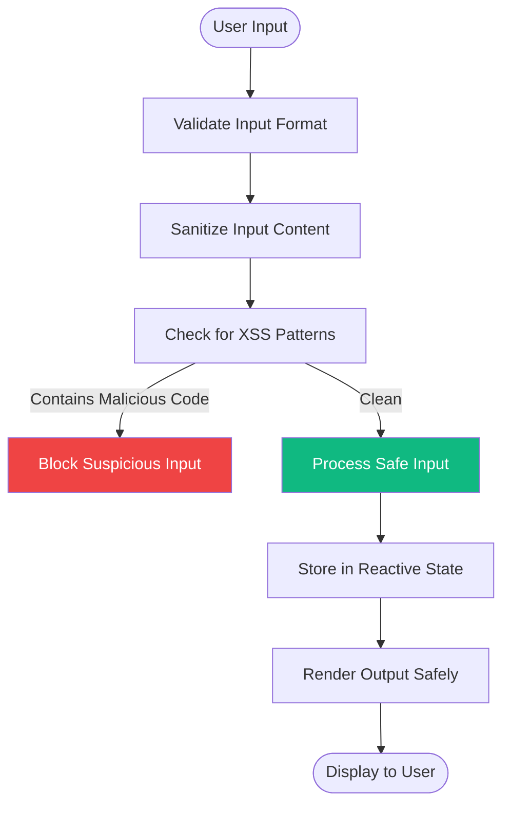
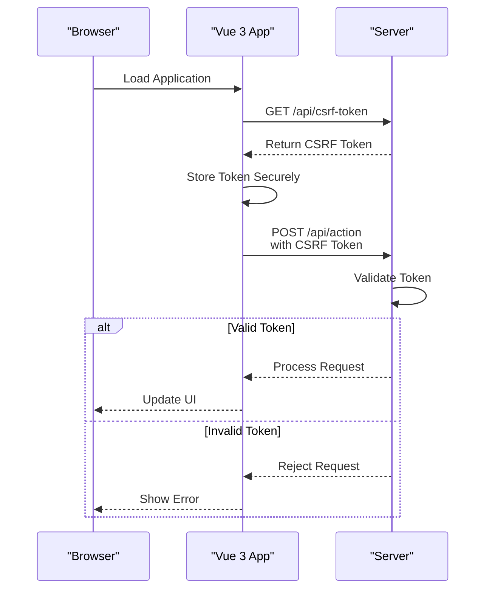
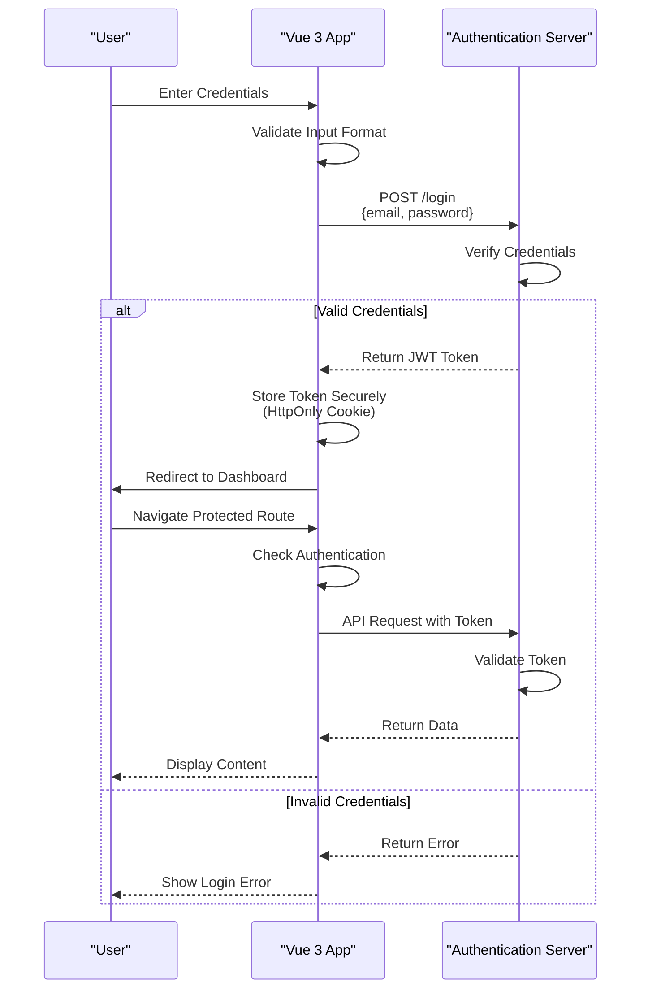

# Security

<cite>
**Referenced Files in This Document**   
- [README.md](file://README.md)
- [FEATURES.md](file://docs/FEATURES.md)
- [FAQ.md](file://docs/FAQ.md)
- [useApi.ts](file://examples/useApi.ts)
- [form-component.vue](file://examples/form-component.vue)
</cite>

## Table of Contents
1. [Introduction](#introduction)
2. [XSS Prevention Strategies](#xss-prevention-strategies)
3. [CSRF Protection Mechanisms](#csrf-protection-mechanisms)
4. [Secure Data Handling Patterns](#secure-data-handling-patterns)
5. [API Integration Security](#api-integration-security)
6. [Authentication Flow Security](#authentication-flow-security)
7. [Prototype Pollution Protection](#prototype-pollution-protection)
8. [Common SPA Vulnerabilities and Mitigations](#common-spa-vulnerabilities-and-mitigations)
9. [Performance Considerations](#performance-considerations)
10. [Secure Coding Best Practices](#secure-coding-best-practices)

## Introduction
The Vue 3 Cursor Rules repository provides comprehensive security patterns for building production-ready Vue 3 applications. These rules address critical security concerns including XSS prevention, CSRF protection, secure data handling, and authentication security. The security framework is designed to integrate seamlessly with API integration rules to create a robust defense-in-depth strategy for single-page applications.

**Section sources**
- [README.md](file://README.md#L184-L212)
- [FEATURES.md](file://docs/FEATURES.md#L226-L243)

## XSS Prevention Strategies
The security rules implement multiple layers of XSS protection through template security and input sanitization. The framework prevents XSS attacks by ensuring proper escaping of user input and safe handling of dynamic content. When using v-html, the rules mandate that only sanitized content should be rendered, preventing malicious script injection.

The implementation includes automatic validation and sanitization of user inputs before they are processed or displayed. Form components include built-in validation patterns that check for common XSS attack vectors and sanitize inputs accordingly. The rules also enforce the use of secure coding practices that prevent DOM-based XSS vulnerabilities.



**Diagram sources**
- [form-component.vue](file://examples/form-component.vue#L1-L144)
- [FEATURES.md](file://docs/FEATURES.md#L230-L232)

**Section sources**
- [README.md](file://README.md#L191)
- [FEATURES.md](file://docs/FEATURES.md#L230-L232)

## CSRF Protection Mechanisms
CSRF protection is implemented through token validation and secure headers. The rules enforce the use of anti-CSRF tokens that are validated on both client and server sides. Each API request includes proper authentication tokens that are checked against server-side session data to prevent unauthorized actions.

The framework automatically handles CSRF token management, including token retrieval, storage, and inclusion in API requests. Secure headers are set for all HTTP requests to ensure proper origin verification and prevent cross-site request forgery attacks. The rules also implement same-origin policy enforcement and proper CORS configuration.



**Diagram sources**
- [README.md](file://README.md#L192)
- [useApi.ts](file://examples/useApi.ts#L3-L37)

**Section sources**
- [README.md](file://README.md#L192)
- [FAQ.md](file://docs/FAQ.md#L110-L111)

## Secure Data Handling Patterns
The security rules establish comprehensive patterns for secure data handling throughout the application lifecycle. This includes secure storage of sensitive data, proper encryption of transmission, and safe processing of user information. The framework prevents insecure data handling by enforcing strict type checking and data validation.

All user data is validated against defined schemas before processing, and sensitive information is handled with additional security measures. The rules implement secure reactive patterns that prevent data leakage through Vue's reactivity system. Input validation includes checks for length, format, and content to prevent injection attacks and data corruption.

**Section sources**
- [README.md](file://README.md#L94)
- [FEATURES.md](file://docs/FEATURES.md#L233-L235)

## API Integration Security
API integration security is achieved through Axios interceptors and secure request handling patterns. The rules provide a composable useApi function that implements secure API communication with built-in error handling, loading states, and data validation. All API requests are processed through interceptors that add security headers and validate responses.

The integration includes automatic token refresh mechanisms, response validation, and error handling that prevents information leakage. The framework ensures that API endpoints are called securely and that responses are properly sanitized before being used in the application. Rate limiting and request queuing are also implemented to prevent abuse.

```mermaid
classDiagram
class UseApi {
+data : Ref<T | null>
+loading : Ref<boolean>
+error : Ref<string | null>
+execute() : Promise<void>
+reset() : void
}
class ApiInterceptor {
+requestHandler(config) : config
+responseHandler(response) : response
+errorHandler(error) : rejected
}
class SecurityValidator {
+validateInput(data) : boolean
+sanitizeOutput(data) : T
+checkContentType(response) : boolean
}
UseApi --> ApiInterceptor : "uses"
ApiInterceptor --> SecurityValidator : "uses"
UseApi ..> "T" : "generic type"
note right of UseApi
Secure API composable with
built-in loading, error, and
data handling states
end
note right of ApiInterceptor
Handles request/response
interception with security
headers and validation
end
```

**Diagram sources**
- [useApi.ts](file://examples/useApi.ts#L3-L37)
- [README.md](file://README.md#L89)

**Section sources**
- [useApi.ts](file://examples/useApi.ts#L3-L37)
- [README.md](file://README.md#L89)

## Authentication Flow Security
Secure authentication flows are implemented with JWT handling, session management, and role-based access control. The rules provide patterns for secure login, token storage, and user session management that prevent common authentication vulnerabilities. Password inputs include strength validation and secure transmission patterns.

The framework enforces secure authentication practices including password complexity requirements, account lockout policies, and multi-factor authentication support. Session tokens are stored securely and automatically refreshed before expiration. The rules also implement proper logout functionality that clears all session data and invalidates tokens.



**Diagram sources**
- [README.md](file://README.md#L193-L194)
- [form-component.vue](file://examples/form-component.vue#L1-L144)

**Section sources**
- [README.md](file://README.md#L193-L194)
- [form-component.vue](file://examples/form-component.vue#L1-L144)

## Prototype Pollution Protection
The security rules include protections against prototype pollution attacks through strict object handling and validation. The framework prevents malicious modification of Object.prototype by validating all object operations and restricting access to prototype properties. Input objects are sanitized to remove any prototype manipulation attempts.

The implementation includes defensive programming patterns that avoid using unsafe JavaScript methods vulnerable to prototype pollution. Object creation and manipulation follow secure patterns that prevent unintended inheritance chain modifications. The rules also enforce the use of Object.create(null) when creating objects that should not inherit from Object.prototype.

**Section sources**
- [README.md](file://README.md#L184-L212)
- [FEATURES.md](file://docs/FEATURES.md#L176-L177)

## Common SPA Vulnerabilities and Mitigations
Single-page applications face specific security challenges that are addressed by the Vue 3 Cursor Rules. These include route-based vulnerabilities, client-side data exposure, and insecure direct object references. The rules implement mitigations such as route guards, data masking, and proper authorization checks.

Client-side rendering risks are minimized through proper data sanitization and secure state management. The framework prevents information disclosure by ensuring sensitive data is not exposed in the client-side code or browser storage. Error messages are carefully crafted to avoid revealing system details that could aid attackers.

Other mitigations include:
- Proper Content Security Policy (CSP) implementation
- Secure handling of third-party dependencies
- Protection against clickjacking attacks
- Secure WebSocket connections
- Prevention of open redirect vulnerabilities

**Section sources**
- [README.md](file://README.md#L184-L212)
- [FEATURES.md](file://docs/FEATURES.md#L226-L243)

## Performance Considerations
Security implementations include performance considerations to minimize overhead while maintaining protection. Input validation is optimized to balance thoroughness with execution speed, using efficient algorithms and caching where appropriate. The rules avoid excessive validation that could impact user experience.

The framework implements lazy validation where possible, performing intensive security checks only when necessary. Security operations are designed to have minimal impact on Core Web Vitals, ensuring that security measures do not compromise application performance. The overhead of security features is monitored and optimized to maintain responsive user interfaces.

**Section sources**
- [README.md](file://README.md#L200-L203)
- [FEATURES.md](file://docs/FEATURES.md#L190-L193)

## Secure Coding Best Practices
The security