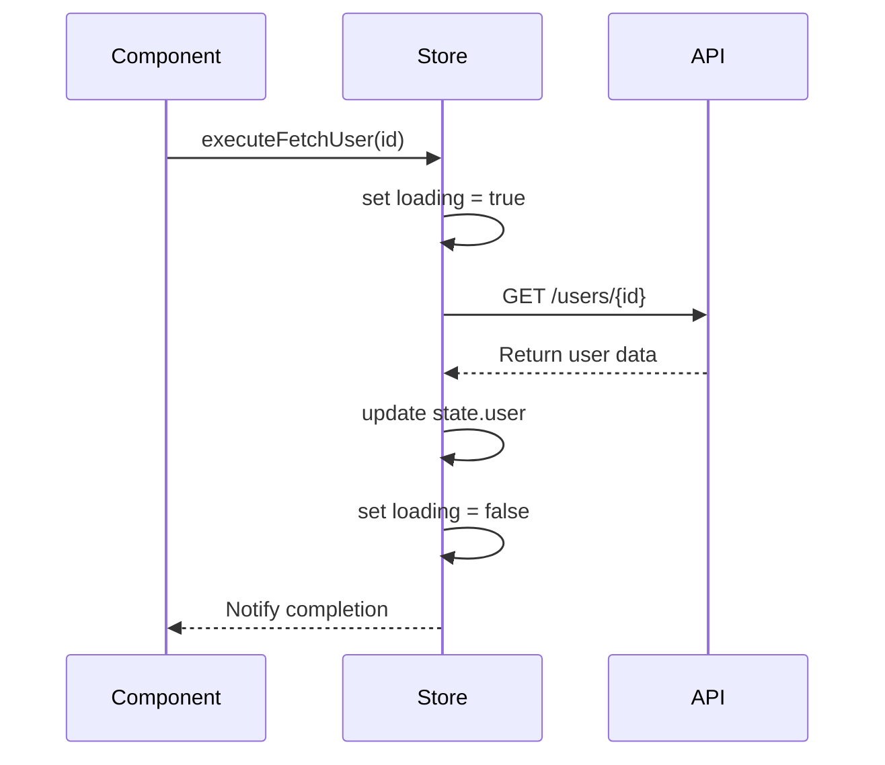

# State Management

<cite>
**Referenced Files in This Document**
- [examples/useApi.ts](file://examples/useApi.ts)
- [examples/basic-component.vue](file://examples/basic-component.vue)
- [examples/form-component.vue](file://examples/form-component.vue)
</cite>

## Table of Contents
1. [Introduction](#introduction)
2. [Core Principles of Pinia State Management](#core-principles-of-pinia-state-management)
3. [Defining Stores with defineStore()](#defining-stores-with-defineStore)
4. [State Mutation Patterns and Actions](#state-mutation-patterns-and-actions)
5. [Efficient Use of Getters](#efficient-use-of-getters)
6. [Modular Store Organization](#modular-store-organization)
7. [Cross-Store Interactions](#cross-store-interactions)
8. [Integration with Vue 3 Reactivity](#integration-with-vue-3-reactivity)
9. [Common Issues and Solutions](#common-issues-and-solutions)
10. [Optimization Tips for Large-Scale Applications](#optimization-tips-for-large-scale-applications)

## Introduction
Pinia is the official state management solution for Vue 3, designed to provide a lightweight, type-safe, and modular approach to managing application state. These rules promote clean store design by enforcing proper separation of concerns, predictable mutation patterns, and scalable composition strategies. By following these guidelines, developers can build maintainable applications that leverage Vue's reactivity system effectively while avoiding common pitfalls such as direct state mutations or circular dependencies.

The examples provided in this repository demonstrate best practices for integrating Pinia into real-world Vue applications, emphasizing enterprise-grade patterns like auto-retry mechanisms, caching strategies, and performance monitoring.

## Core Principles of Pinia State Management
Pinia enforces several key principles that ensure robust and maintainable state management:
- **Centralized State**: All application state is stored in well-defined stores.
- **Immutability via Actions**: Direct mutation of state is prohibited; all changes must occur through actions.
- **Type Safety**: Full TypeScript support ensures compile-time validation of state, getters, actions, and payloads.
- **Modularity**: Stores are self-contained units that can be easily composed and reused across components.

These principles align with modern Vue development practices, promoting code clarity and reducing side effects.

**Section sources**
- [examples/useApi.ts](file://examples/useApi.ts#L0-L41)

## Defining Stores with defineStore()
Stores in Pinia are defined using the `defineStore()` function, which returns a useable store instance. This function accepts a unique name (used for devtools integration) and a configuration object containing state, getters, and actions.

A properly structured store separates concerns clearly: state holds reactive data, getters compute derived values, and actions encapsulate business logic. The use of TypeScript interfaces enhances type safety and improves developer experience through autocompletion and error detection.

```mermaid
classDiagram
class UserStore {
+state : UserState
+getters : { fullName() : string, isAdmin() : boolean }
+actions : { fetchUser(id), updateUser(data), logout() }
}
class AuthStore {
+state : AuthState
+getters : { isLoggedIn() : boolean, token() : string }
+actions : { login(credentials), register(userData), refreshToken() }
}
UserStore --> AuthStore : "depends on for authentication"
```

**Diagram sources**
- [examples/useApi.ts](file://examples/useApi.ts#L0-L41)

## State Mutation Patterns and Actions
Actions in Pinia serve as the sole entry point for modifying state, ensuring mutations are traceable and intentional. Each action should be focused, testable, and capable of handling asynchronous operations seamlessly.

To prevent inconsistent state, actions must validate inputs before committing changes. For complex workflows involving API calls, actions should include error handling, retry logic, and loading states—patterns exemplified in the `useApi` composable.



**Diagram sources**
- [examples/useApi.ts](file://examples/useApi.ts#L0-L41)

## Efficient Use of Getters
Getters in Pinia are computed properties that derive values from the store’s state. They are cached based on their dependencies and only recompute when relevant state changes.

Effective getter usage includes formatting data for display, filtering lists, and combining information from multiple state properties. Getters should remain pure functions without side effects to maintain predictability.

For example, a getter might combine first and last names into a full name, or calculate whether a user has permission to access certain features based on role and status.

**Section sources**
- [examples/basic-component.vue](file://examples/basic-component.vue#L0-L52)

## Modular Store Organization
Large applications benefit from splitting state into domain-specific modules. Each store should represent a logical feature area such as users, products, or settings.

This modular approach enables lazy loading via dynamic imports, improving initial load times. It also simplifies testing and maintenance by isolating functionality.

Directory structure should mirror this modularity:
```
stores/
├── user.store.ts
├── auth.store.ts
├── product.store.ts
└── cart.store.ts
```

**Section sources**
- [examples/form-component.vue](file://examples/form-component.vue#L0-L144)

## Cross-Store Interactions
While stores should be independent, some scenarios require interaction between them. Pinia allows one store to access another by importing and calling its methods directly.

For example, an `authStore` may need to notify a `userStore` when a session expires. To avoid tight coupling, interactions should be mediated through events or shared actions rather than direct state manipulation.

Circular dependencies between stores must be avoided by abstracting shared logic into utility functions or higher-level services.

**Section sources**
- [examples/useApi.ts](file://examples/useApi.ts#L0-L41)

## Integration with Vue 3 Reactivity
Pinia integrates natively with Vue 3’s reactivity system using `ref`, `reactive`, and `computed`. State properties are automatically made reactive, and any component accessing store state will re-render when changes occur.

Because Pinia uses Vue’s reactivity under the hood, developers can trust that updates are efficient and batched appropriately. However, care must be taken not to break reactivity by replacing entire state objects unless necessary.

Using `readonly()` wrappers (as seen in `useApi`) protects against accidental mutations and reinforces immutability principles.

**Section sources**
- [examples/useApi.ts](file://examples/useApi.ts#L0-L41)

## Common Issues and Solutions
### Circular Dependencies
Occur when two stores depend on each other directly. Solution: Extract shared logic into a service or third store.

### Over-Fetching in Actions
Happens when unnecessary data is retrieved repeatedly. Solution: Implement caching strategies (e.g., TTL-based invalidation) and memoize expensive operations.

### Direct State Mutations
Violate Pinia’s unidirectional flow. Solution: Enforce mutations only through actions, potentially using ESLint rules to detect invalid patterns.

### Memory Leaks in Long-Running Apps
Can result from unsubscribed watchers or lingering references. Solution: Clean up subscriptions in `$onAction` hooks or store destruction lifecycle methods.

**Section sources**
- [examples/useApi.ts](file://examples/useApi.ts#L0-L41)

## Optimization Tips for Large-Scale Applications
- **Lazy Load Stores**: Import stores dynamically when needed to reduce bundle size.
- **Use Plugins for Cross-Cutting Concerns**: Implement logging, persistence, or analytics via Pinia plugins.
- **Batch Updates**: Group related mutations within a single action to minimize re-renders.
- **Monitor Performance**: Track store initialization time, action duration, and memory usage using tools like `usePerformanceMonitor`.
- **Enable Strict Mode**: Catch mutations outside actions during development.
- **Tree-Shake Unused Stores**: Ensure unused stores are not included in production builds.

By applying these optimizations, teams can scale Pinia-based applications efficiently while maintaining high performance and developer productivity.

**Section sources**
- [examples/useApi.ts](file://examples/useApi.ts#L0-L41)