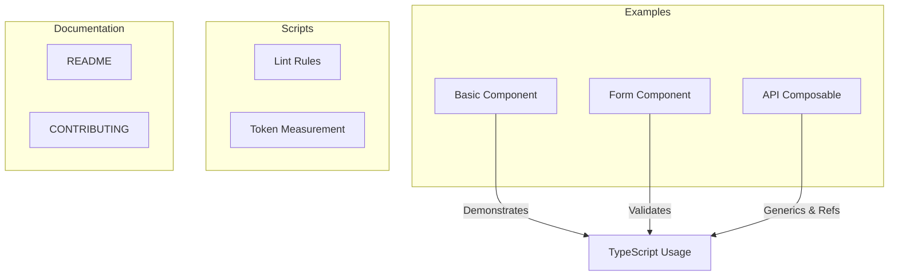
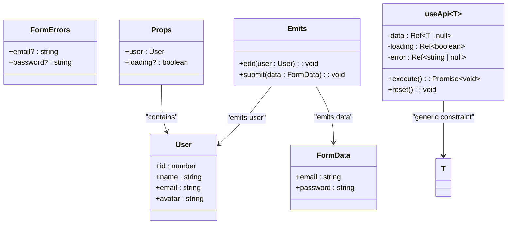
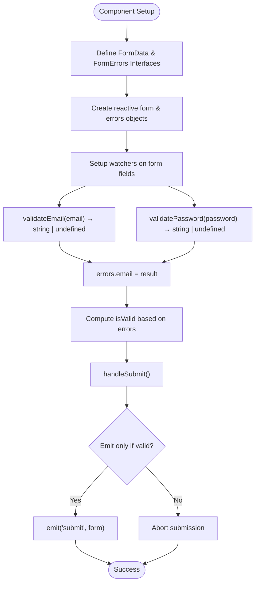
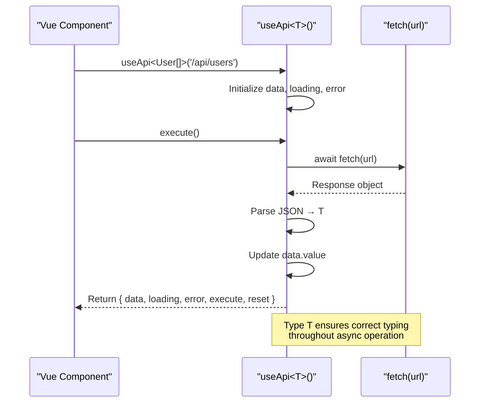
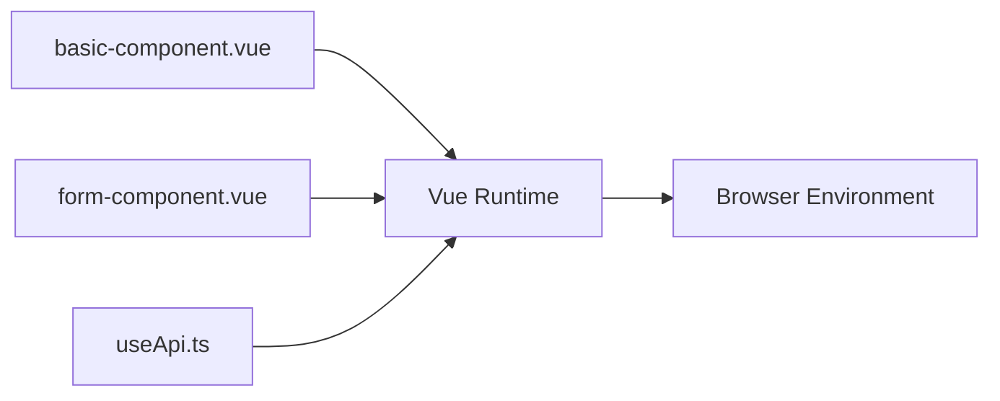

# TypeScript Safety

<cite>
**Referenced Files in This Document**   
- [basic-component.vue](file://examples/basic-component.vue)
- [form-component.vue](file://examples/form-component.vue)
- [useApi.ts](file://examples/useApi.ts)
</cite>

## Table of Contents
1. [Introduction](#introduction)
2. [Project Structure](#project-structure)
3. [Core Components](#core-components)
4. [Architecture Overview](#architecture-overview)
5. [Detailed Component Analysis](#detailed-component-analysis)
6. [Dependency Analysis](#dependency-analysis)
7. [Performance Considerations](#performance-considerations)
8. [Troubleshooting Guide](#troubleshooting-guide)
9. [Conclusion](#conclusion)

## Introduction
The TypeScript Safety rule category ensures strict typing, interface usage, and type narrowing in Vue 3 applications. These rules enforce best practices for defining props, emits, and composables with proper type annotations to eliminate the use of `any` types and prevent runtime errors. The integration with Vue's typing system—particularly through `defineProps` and `defineEmits`—enables robust compile-time checks that improve code maintainability and developer experience. This documentation explores implementation patterns, common pitfalls like improper type assertions, and performance implications of complex generic types.

## Project Structure
The repository follows a modular structure focused on enterprise-grade Vue 3 development patterns. The core examples demonstrate real-world usage of TypeScript within Vue components and composables, emphasizing type safety across component interfaces and reusable logic.



**Diagram sources**
- [basic-component.vue](file://examples/basic-component.vue#L1-L52)
- [form-component.vue](file://examples/form-component.vue#L1-L144)
- [useApi.ts](file://examples/useApi.ts#L1-L41)

**Section sources**
- [basic-component.vue](file://examples/basic-component.vue#L1-L52)
- [form-component.vue](file://examples/form-component.vue#L1-L144)
- [useApi.ts](file://examples/useApi.ts#L1-L41)

## Core Components
The core components illustrate how TypeScript enforces type safety in Vue 3’s Composition API. Key aspects include strongly-typed props using interfaces, emit event definitions via callable interface syntax, and generic composables that preserve type information across usages. Type narrowing is applied through validation logic and computed properties to ensure data integrity throughout the component lifecycle.

**Section sources**
- [basic-component.vue](file://examples/basic-component.vue#L10-L30)
- [form-component.vue](file://examples/form-component.vue#L15-L40)
- [useApi.ts](file://examples/useApi.ts#L5-L15)

## Architecture Overview
The architecture leverages Vue 3’s native TypeScript support to create a type-safe development environment. Components are designed with explicit interfaces for props and emits, while composables utilize generics to maintain flexibility without sacrificing type accuracy. This approach aligns with Vue 3 Patterns by promoting reusability, testability, and clarity in large-scale applications.



**Diagram sources**
- [basic-component.vue](file://examples/basic-component.vue#L10-L20)
- [form-component.vue](file://examples/form-component.vue#L15-L25)
- [useApi.ts](file://examples/useApi.ts#L5-L10)

## Detailed Component Analysis

### Component A Analysis
This section analyzes the `basic-component.vue` file, which demonstrates proper type annotation for props and emits using interface-based typing. It uses `withDefaults` alongside `defineProps` to provide both type safety and default value handling.

#### For Object-Oriented Components:
```mermaid
classDiagram
class User {
+id : number
+name : string
+email : string
+avatar : string
}
class Props {
+user : User
+loading? : boolean
}
class Emits {
(e : 'edit', user : User) : void
}
Props --> User : "references"
Emits --> User : "passes in event"
```

**Diagram sources**
- [basic-component.vue](file://examples/basic-component.vue#L10-L25)

**Section sources**
- [basic-component.vue](file://examples/basic-component.vue#L1-L52)

### Form Validation Logic
The `form-component.vue` implements reactive state management with typed form data and error tracking. It showcases type narrowing through validation functions that return union types (`string | undefined`) and watches that update error states conditionally.

#### For Complex Logic Components:


**Diagram sources**
- [form-component.vue](file://examples/form-component.vue#L15-L113)

**Section sources**
- [form-component.vue](file://examples/form-component.vue#L1-L144)

### Generic Composable Design
The `useApi.ts` composable demonstrates advanced TypeScript usage through generics, allowing it to be reused across different API endpoints while preserving response type information. It avoids `any` by constraining the generic parameter and returning readonly refs for immutability.

#### For API/Service Components:


**Diagram sources**
- [useApi.ts](file://examples/useApi.ts#L1-L41)

**Section sources**
- [useApi.ts](file://examples/useApi.ts#L1-L41)

## Dependency Analysis
There are no external dependencies required for the demonstrated TypeScript safety patterns, as they rely solely on Vue 3’s built-in support for TypeScript in `<script setup>` syntax. However, the design encourages separation of concerns between components and composables, reducing coupling and enhancing testability.



**Diagram sources**
- [basic-component.vue](file://examples/basic-component.vue#L1-L52)
- [form-component.vue](file://examples/form-component.vue#L1-L144)
- [useApi.ts](file://examples/useApi.ts#L1-L41)

**Section sources**
- [package.json](file://package.json#L1-L61)

## Performance Considerations
Using complex types and generics has minimal runtime impact since TypeScript compiles away during build time. However, deeply nested or recursive types may increase TypeScript compilation time, especially in large projects. To mitigate this:
- Limit excessive conditional types
- Avoid overly broad union types
- Use `readonly` and `const` assertions where applicable to reduce reactivity overhead
- Prefer simple interfaces over abstract classes unless necessary

While there is no direct runtime cost, developers should monitor editor performance when working with highly generic composables or extensive type mappings.

## Troubleshooting Guide
Common issues in TypeScript-enabled Vue components include incorrect emit signatures, misuse of type assertions (`as`), and improper handling of nullable values from APIs. Solutions involve:
- Using exact interface definitions for `defineEmits`
- Avoiding `any` by leveraging generics and utility types like `Partial<T>` or `Pick<T>`
- Validating data before assignment when dealing with untyped external sources
- Ensuring all reactive references are properly typed (e.g., `ref<string | null>(null)`)

Type assertion misuse often occurs when bypassing compiler checks; instead, use type guards or validation functions to safely narrow types.

**Section sources**
- [form-component.vue](file://examples/form-component.vue#L45-L60)
- [useApi.ts](file://examples/useApi.ts#L20-L30)

## Conclusion
The TypeScript Safety rules exemplify best practices for building maintainable, scalable Vue 3 applications. By enforcing strict typing for props, emits, and composables, these patterns significantly reduce bugs and improve developer productivity. Integration with Vue’s typing system enables powerful features like generic composables and compile-time validation, while alignment with Vue 3 Patterns ensures long-term project sustainability. With careful attention to type design and avoidance of anti-patterns like `any` usage, teams can achieve high-quality, self-documenting codebases that scale effectively.