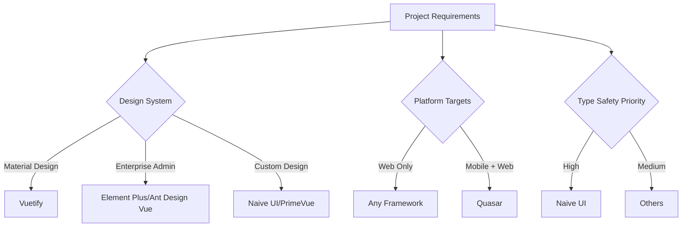
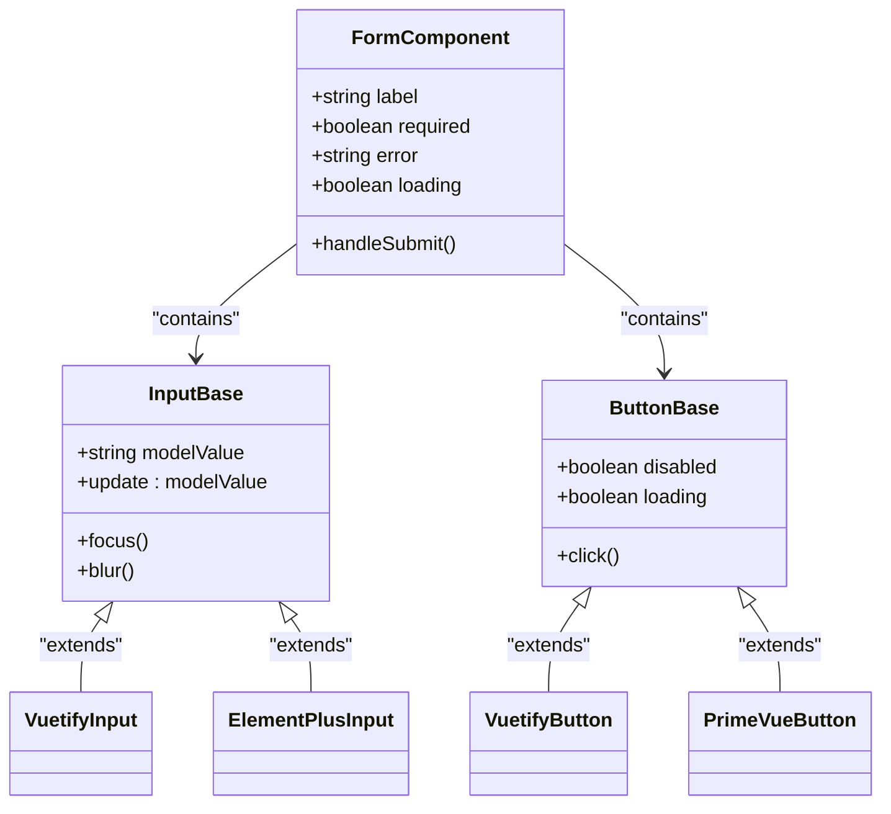
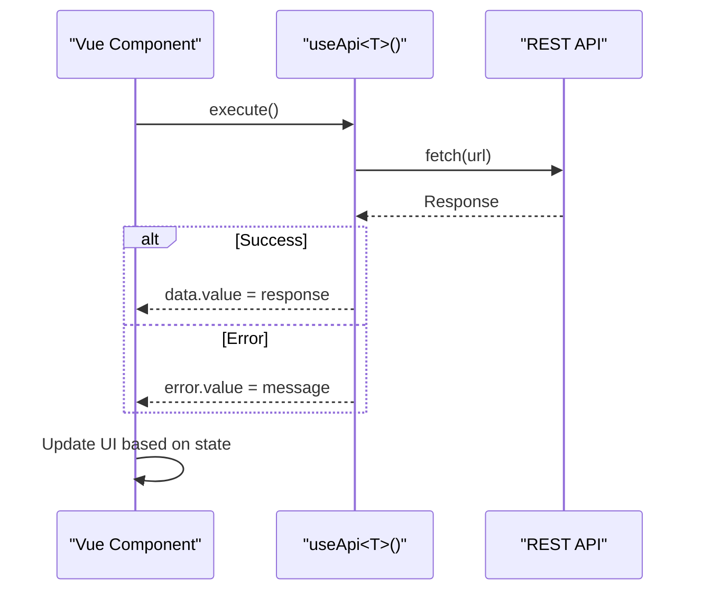

# UI Frameworks

<cite>
**Referenced Files in This Document **  
- [basic-component.vue](file://examples/basic-component.vue)
- [form-component.vue](file://examples/form-component.vue)
- [useApi.ts](file://examples/useApi.ts)
- [package.json](file://package.json)
- [README.md](file://README.md)
- [CONTRIBUTING.md](file://CONTRIBUTING.md)
</cite>

## Table of Contents
1. [Introduction](#introduction)
2. [Framework Overview and Selection Criteria](#framework-overview-and-selection-criteria)
3. [Implementation Patterns Across UI Libraries](#implementation-patterns-across-ui-libraries)
4. [Theme Customization Strategies](#theme-customization-strategies)
5. [Component Composition Best Practices](#component-composition-best-practices)
6. [Accessibility Compliance Guidelines](#accessibility-compliance-guidelines)
7. [Integration with Vue 3 and TypeScript](#integration-with-vue-3-and-typescript)
8. [Common Issues and Troubleshooting](#common-issues-and-troubleshooting)
9. [Bundle Optimization Techniques](#bundle-optimization-techniques)
10. [Conclusion](#conclusion)

## Introduction

This document provides comprehensive guidance on the effective use of popular Vue UI frameworks within modern Vue 3 applications. It covers best practices for integrating Vuetify, Element Plus, Ant Design Vue, Naive UI, PrimeVue, and Quasar while maintaining consistency, performance, and accessibility standards. The rules are designed to ensure production-ready implementations that leverage Vue 3's Composition API and TypeScript support effectively.

The documentation draws from established patterns in enterprise-grade Vue development, emphasizing maintainability, type safety, and developer experience. Special attention is given to real-world integration scenarios, common pitfalls, and optimization strategies that apply across different UI libraries.

**Section sources**
- [README.md](file://README.md#L89-L131)
- [CONTRIBUTING.md](file://CONTRIBUTING.md#L184-L220)

## Framework Overview and Selection Criteria

Each Vue UI framework serves distinct project requirements and team preferences:

- **Vuetify**: Ideal for Material Design implementations with extensive component coverage and strong accessibility features
- **Element Plus**: Best suited for desktop-centric enterprise applications with rich form controls and data tables
- **Ant Design Vue**: Recommended for complex admin panels and B2B applications requiring sophisticated layout systems
- **Naive UI**: Optimal choice for TypeScript-first projects valuing type safety and tree-shakable components
- **PrimeVue**: Suitable for applications needing a wide variety of specialized components and premium themes
- **Quasar**: Preferred for cross-platform development targeting web, mobile, and desktop from a single codebase

Selection should consider factors such as design system alignment, bundle size constraints, TypeScript integration quality, community support, and long-term maintenance viability. Teams should standardize on one primary framework to avoid CSS conflicts and maintain consistent UX patterns.

**Diagram sources**
- [README.md](file://README.md#L89-L131)
- [package.json](file://package.json#L1-L61)

## Implementation Patterns Across UI Libraries

Consistent implementation patterns ensure predictable behavior regardless of the chosen UI framework. Key patterns include proper prop usage, event handling, and slot composition.

For form components, all frameworks follow similar composition principles using v-model binding, validation states, and error messaging. The examples demonstrate how to implement accessible forms with proper labeling, keyboard navigation, and loading states.

When creating reusable components, developers should wrap framework-specific components with project-specific abstractions to facilitate future migrations and maintain consistent APIs across the application.

**Diagram sources**
- [form-component.vue](file://examples/form-component.vue#L1-L144)
- [basic-component.vue](file://examples/basic-component.vue#L1-L52)

**Section sources**
- [form-component.vue](file://examples/form-component.vue#L1-L144)
- [basic-component.vue](file://examples/basic-component.vue#L1-L52)

## Theme Customization Strategies

Effective theme customization ensures brand consistency while leveraging framework capabilities. Most Vue UI libraries provide multiple approaches for theme configuration:

1. **SCSS Variables**: Override framework variables during compilation
2. **CSS Variables**: Runtime theme switching through custom properties
3. **Configuration Objects**: Programmatic theme definition via JavaScript/TypeScript
4. **Dynamic Themes**: User-selectable themes stored in application state

Best practices include defining theme specifications early in the project lifecycle, documenting color palettes and typography scales, and implementing theme switching with proper persistence mechanisms. Developers should avoid inline styling in favor of framework-provided theming APIs to ensure consistency and maintainability.

For optimal results, create a centralized theme configuration file that exports theme definitions consumable by all components, enabling easy updates and consistent application-wide styling.

**Section sources**
- [README.md](file://README.md#L89-L131)
- [CONTRIBUTING.md](file://CONTRIBUTING.md#L184-L220)

## Component Composition Best Practices

Proper component composition enhances reusability and maintainability. Key principles include:

- **Single Responsibility**: Each component should have one clear purpose
- **Prop Driven Configuration**: Use props for customization rather than slots when possible
- **Event Emission**: Follow framework conventions for emitting events
- **Slot Usage**: Reserve slots for complex content projection needs
- **Size Attributes**: Standardize on consistent sizing (small, medium, large) across components

Composition patterns should align with Vue 3's `<script setup>` syntax and TypeScript interfaces for type safety. When composing multiple framework components, create wrapper components that encapsulate framework-specific implementation details, exposing only necessary props and events.

The use of composable functions can further enhance component logic reuse, particularly for form handling, data fetching, and state management patterns that span multiple components.

**Section sources**
- [basic-component.vue](file://examples/basic-component.vue#L1-L52)
- [form-component.vue](file://examples/form-component.vue#L1-L144)
- [useApi.ts](file://examples/useApi.ts#L1-L41)

## Accessibility Compliance Guidelines

All UI framework implementations must adhere to WCAG 2.1 AA guidelines. Essential accessibility practices include:

- **Semantic HTML**: Use appropriate HTML elements and ARIA roles
- **Keyboard Navigation**: Ensure all interactive elements are keyboard accessible
- **Screen Reader Support**: Provide meaningful labels and announcements
- **Focus Management**: Implement proper focus trapping and restoration
- **Color Contrast**: Maintain minimum contrast ratios for text and interactive elements
- **Error Identification**: Clearly identify form errors with associated messages

Frameworks vary in their default accessibility implementations, so teams should audit components for compliance and supplement missing features. Automated accessibility testing should be integrated into the development workflow to catch regressions early.

The repository enforces accessibility standards through its rule system, ensuring all examples meet baseline compliance requirements before inclusion.

**Section sources**
- [CONTRIBUTING.md](file://CONTRIBUTING.md#L184-L220)
- [README.md](file://README.md#L89-L131)

## Integration with Vue 3 and TypeScript

Seamless integration with Vue 3's Composition API and TypeScript is critical for modern applications. Best practices include:

- **Type Declarations**: Define interfaces for props, emits, and component data
- **Generic Components**: Use generics for reusable component patterns
- **Reactive State**: Leverage ref, reactive, and computed with proper typing
- **Composables**: Create reusable logic hooks with typed parameters and return values
- **Template Safety**: Utilize IDE support for template type checking

TypeScript configuration should include strict mode settings to maximize type safety. Framework-specific type declarations should be properly installed and configured to enable autocompletion and error detection.

The examples demonstrate proper TypeScript usage with Vue 3's `<script setup>` syntax, showing how to define component interfaces, use generics, and type composables correctly.

**Diagram sources**
- [useApi.ts](file://examples/useApi.ts#L1-L41)
- [form-component.vue](file://examples/form-component.vue#L1-L144)

## Common Issues and Troubleshooting

Developers frequently encounter several common issues when working with Vue UI frameworks:

### CSS Conflicts
Multiple UI libraries can cause CSS collisions due to global styles. Solutions include:
- Using a single primary framework
- Implementing CSS scoping strategies
- Configuring build tools to isolate framework styles
- Avoiding framework mixing unless absolutely necessary

### Tree-Shaking Misconfigurations
Improper bundler configuration leads to unnecessarily large bundles. Ensure:
- Proper import syntax for tree-shaking support
- Correct