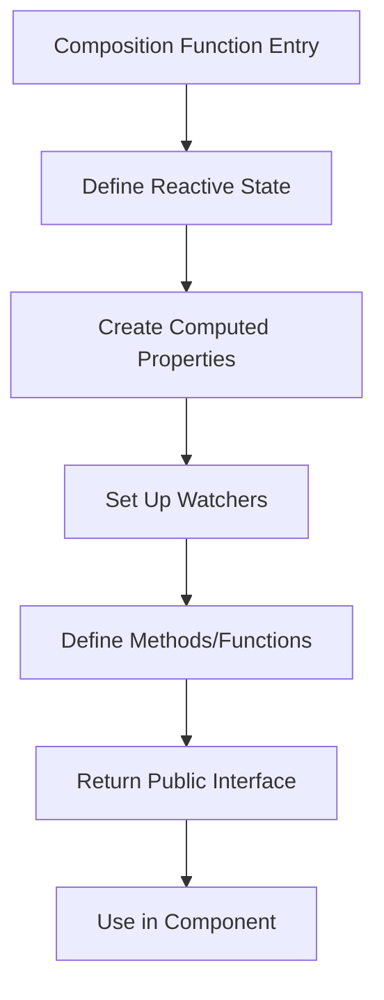
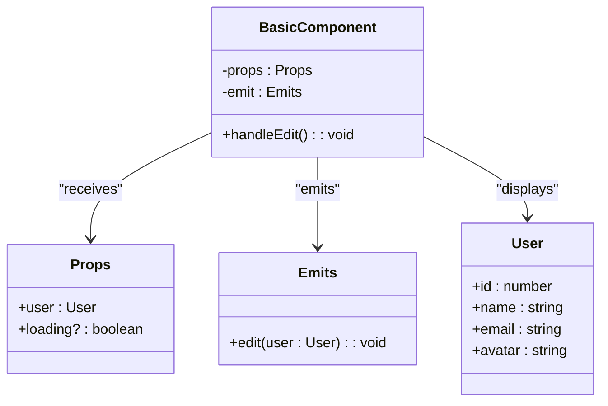
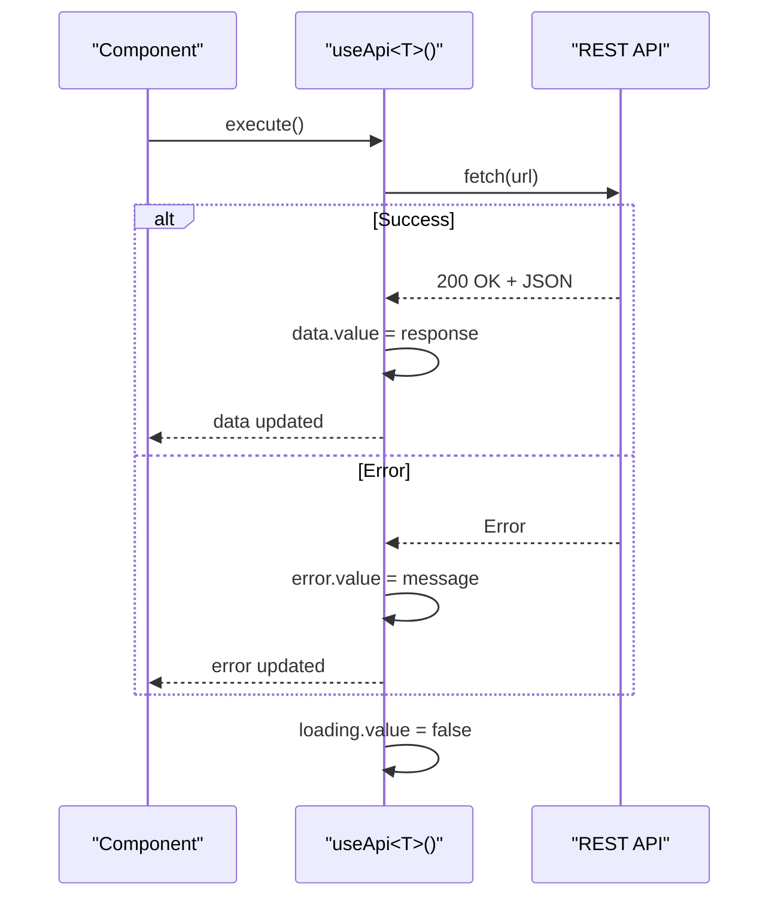
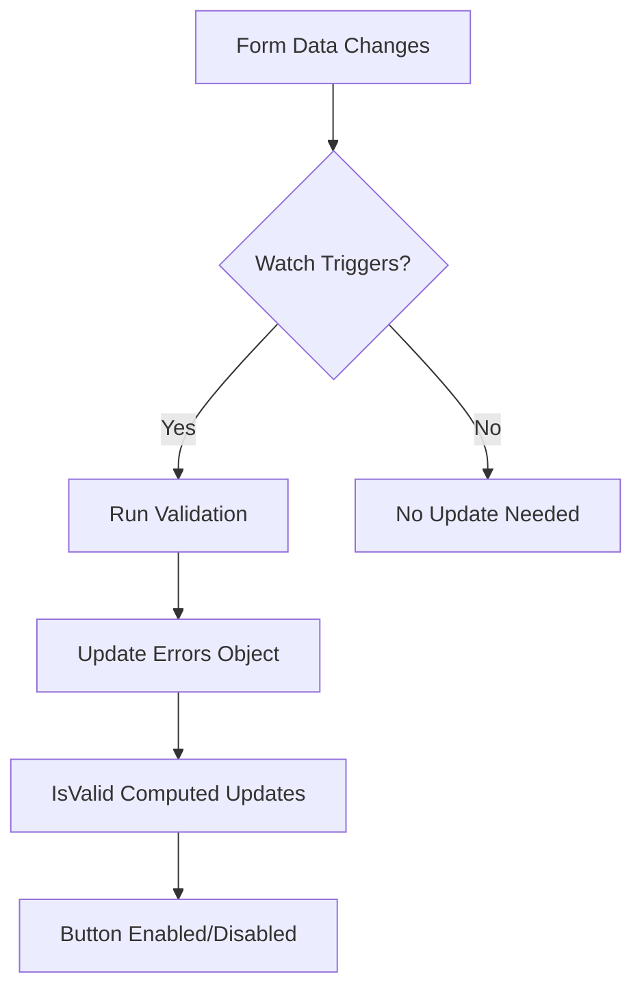

# Vue 3 Patterns

<cite>
**Referenced Files in This Document**   
- [basic-component.vue](file://examples/basic-component.vue)
- [form-component.vue](file://examples/form-component.vue)
- [useApi.ts](file://examples/useApi.ts)
</cite>

## Table of Contents
1. [Introduction](#introduction)
2. [Core Composition API Patterns](#core-composition-api-patterns)
3. [Component Architecture Best Practices](#component-architecture-best-practices)
4. [Lifecycle Management](#lifecycle-management)
5. [Reactivity Optimization](#reactivity-optimization)
6. [Common Anti-Patterns](#common-anti-patterns)
7. [Integration with TypeScript](#integration-with-typescript)
8. [Troubleshooting Reactivity Issues](#troubleshooting-reactivity-issues)

## Introduction

The Vue 3 Patterns rule category establishes best practices for modern Vue.js development using the Composition API. These patterns promote maintainable, performant, and accessible applications by standardizing how developers structure components, manage state, and handle lifecycle events. The rules emphasize reusability through composables, proper type safety with TypeScript integration, and performance optimization through efficient reactivity patterns.

This documentation provides comprehensive guidance on implementing these patterns in real-world applications, with practical examples demonstrating correct usage of core Vue 3 features like ref(), reactive(), computed(), and lifecycle hooks.

**Section sources**
- [form-component.vue](file://examples/form-component.vue#L0-L144)
- [useApi.ts](file://examples/useApi.ts#L0-L41)

## Core Composition API Patterns

The Composition API enables organizing component code based on logical concerns rather than option types, improving code reuse and maintainability. Key patterns include proper usage of reactivity APIs and composable functions that encapsulate reusable logic.

**Diagram sources**
- [form-component.vue](file://examples/form-component.vue#L55-L90)
- [useApi.ts](file://examples/useApi.ts#L4-L25)

### Reactive State Management

Vue 3 provides multiple ways to create reactive state, each suited for different scenarios:

- **ref()**: For primitive values and objects where reassignment is needed
- **reactive()**: For object-based state that maintains reactivity when properties change
- **computed()**: For derived state that automatically updates when dependencies change

The form component example demonstrates these patterns effectively, using `ref()` for simple boolean flags and `reactive()` for form data objects, while `computed()` determines overall form validity.

**Section sources**
- [form-component.vue](file://examples/form-component.vue#L55-L60)
- [useApi.ts](file://examples/useApi.ts#L4-L10)

## Component Architecture Best Practices

Effective component architecture in Vue 3 follows principles of single responsibility, reusability, and clear separation of concerns. Components should be focused on specific UI tasks and leverage composables for shared logic.

### Props and Emits Pattern

The basic component example illustrates proper use of props and emits for parent-child communication. It defines a clear interface using TypeScript interfaces for both props and emitted events, ensuring type safety throughout the application.

**Diagram sources**
- [basic-component.vue](file://examples/basic-component.vue#L10-L35)

### Composable Functions

Composable functions are the cornerstone of reusable logic in Vue 3 applications. The `useApi` composable demonstrates this pattern by encapsulating API request functionality with proper error handling, loading states, and data management.

This approach allows any component to consume API data without duplicating boilerplate code for fetch operations, error handling, or state management.

**Diagram sources**
- [useApi.ts](file://examples/useApi.ts#L12-L35)

**Section sources**
- [useApi.ts](file://examples/useApi.ts#L1-L41)
- [form-component.vue](file://examples/form-component.vue#L45-L50)

## Lifecycle Management

Proper lifecycle management ensures resources are correctly initialized and cleaned up, preventing memory leaks and unexpected behavior. Vue 3's Composition API provides lifecycle hooks that can be used within setup functions.

### Mounting and Unmounting

While not explicitly shown in the examples, proper use of `onMounted()` and `onUnmounted()` hooks is critical for managing side effects. Typical patterns include setting up event listeners, starting timers, or establishing WebSocket connections in `onMounted()`, and cleaning them up in `onUnmounted()`.

For API requests, the pattern demonstrated in `useApi.ts` implicitly handles lifecycle concerns by providing a reset function that can be called when components are unmounted or need to clear their state.

**Section sources**
- [useApi.ts](file://examples/useApi.ts#L25-L35)

## Reactivity Optimization

Efficient reactivity patterns are essential for maintaining good application performance, especially as component complexity grows. Understanding when to use different reactivity APIs prevents unnecessary computations and DOM updates.

### Ref vs Reactive Selection

The choice between `ref()` and `reactive()` depends on the use case:
- Use `ref()` when you need to replace the entire value (e.g., toggling a boolean flag)
- Use `reactive()` for objects where individual property changes should trigger updates

The form component correctly uses `ref(false)` for the `isSubmitting` state since it only needs to toggle between true and false values, while using `reactive({})` for the form data object which has multiple fields that may change independently.

### Computed Property Efficiency

Computed properties automatically cache their results and only re-evaluate when their dependencies change. The `isValid` computed property in the form component efficiently combines multiple validation checks into a single source of truth for form submission readiness.

**Diagram sources**
- [form-component.vue](file://examples/form-component.vue#L62-L78)

**Section sources**
- [form-component.vue](file://examples/form-component.vue#L62-L90)

## Common Anti-Patterns

Avoiding common anti-patterns is crucial for maintaining code quality and performance in Vue 3 applications.

### Inline Lambda Expressions

Using inline lambda expressions in templates (e.g., `@click="() => doSomething()"`) creates new function instances on every render, potentially impacting performance. Instead, define methods in the setup function and reference them directly.

### Misusing Provide/Inject

While not demonstrated in the examples, improper use of provide/inject can lead to tightly coupled components that are difficult to test and maintain. These should be reserved for truly global state (like themes or user authentication) rather than general component communication.

**Section sources**
- [form-component.vue](file://examples/form-component.vue#L40-L42)

## Integration with TypeScript

TypeScript integration enhances the reliability and developer experience of Vue 3 applications by providing compile-time type checking and better IDE support.

### Interface-Driven Development

Both examples demonstrate interface-driven development, defining clear contracts for component props, emits, and data structures. This approach catches type errors during development and improves code readability.

The use of generic types in the `useApi<T>()` composable allows for type-safe API consumption across the application, ensuring that consumers receive properly typed data.

**Section sources**
- [basic-component.vue](file://examples/basic-component.vue#L10-L18)
- [form-component.vue](file://examples/form-component.vue#L47-L53)
- [useApi.ts](file://examples/useApi.ts#L1-L3)

## Troubleshooting Reactivity Issues

Understanding common reactivity gotchas helps diagnose and resolve issues quickly.

### Lost Reactivity

Reactivity can be lost when destructuring reactive objects or replacing entire refs. The examples avoid these pitfalls by maintaining references to reactive objects and using the `.value` property appropriately when needed.

### Watcher Dependencies

When using `watch()`, ensure dependencies are properly tracked. The form component correctly watches individual form fields by wrapping them in getter functions (`() => form.email`), ensuring the watcher triggers when those specific values change.

**Section sources**
- [form-component.vue](file://examples/form-component.vue#L79-L90)